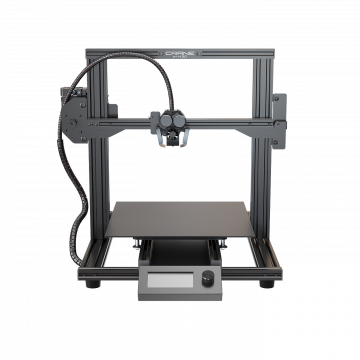

# Welcome

Welcome to the User Manual for the M3D Crane 3D Printer. A feature-packed, expandable, industrial 3D printer designed for manufacturing, assembly and design operations. Fully enclosed in a 20" all-metal frame, the 15.3"-cubed build volume makes printing just about anything possible. Please feel free to add suggestions to any of the guides by creating a pull-request or issue on [GitHub](https://github.com/PrintM3D/Crane-Docs/issues). This manual is hosted in Github.com via Gitbook.com.

If you are a complete beginner to 3D printing and just got the Crane, please start at the [Beginner Guides](beginner-guides/).

If you are a more experienced 3D printer user: [Get Started Here](https://m3d.gitbook.io/promega-docs/getting-started). This guide will get you set-up and walk you through your first print.

Visit the [Crane Launchpad](https://store.printm3d.com/pages/promegalaunchpad) website for more useful resources!

## Contributing

The main way to collaborate to the guides is to become a collaborator. But sometimes you simply want to submit a small contribution, without becoming a regular collaborator.

On GitHub, one can use the popular _Pull Request_ feature. To do so, you would clone [https://github.com/PrintM3D/Crane-Docs](https://github.com/PrintM3D/Crane-Docs), make changes on your own copy, and submit back your changes by submitting a _Pull Request_ to M3D. Then we will review the changes accordingly.

Thank you

