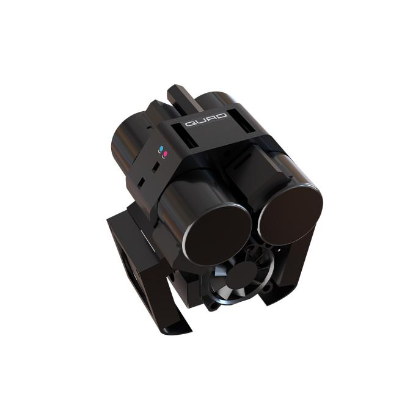

# Welcome

                                                                                                                                                                                                                                                                                                                                                                                                                                                                                                                                                                                                                                                                               Welcome to the User Manual for the the QuadFusion print head.  This manual is hosted in GitHub.com and managed via GitBook.com.  Please feel free to add suggestions to any of the guides by creating a pull request or issue on [GitHub](https://github.com/PrintM3D/Quad-Fusion-Docs/issues).

IMPORTANT: For users setting up early access QuadFusion heads, critical information can be found [here](getting-started/updating-control-board-settings.md).

**This user manual is a work in progress and may contain incomplete or incorrect information.  Please exercise caution with the information contained herein.  This message will be removed as the guide matures.**

If you are a complete beginner to 3D printing, please start at the [Beginner Guides](beginner-guides/).

If you are a more experienced 3D printer user, [Get Started Here](https://m3d.gitbook.io/m3d-quadfusion-documentation/getting-started).  This guide will get you set-up and walk you through your first print.

## Contributing

The main way to collaborate to the guides is to become a collaborator.  But sometimes you simply want to submit a small contribution, without becoming a regular collaborator.

On GitHub, one can use the popular _Pull Request_ feature.  To do so, you would clone [https://github.com/PrintM3D/Quad-Fusion-Docs](https://github.com/PrintM3D/Quad-Fusion-Docs), make changes on your own copy, and submit back your changes by submitting a _Pull Request_ to M3D.  Then we will review the changes accordingly.

Thank you!

