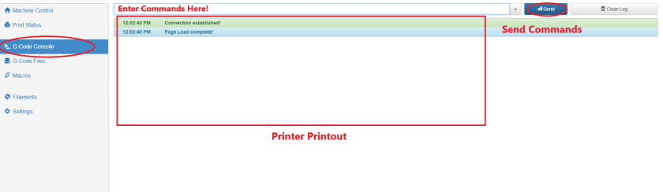

# \*Beginner: Introduction to G-Code Commands

Now that you are familiar with the coordinate system of the Crane, its orientation and direction, we can get started with learning and sending G-code commands. G-code commands are sent one line at a time, with one command per line. When you send a print file to your printer in order to print something, you are sending the printer a long list of G-code commands. It will look something like this \(but way longer!\):

```text
G1 X173.448 Y182.05 E0.03872
G1 X173.922 Y181.843 E0.03871
G1 X174.422 Y181.712 E0.03868
G1 X174.883 Y181.662 E0.0347
G1 X178.301 Y181.524 E0.256
G1 X183.787 Y181.051 E0.41207
G1 X189.186 Y180.278 E0.40816
G1 X194.553 Y179.196 E0.40972
G1 X197.18 Y178.55 E0.20245
G1 X202.457 Y177.012 E0.41134
G1 X208.239 Y174.993 E0.45832
G1 X208.864 Y174.84 E0.04815
G1 X209.841 Y174.699 E0.07387
G1 X210.32 Y174.665 E0.03594
G1 X240.74 Y174.665 E2.27649
G1 X241.414 Y174.733 E0.0507
G1 X242.865 Y175.031 E0.11085
G1 X243.362 Y175.174 E0.0387
G1 X243.641 Y175.293 E0.0227
G1 X244.676 Y175.79 E0.08592
G1 X245.287 Y176.169 E0.05381
G1 X245.992 Y176.719 E0.06691
G1 X246.435 Y177.134 E0.04543
G1 X247.028 Y177.801 E0.06679
G1 X247.379 Y178.274 E0.04408
G1 X247.842 Y179.028 E0.06621
G1 X248.113 Y179.576 E0.04575
G1 X248.46 Y180.476 E0.07218
G1 X248.633 Y181.098 E0.04831
G1 X248.792 Y181.998 E0.06839
G1 X248.843 Y182.581 E0.0438
```

**Basic Commands**

The command, `G1`, you are see above is called the move command. This is arguably the most important G-code as it allows you to move the printer. Each G-code command consists of a letter followed by a number. `G31`, `M564` and `T0` are all valid G-code commands as well. The Duet Maestro control board runs [RepRap Firmware](https://reprap.org/wiki/RepRap_Firmware). This firmware determines what commands are valid, and which commands are not. You can find all the valid commands that you can send in a long list on the [RepRap Wiki G-codes Page](https://reprap.org/wiki/G-code). After the initial letter-number combination of the G-code command a parameter can follow. This is also visible with the G-code commands listed above, the command `G1 X248.843 Y182.581 E0.0438` has `X248.843 Y182.581 E0.0438` as parameters. Many different G-code commands have optional parameters that can be entered after the initial command.

**Absolute vs. Relative in Commands**

With the `G1` command you can move the printer. However, where the `G1` command moves your printer depends on whether you are in absolute or relative mode. Absolute mode is enabled whenever you send the command `G90`, relative mode is enabled when you send the command `G91`. Whenever you are printing absolute mode is typically enabled. If you restart your printer, absolute mode will also be enabled. If you send the command `G1 X150 Y120 Z100` in absolute mode \(`G90`\), the printer will move to the position X = 150mm, Y = 120mm and Z = 100mm, **relative to the origin**. If you send the same command in relative mode \(`G91`\), it will send the printer 150 mm in the positive X-direction, 120 mm in the positive Y-direction and 100 mm in the Z-direction relative to where the printer currently is positioned. The same command can send the printer to two completely different places depending on what mode you are in. As you saw in one of the commands above, the move command, `G1`, can also have an `E` parameter, this allows for a movement of the extruder motor.

**Feedrate**

Aside from the `X`, `Y`, `Z` and `E` parameters which allow the printer to move each of the motors, there is one other important parameter `F`. `F` is the feedrate of the motor, or is simple terms, the speed that the motor will travel at. The units of the `X`, `Y`, `Z` and `E` parameters is mm. However for `F` or feedrate the units are `mm/min`. A normal travel feedrate \(speed\) would be 3000mm/min, but for printing the feedrates are typically much lower.

**The Movement Buttons**

In one of the steps above you used the buttons in _Machine Control_ to move the printer. What is really happening here is that when you press a button a list of G-code commands are sent to the printer. For example, if you press the X+10 button to move the printer 10mm in the positive X-direction this is what is actually sent:

```text
M120
G91
G1 X10 F6000
M121
```

You might be familiar with two of the G-code commands here `G91` and `G1`. `G91` enables relative mode, so the next move command that is sent will be with respect to the printers current position and not the origin. After the `G91` command, the move command `G1` is sent. This sends the printer 10mm in the positive X-direction at a feedrate of 6000mm/min. The `M120` and `M121` commands are stack push and pop. If you are not familiar with these two programming terms, then don't worry, they are not important to know for a beginning user. All you have to know is that it will disable relative mode `G91` and return to absolute mode `G90`. This is because you want the printer to be back in absolute mode after pressing the move buttons.

**Sending G-code Commands**

Now that you are more familiar with G-code commands you can try to complete the steps below in order to see how the printer responds to you sending G-code commands directly to the printer itself.

Find the _G-code Console_ tab in the Duet Web Console.



This tab allows you to send commands to the printer using the textfield as seen above. Once you enter a command in the text field you can press _Enter_ or press the dark-blue send button. The printer will then process the command and execute it. If the command executed successfully you will see a print out of the command you send in the _Printer Printout_ terminal with a green background. If the firmware encountered an error while trying to process the command, it will printout the command with a red background and more information about the error. If you have not yet homed your printer, click the _Home All_  button in the _Machine Control_  tab. Try sending the command `G1 X100 Y100`. This will move the printer to 100 mm X and 100 mm Y. Send the command `G1 Z50`. This will move the bed to about 50 mm from the nozzle. You can keep sending commands to move the printer around the build space. The table below represents the limits of the printer, the firmware should prevent you from going past these limits. Still, try to keep your move commands within the build space of the printer. You can also try to change the feedrate of the printer to see how the speed of the printer changes as the printer moves around.

|  | Axes Limits |  |
| :--- | :--- | :--- |
|  | Max \(mm\) | Min \(mm\) |
| X - Axis | 214 | 0 |
| Y - Axis | 214 | 0 |
| Z - Axis | 230 | 0 |

**Other G-code Commands**

Of course there are many more RepRap supported G-code commands \(as you might have seen on the [RepRap Wiki](https://reprap.org/wiki/G-code)\). You will come across some of them as you follow this guide. Whenever you have questions about what a command does, you can look up the command in the wiki.

Throughout the different guides you will find G-code in `this format`. That typically means you can execute the G-code command. Comments are denoted by any text following a semi-colon ";". A new line will end the comment.

`G1 X100 ; This is a comment!`

