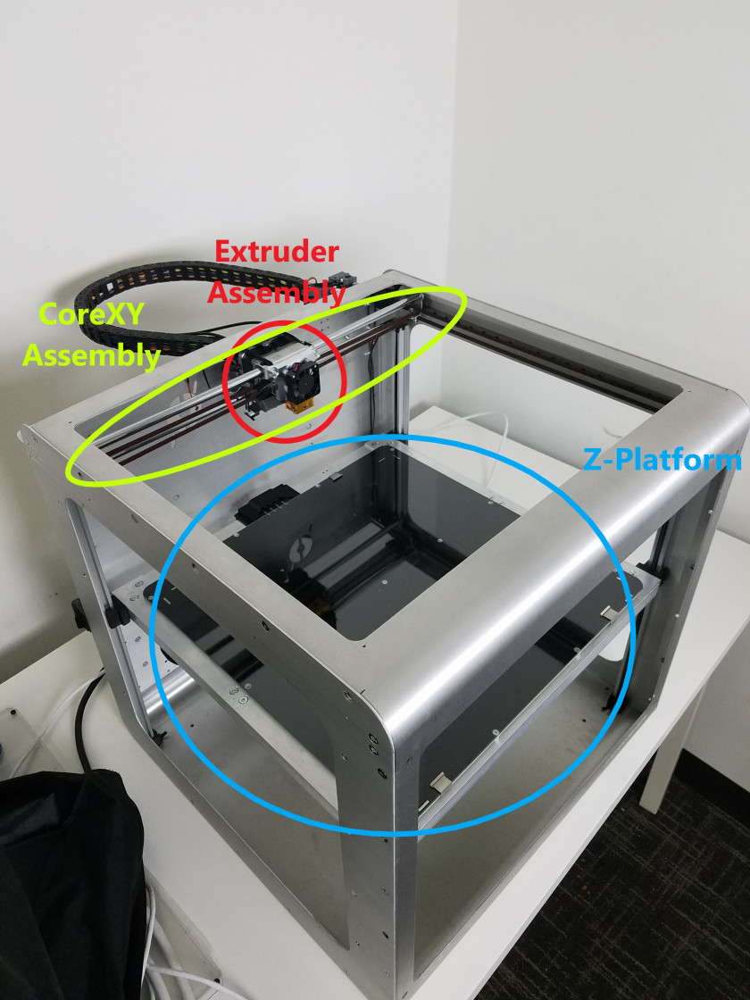

# Beginner: Printer Assemblies

This guide will cover a significant amount of technical knowledge and terms. The different assemblies of the Promega will be mentioned frequently in the sections below.

List of the core Promega Assemblies:

* **Extruder Assembly**: This heats up and prints the filament. It is also referred to as the extruder carriage. This uses the coreXY system in order to travel in the X and Y plane.
* **CoreXY Assembly**: A belt system that allows the extruder carriage to travel on a plane along the X and Y axes.
* **Z-platform**: A heated bed that is actuated up and down with belts along the Z-axis.
* **Electronics \(not shown\):** Located on the back of the printer. Includes the Duet Maestro, the "brains" of the Promega.

