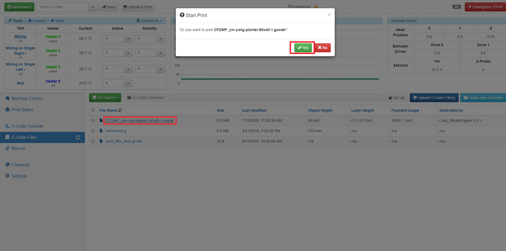
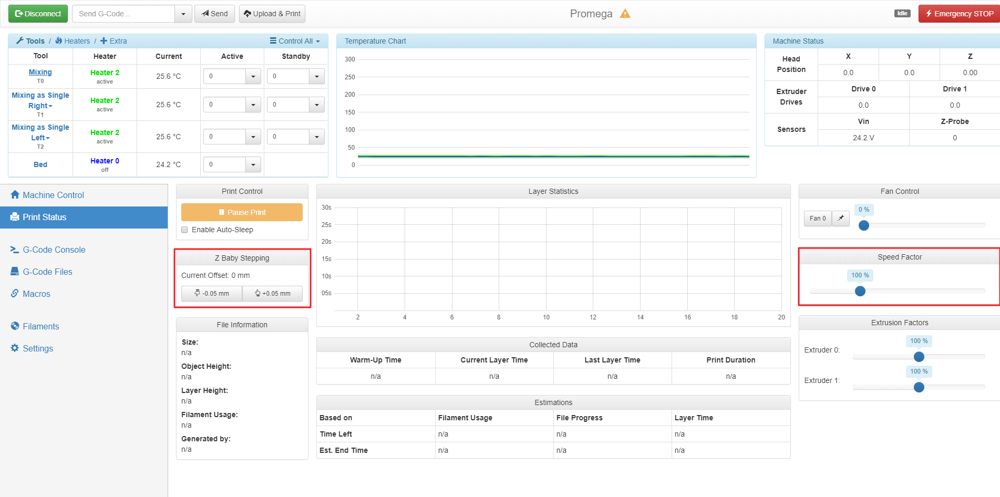

# Beginner: Printing the Print

This is the final guide in the Beginner Guides chapter. It will cover how to upload and monitor a print on the Duet Web Console. This guide assumes you have properly configured your printer with all the previous beginner guides. That means:

* You have homed your printer
* You have run and enabled mesh bed leveling
* You have loaded filament into the extruder

## Heating your QuadFusion print head for the first time:

It's important to heat your QuadFusion print head to 235C and allow it to sit for several minuets BEFORE your first print. This will allow you to not only determine if the print head has been connected properly, but it will also allow it to prime for it's first use. 

To do this simply set the temperature to 235C for Tool 0 in the upper left area of your Duet Web Control console.  

Since this is the VERY first time the QuadFusion head has been heated, it may emit an odor. This odor should be slight and it should dissipate within a few minutes. Please make sure your work area is well ventilated during the first heating of your QuadFusion print head.  

## Uploading the G-code File

First, we will have to upload the G-code file we produced in the previous guide. Connect to the Duet Web Console on the printer. Then, press the _G-code Files_ button and then press the _Upload G-code File\(s\)_ button as shown in the image above. This will open a window which will allow you to select the G-code file you sliced. _Open_ the file and wait for it to upload.

## Printing the File

Once the file is uploaded, you can click the file in order to print it. A window will pop-up confirming that you are about to print something. Click _Yes._

## Monitoring the Print

Now, the print has started. First, the printer will reach it's designated printing temperature that you set in Cura. This might take a while and the printer will not start printing until all components have reached temperature. When the print starts the Duet Web Console will shift over to the _Print Status_ tab on the Duet Web Console. This tab allows you to monitor certain settings of the print. Two of the functions on this tab are very useful: _Z Baby Stepping_ and _Speed Factor_ , these allow you to change the height of the Z and speed while printing. If you notice that a layer is not sticking, try to reduce the speed.

Your print should now be able to run to completion.

