# \*Beginner: What is Slicing?

Whenever you want to print a model you will have to convert the model to a _.gcode_ file type. This file type is a huge list of G-code commands that the Duet Board will process one by one in order to achieve a complete print. The G-code file is generated by software called a slicer. A slicer takes a model applies certain print and printer settings and generates the _.gcode_ file. The model also has to be of a specific file type called a _.STL._ This file type can be generated from a CAD model that you designed or downloaded from the internet from websites such as [Thingiverse](https://www.thingiverse.com/), [Pinshape,](https://pinshape.com/) [MyMiniFactory ](https://www.myminifactory.com/)and many others!

## Finding an _.STL_ File

It is possible to create your own _.STL_ file by downloading a CAD \(Computer Assisted Design\) software such as SolidWorks or [TinkerCAD](https://www.tinkercad.com/). However, in order to take things one step at a time, we will go online and download a working model from the internet. This is because multiple constraints of the 3D printer have to be taken into account when designing a model for printing with a 3D printer.

Go to one of the websites listed above and download a _.STL_ model of something you would want to print. For this guide I am going to use this model: [Customizable Yin-Yang Planter / Container](https://www.thingiverse.com/thing:2531208) by [Lucina M](https://www.thingiverse.com/Lucina/about). Follow the red markings below. Click Thing Files and then click the models you want to download the ._STL_ files of. These files will then end up in your downloads folder.

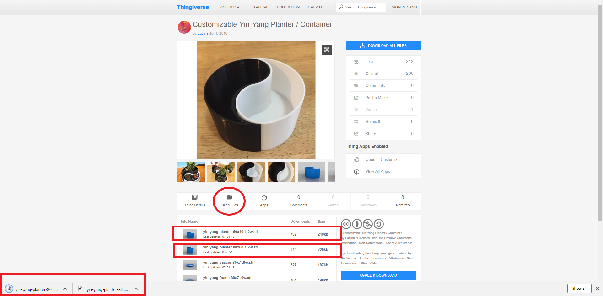

Next, we will move on to installing a slicer to slice the models we just downloaded.

## Installing Cura

For this guide we will use Cura to slice our model. [Download it here!](https://ultimaker.com/en/products/ultimaker-cura-software)

Continue with the installation process until you are able to launch Cura.

### Configuring Cura

Open Cura's Setting by pressing _Preferences &gt; Configure Cura._

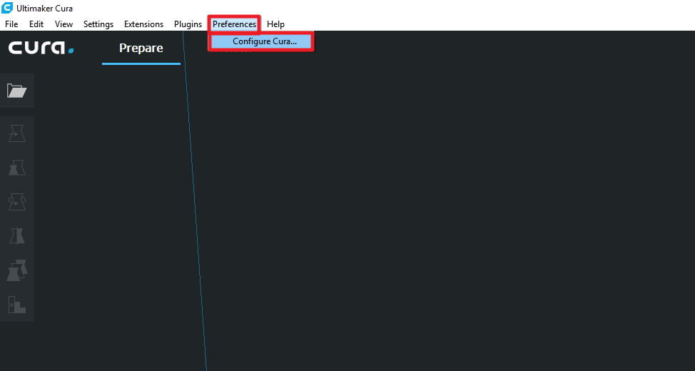

Once you have opened Cura's settings we will go to add a printer. This is because we need to tell Cura the specifics of our printer, such as the maximum build volume of the printer. Press _Printers_ and then _Add_ in order to add a new printer. This will open a new window.

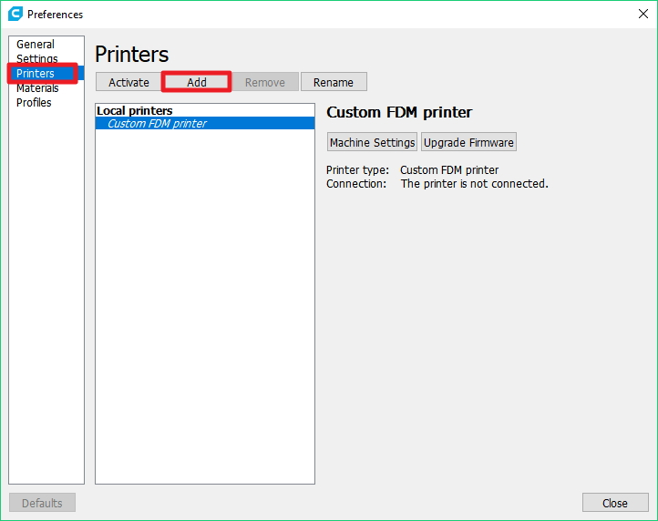

Next, press _Custom._ This indicates we are adding a custom printer to Cura's loadout. You can define the _Printer Name_ however you want. Then press _Add Printer,_ this should open another setting window_._

This window allows you to configure the printer settings of the Crane. This informs Cura of the Crane's build space, the firmware flavor and specifies starting and ending G-code. The build volume of the printer represents the maximum value that the printer can travel in each direction. The firmware flavor is the type of firmware that the board is running. The Duet Maestro board runs on RepRap firmware. Your firmware flavor indicates what type of commands the board can understand. The starting and ending G-code is a series of commands that are run at the start and at the end of every print. This is important as it allows you to retract your filament after the print and turn all the heaters off. Configure the settings in this window exactly as shown in the image below.

`; Starting G-code:            
G28 ;Home    
;Prime the extruder    
G92 E0    
G1 F200 E3    
G92 E0`

`; Ending G-code    
M104 S0    
M140 S0    
;Retract the filament    
G92 E1    
G1 E-1 F300    
G28 X0 Y0  
M84`

**Don't click** _**Close**_ **just yet!** Move on to the _Extruder 1_ tab and fill in the following information. Fill in the nozzle diameter and the material diameter. Your nozzle diameter may vary in the future as you mount different types of nozzles on the Crane. Then you can click _Close._

Once you have added the printer make sure to activate it by selecting the name and then clicking the button _Activate._

### Importing the Printer Profile

The next step is to go to the M3D GitHub Crane repository, in the [Cura Profiles folder](https://github.com/PrintM3D/Crane/tree/devel/Cura%20Profiles) and download the Cura profile for your extruder setup. In order to download the Cura Profile, click on the file in GitHub and then press the Download button as seen in the image below, outline in red. This profile contains all kinds of print settings that help the Crane print well. You can find and tune these settings through experimentation at a later time. For now, this default profile will work well.

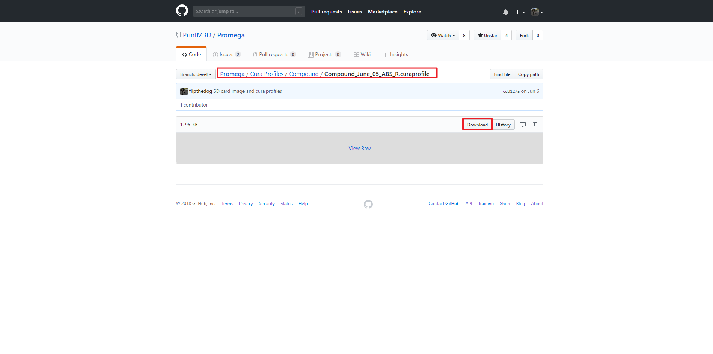

In Cura, open the Preferences again by clicking _Preferences &gt; Configure Cura._ Click _Profiles &gt; Import_. Then a window will pop up that will allow you to navigate to the profile you just downloaded. It will most likely be in the _Downloads_ folder.

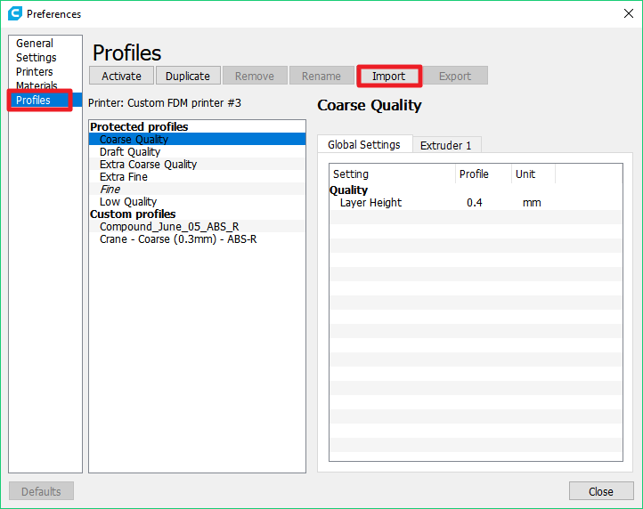

Once you have properly imported the file you will have to _Activate_ it. Select the profile and click the button _Activate._ The print settings you just downloaded have now been applied to Cura. Whenever you slice a model, it will now incorporate these settings.

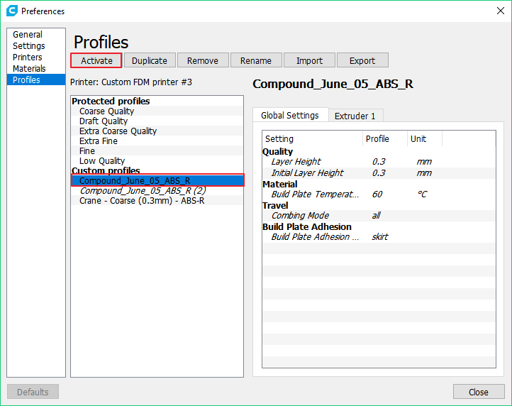

## How Cura Works

Now that you have properly configured Cura, we can go over how it operates, and how you can configure it. Look at the diagram below for a simple drawing of the most important functions of Cura. The buttons on the left side allow you to load a model into Cura. This is very important as loading a model into Cura begins the slicing process. The buttons below the _Open File_ button allow you to manipulate the position, orientation and scale of the model. This is very important. On the right of the window you have buttons to select your material, and _Advanced Settings._ This tab allows you to configure the finer details of the print as you print with your Crane. Mastering the settings of this tab is extremely useful in order to produce fine and high detail prints. Before you print you should always review the settings in this tab in order to ensure that the printing temperature and other settings is correct for your print and material. Whenever you configure your settings and have your print in the correct position and orientation, you can click Prepare in the bottom right corner. Cura will then take a few seconds to slice the file and create a _.gcode_ file. You will then be able to click the button _Save File_ and then save the G-code file to a location file of your choice.

## Slicing in Cura

### Opening a Model

Now we will actually slice the model we downloaded earlier. First, click the folder icon _Open File_ in the top left of the window. Then navigate to the _.STL_ file you downloaded earlier and press _Open._ You should then see the model appear on your build plate.

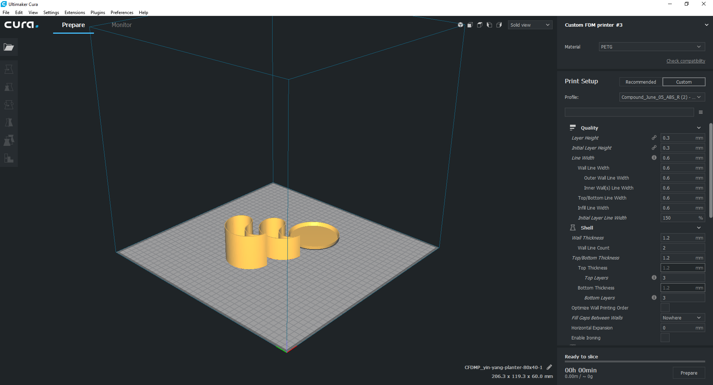

In order to better view your model you can right click and drag in order to change the orientation of your model. Shift + Left Click and dragging will allow you to move the position of the camera. You can always home your view with the buttons in the top-left corner. In the image above I imported three different models.

### Positioning the Model

Use the b~~u~~ttons on the left of the window in order to orient and position the parts as you want. Make sure to keep appropriate distance between parts. Make sure that the parts also have a sufficient flat surface of their model to adhere to the print bed. Check out the images below for more guidance on part orientation.

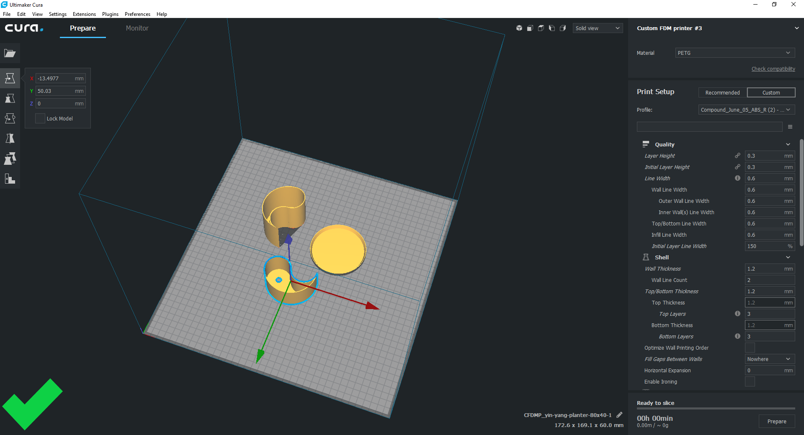

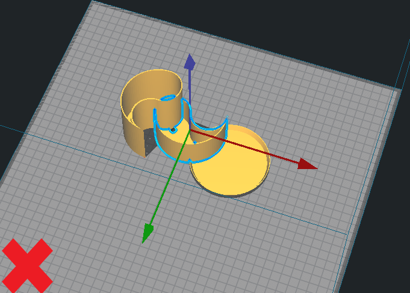

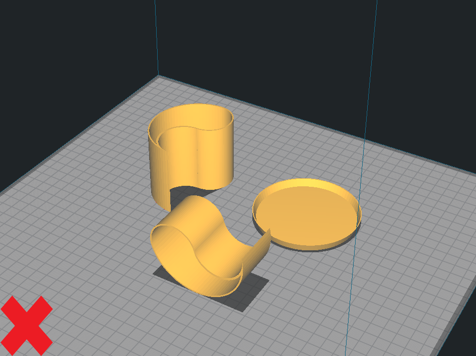

### Configuring Print Settings

Next, we will configure the print settings in Cura. This will all take place on the right side of the Cura window. In a tab called _Custom._


If you can't see any of the option in the steps below. Go to _Preferences &gt; Configure Cura &gt; Settings_ and change the _Setting Visibility_ to _Basic._ This will allow you to see more settings. Eventually, you can change this to _Advanced_ or _Expert_ in order to allow for more print setting options.

\_\_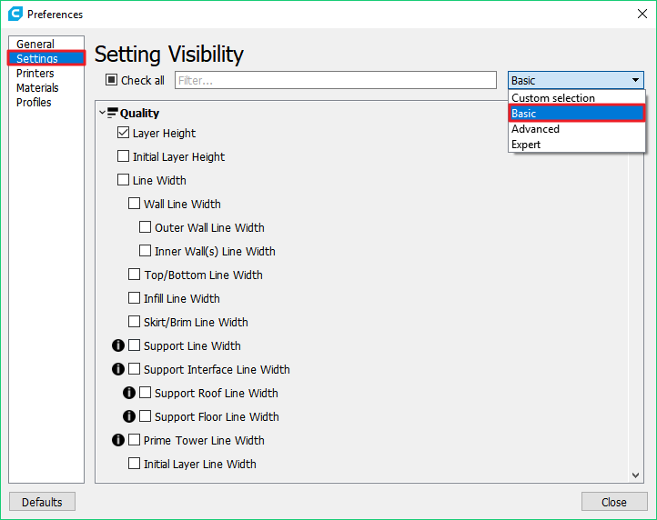 \_\_


The only thing you should have to configure for your first print is the _Material: Temperature Setting._ Configure this based on the material you are printing with. If you are printing with ABS-R, I recommend a temperature of 235°C and if you are printing with PLA a temperature of 205°C is fit. Fill this into the box as shown below. For my print, I am printing with ABS-R, so I filled in 235°C.

Now we are ready to slice the model. Just click Prepare in the bottom right corner. It might take a few seconds for Cura to slice the model. Click once and wait for a few seconds.

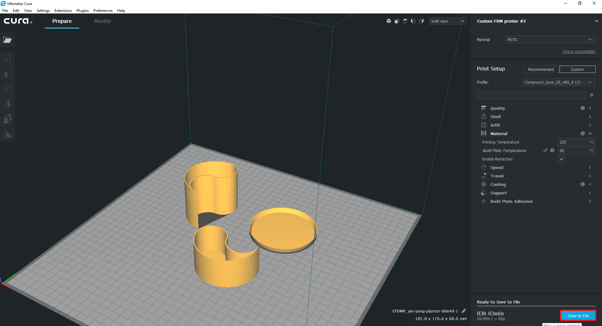

Once you have sliced the model press the _Save to File_ button. Then save the file to a location that you will remember. You will notice that the file you are saving is a _.gcode_ file which is ready to print.

You are now ready to continue on to the next guide.

