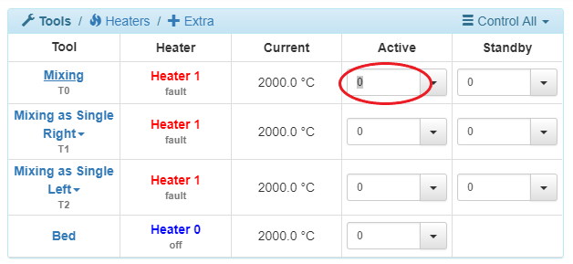
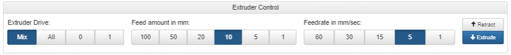

# Beginner: Meet the Extruder

Next, we will move on to one of the most important assemblies on the Promega, the extruder! This complicated assembly can reach temperatures above 300°C in order to melt plastic and print it. The extruder assembly contains a fan directly on the front, this is called the _Cold-Section Fan_. It is meant to keep the extruder block, directly behind it, cold. If the extruder block gets too hot, the filament could start melting before the filament ever reaches the nozzle. On the underside of the extruder assembly, there are two smaller fans called _Nozzle Fans_. These are meant to cool any filament that is pushed out of the nozzle so that it becomes rigid. On the right of the nozzle fans is a small electronics board called the _IR Probe_. This probe uses Infra-Red rays in order to detect the bed. On the left of the extruder is a small deploy-able limit switch, this is also a Z-probe. Z-probes are used in order to measure the exact distance from the nozzle to the bed. They are also used in order to level the bed of the printer as printing requires a very flat and level surface. You can view the image below to see a diagram of the different extruder components.


### Tools

Tools are a relatively new concept in 3D printing. They allow you to create different extruder configuration ahead of time that you can quickly switch between while printing. The Duet Maestro board uses tools in order to allow printing with multiple extruders, or mixing extruders. The Promega actively makes use of this in order to print with different tool mixing ratios, or do dual nozzle prints with the K'tana. You can find your currently configured tools in the Duet Web Console in a table labeled: _Tools/Heaters/Extra_ on the top-left.


In the image above there are two different tools. In RepRap firmware, tools are defined as `Tnnn`, where `nnn` represents a tool number. In the image above there are tools T0 and T1. Each tool has it's own extruder motor attached to it, or multiple if you are mixing. A tool also has one heater attached to it. All these tools are defined and configured when the printer powers up with G-code commands, we will go over how exactly that works later. Below are the default tools for the Compound and K'Tana setups. In order to select a tool you can either click on the tool name in the Duet Web Console or you can send the command `Tnnn` where `nnn` represents the tool number. If you wanted to switch to tool 0, you would send the command `T0`. The Duet Web Console always shows you which tool is selected: it will underline the tool name. In the image above T0 is selected.

Compound Tools:

* `T0`: Mixing tool
  * Extruder 0 \(Left\) & Extruder 1 \(Right\)
  * Heater 2
  * Allows for extruding two filaments and combining them at a 1:1 ratio
* `T1`: Single Left
  * Extruder 0 \(Left\)
  * Heater 2
  * Extrudes with only the right extruder
* `T2`: Single Right
  * Extruder 1 \(Right\)
  * Heater 2
  * Extrudes with only the left extruder

K'Tana Tools:

* `T0`: K'tana Single Left
  * Extruder 0 \(Left\)
  * Heater 1
* `T1`: K'tana Single Right
  * Extruder 1 \(Right\)
  * Heater 2

In the future, if you find that none of your extruders are working, or an extruder you didn't expect to be running is running, chances are you have the wrong tool selected. Use the `Tnnn` command in order to select a tool with number `nnn`.

### Filament Properties

There are many different filament types used in the 3D printing industry, a [Google search](https://www.google.com/search?q=3d+printing+materials&oq=3d+printing+materials&aqs=chrome..69i57.3072j0j1&sourceid=chrome&ie=UTF-8) will prove that. They vary in material, diameter and many other properties. The Promega allows you to print with 1.75mm diameter filament. The Promega can also print many different materials, but if you are a beginner we recommend ABS-R or PLA. These two materials tend to be easiest to print with. PLA prints well at around 200°C and ABS-R at 230°C. Printing temperature varies greatly depending on what material you are printing with. Please do appropriate research before attempting to extrude a new filament. Follow the section below in order to get started with extruding.

### Loading Filament

To load filament into the extruder you will need to find two small holes on the top of the extruder assembly. 1.75mm diameter filament can be loaded into this opening. It will then be grabbed by the extruder motor and pushed down into the hot-end. The hot-end term refers to the pieces of the extruder which will heat up in order to melt the plastic. In the Promega's case that is the nozzle and the aluminum block surrounding it. Once the filament is melted in the hot-end it will come out of the nozzle. The compound nozzle will have two holes to allow entry to two different filaments. It then melts both filaments and combines them to produce one stream of filament coming out. The K'Tana has two different nozzles and therefore each filament will get extruded out of separate nozzles. To load filament follow the steps below.


1. To load filament into the extruder you will first have to heat up the nozzle. It also helps to have the extruder located in the center of the printer. So move the extruder to the center of the printer by entering the command `G1 X200 Y200`.
2. There are multiple ways to heat up the nozzle to your desired temperature. One is with a G-code command and the other is with the Duet Web Console. Heating up tools with the Duet Web Console is the easiest. In the table _Tools/Heaters/Extra_ on the Duet Web Console, enter the desired temperature in the circled box below \(your _Current_ reading should not have a value of 2000°C, 2000°C is an error value\). Once you have entered the temperature press Enter. You should now see a steady rise in temperature in the _Current_ box and on the graph to the right. The temperature you set should depend on the filament you are planning to extrude.

   

3. Once the extruder has reached it's set temperature you are ready to load your filament. Take the filament and insert it into the opening circled in red in the image above. If you are attempting to extrude with a Compound nozzle, you will have to load filament into both openings in the extruder. For the K'Tana you will only have to load filament on one side. Now, on the Duet Web Console go to the _Machine Control_ tab in order to move the extruder motors. In this tab there is a box called _Extruder Control_. Here you can select the extruder you want to control and how much filament you want to extrude and at what speed. If you have the Compound nozzle, set the _Extruder Drive_ settings to _Mix_ in order to get both extruder motors to push filament. If you have the K'Tana, select Drive 0 or 1 depending on which side you loaded filament into. The _Feedrate amount_ should be set to 10mm and the _Feedrate_ to 5mm/sec. You can then press _Extrude_ this should move the filament into the extruder. It could be possible that you have to push the filament properly into the opening until the extruder grabs it.

   

4. Once the filament is inside the extruder keep pressing _Extrude_ until filament comes out of the nozzle. You can increase the _Feed amount_ to 50mm or more to decrease the times you have to press _Extrude_.
5. Congratulations, you have just created your first print! It probably looks like a long stream of filament, but that counts, right? You can keep pressing the _Extrude_ button for as long as you like, or you can move on to the next section.

### Extruding with G-code Commands

The steps that you accomplished above in order to extrude filament can also be done with G-code commands. Follow the steps below in order to learn more G-code commands.

1. Select your appropriate tool with `Tnnn`. For example, tool 0 with `T0`.
2. Turn off the heat to your tool by sending the command `G10 Pnnn S0`. `G10` allows you to set a tool temperature. The `P` parameter and `nnn` represents your tool number that you want to change the temperature of. `Snnn` is the temperature of the tool. So by setting the temperature to 0 the tool is turned off.
3. If you wanted to turn the temperature of a tool back on you would have to enter the command `G10 P0 Snnn` where `nnn` is your new tool temperature. The `G10` `S` parameter only sets the **active** temperature of a tool. This means the tool will only go to that temperature when it is selected or active.
4. If you wanted to extrude 100mm of filament at a feedrate of 20 mm/sec you could enter the commands below. Remember that you should zero your extruder first before telling your extruder to move. This is because your extruder could have a very high position in mm, for example 10291mm. If you then tell the extruder to move to the absolute position of 100mm. The extruder will have to travel 10191mm backwards, and that will take a long time! You can also turn on relative extruder moves with `M83`, and then you would not have to zero the extruder as it just adds 100mm to the position the extruder is already at.

   ```text
   G92 E0
   G1 E100 F120 ; Remember that Feedrate is in terms of mm/min!
   G92 E0
   ```

   ```text
   M83 
   G1 E100 F120
   M82
   ```

5. To retract, pull filament back into the extruder, send a negative extruder position. Like `G1 E-100 F3000`.

### Alternative Commands to Heat

Throughout your printing career with the Promega you will notice other commands to heat up your nozzle. `M104` and `M105` can also be used to heat up your tools.

`M104 Snnn`: Heat up your active tool to `nnn`°C.

`M109 Snnn`: Heat up your active tool to `nnn`°C and wait until temperature is achieved.

`M140 Snnn`: Heat up your bed to `nnn`°C.

`M190 Snnn`: Heat up your bed to `nnn`°C and wait until temperature is achieved.

There are even more commands to heat up your extruder. The `G10` command allows you to heat up any tool including when you don't have the tool selected. This command can be useful when you are attempting to change the temperature of tools while they are not selected. The command `G10` allows you to change the temperature or offset of a specific tool.

`G10 Pnnn Xnnn Ynnn Znnn Rnnn Snnn` :

* `Pnnn` : Represents the tool number of the tool you are attempting to change the temperature or offset of.
* `Xnnn` , `Ynnn` and `Znnn` : Represent the X, Y and Z offset of the tool
* `Rnnn` : The tool's standby temperature. Or the temperature of the tool when it is not selected, but was previously active.
* `Snnn` : The tool's active temperature. Or the temperature of the tool when it is selected.

Example: `G10 P1 X10 Y0 Z0 R120 S230` , This will set the offset of tool 1 to 10mm in the positive X direction. It will also set the active temperature of the tool to 230C and the standby temperature of the tool to 120C.

The `G10` command is especially useful for mixing and switching prints.  

