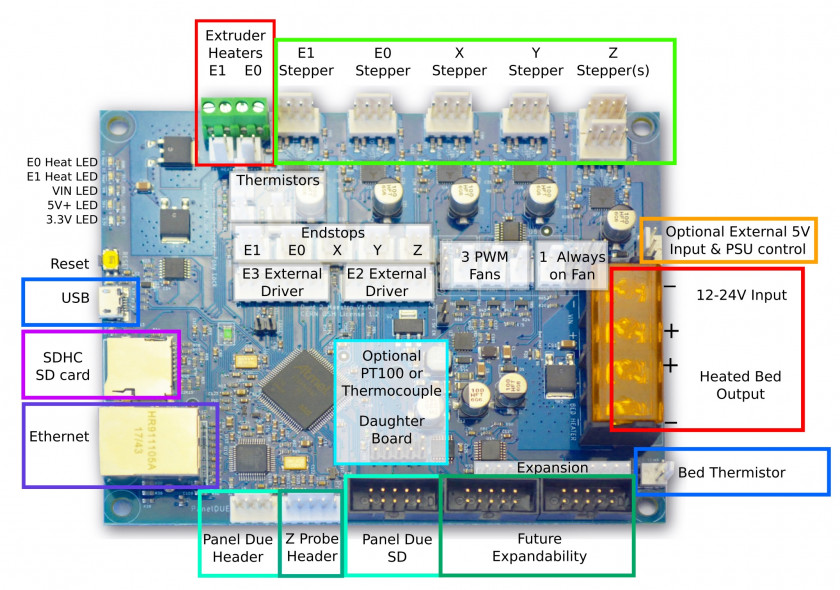
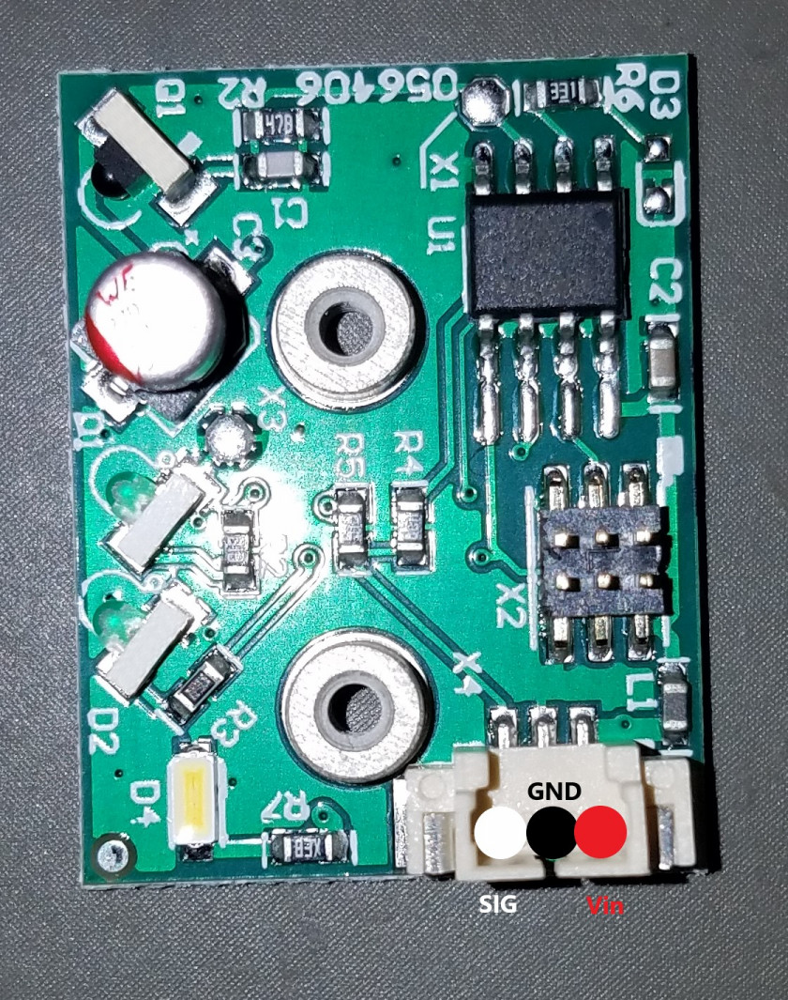

# Duet Maestro Wiring

This guide covers the wiring of the Promega along with possible wiring solutions to problems. Properly understanding the wiring of the Promega is extremely important. Shorting the Duet Maestro board can be done easily. Follow and acknowledge the warnings listed in [Critical Warnings](http://promega.printm3d.com/books/user-manual/page/critical-warnings). The Duet Maestro board can be easily damaged or broken by: 

1. Wiring the board incorrectly and causing a short 

2. Electro-static Discharge 

3. Generating too much voltage by manually moving motors 

4. Plugging in and unplugging components while the system is powered 

5. Touching electrical components while the system is powered

### Wiring Guide

#### Duet Maestro Ports

The image above displays the ports found on the Duet Maestro and their functions.

#### Connection Diagram

Each text in the textbox of the first image represents the text found on each cable near the connector. Not all cables have text, but they will have some other feature that identifies them. Read the list, Notes, below for a further explanation on the unmarked wires. Each textbox color represents the cable assembly that the wires are a part of. White represents the cables going up towards the extruder assembly. Red, the cables to the Z and power supply. Blue, the limit switch wires and purple, the wires to the power supply.

Notes:

* The Z-motor cable is coiled to form a rope. The Y-motor is not. Plugging them in wrong will not result in damage but will result in flipped Y and Z axes.
* The X-motor is an unlabeled 4 pin connector coming from the extruder cable assembly. The colors of the wire are red, green, blue and black. It should be the only 4-wire cable with these colors coming from the extruder cable assembly.
* The Z-probe wires are connected to the 5-pin z-probe connector. Only three pins are used. From left to right:
  1. Signal Port: Black Cable, S10
  2. GND Port: White Cable, P5
  3. MOD Port: Empty
  4. 3.3V Port: Brown Cable, S9
  5. 5V Port: Empty

#### Z-probe Wiring

 

The IR Z-probe ports are listed in the image above. The z-probe board can be powered off both 5V and 3.3V, both pins are found on the Duet Maestro Z-probe connector. We recommend you power the z-probe board with 3.3V as it produces a significantly less noisy signal than 5V, and therefore produces are more consistent distance reading.

#### Promega Resistance Table

The Promega electrical components have specific resistances attributed to them. This can make troubleshooting components much easier. With a multi-meter set to measure resistance, you can measure the resistance of a thermistor or heater and compare the reading with the values in the table below. Whenever you are working with electrical components we recommend you switch off the power to the Duet board!

**Resistance Table**

| Component | Expected Value \(Ω\) |
| --- | --- |
| Extruder PT1000 | 1090\* Ω |
| Extruder Heater | 13.1 Ω |
| Bed | 2.2 Ω |
| Bed Thermistor | 106800\* Ω |
| Extruder Stepper Motor | 19.3 Ω |
| Axis Stepper Motor | 9.0 Ω |

\*Remember that the resistance of a thermistor is dependent on temperature and will vary from this reading! Thermistor resistance values listed above were taken at room temperature \(~24 C\)

#### Jumpers

You might notice that your Duet Maestro board for the Promega came with several jumpers on the board. In case you are not familiar with what a jumper is, it represents a connector bridging two electrical components or signals. Read this for more about jumpers: \[Wikipedia: Jumpers\]\([https://en.wikipedia.org/wiki/Jumper\_\(computing](https://en.wikipedia.org/wiki/Jumper_%28computing)\)\). Your Duet should have 5 different jumpers, located as seen in the image below.

 

Jumpers: 

1. Allows for internal 5V power when Vin \(24V\) is connected 

2. Fan voltage jumper, B FAN2, set to 5V for nozzle fan 

3. Fan voltage jumper, A Always-on-fan set to Vin for cold-section fan 

4. and 5. Only one Z-motor on the Promega, so jumpers are required to properly connect Z-motor to the stepper motor driver.

#### Before you continue

If you change the wiring of your printer it is best to proceed with the following steps before continuing to prevent damage. 1. Double check the wiring of every single wire you changed. 2. Plug in the power supply while the printer is switched **off**. 3. Turn the printer on 3. Connect to the Duet Web Console 3. Verify the temperature readouts of all heating components. 3. Test each component individually

* Move each motor independently and confirm that it is travelling in the correct direction.
* Heat up your nozzle\(s\)
* Heat up your bed
* Press each limit switch and test z-probes
  1. You should be ready to go!

#### Extra Resources:

There is way more to the electronics of the Duet Maestro board. Follow the links below for more help and information regarding the Duet Maestro. 1. [Duet Maestro Pinout](https://duet3d.dozuki.com/Wiki/Duet_2_Maestro_Wiring_Diagram) 2. [Duet Maestro Hardware Overview](https://duet3d.dozuki.com/Wiki/Duet_2_Maestro_Hardware_Overview#Section_Wiring_and_pinout) 3. [M3D Support](https://printm3d.com/support) 3. [Duet3D forum](https://forum.duet3d.com/): A great place for very specific Duet Maestro and RepRap firmware questions

