# Extruder Assembly Wiring

The extruder assembly wiring is important to do correctly. Follow the guide below for an explanation of the extruder wiring. The first 50 printers will have an older cable assembly as mentioned

## New Extruder Assembly Wiring

The new extruder assembly is printed in black ABS-R filament, pictured below. This section covers the wiring for the new extruder wiring assembly. If you are removing the old wiring assembly and replacing it with the new wiring assembly follow the _Removing the Old Extruder Wiring Assembly_ section below first.

### Required Items and Tools

**Tools:**

* T10 Torx Screwdriver
* 2mm Hex Screwdriver
* Phillips Head Screwdriver

**Materials:**

* 3x M3 20mm Countersunk T10 Torx bolts
* 2x M3 35mm Countersunk 2mm Hex bolts
* 2x M3 nuts
* 1x M3 locknut

### Preparation

1. Remove the two stepper motor screws pictured below.

   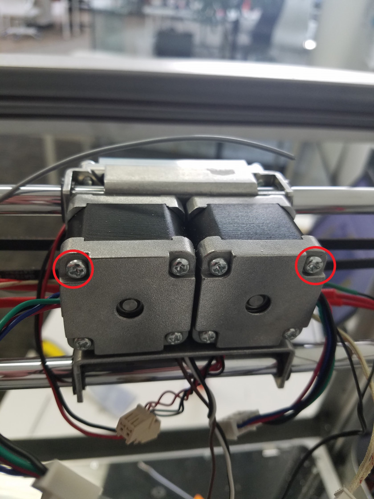

2. Open up 3 or more of the cable chain links nearest to the extruder. This will give you more room to work. Follow [Opening the Cable Chain](https://m3d.gitbook.io/promega-docs/electrical-guides/opening-the-cable-chain) guide for help.

   

3. Cut the zip-ties holding the cable to the back of the printer. Pull the cable out of the cable wrap. This will allow you to redistribute the slack in the wiring. Throughout the following steps, if you find that you do not have enough slack to wire the cable as shown consider pulling slack from the Duet board through the cable chain, to the extruder.

   

4. Put the two M3 nuts into the channels pictured below. Make sure the nuts are properly in the center of the screw hole. You can choose to superglue the nut in place.

   

5. Put the M3 locknut in the hole pictured below. Push the lock nut all the way into the hole with a small screwdriver. It might help to place a bit of superglue on the lock nut to keep it in place.

   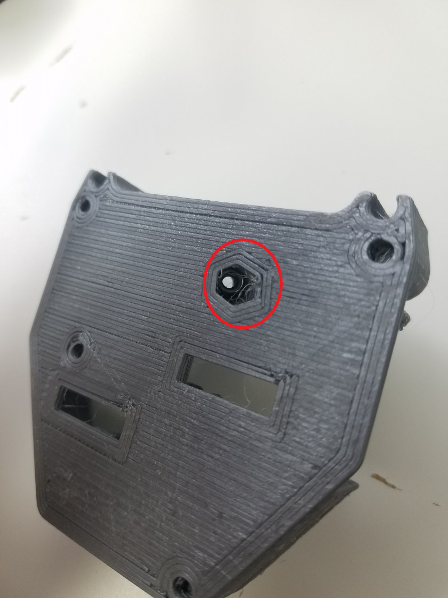

   **Assembly**

6. Mount the back of the new extruder wiring assembly to the stepper motor with the two 35mm M3 screws.

   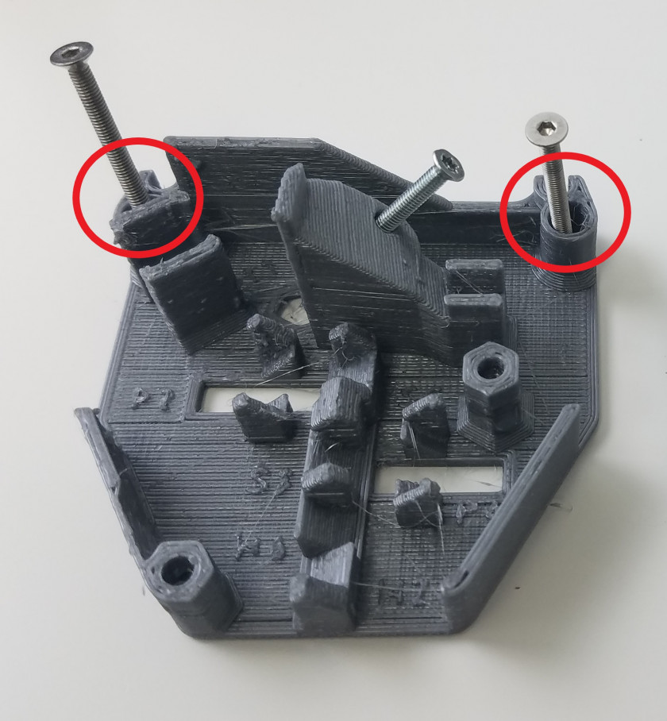

7. Identify whether the nozzle fan is connected to connector P9 or P11. **This varies per printer.** You can either perform a continuity test between the wires. Or observe the colors of the cable and the ports they are plugged into on the duet board. Plugging in the nozzle fan into the cold-section fan connector will break the nozzle fans. In the example below, the blue-green wire will correspond to the nozzle fan and the orange-yellow wire to the cold section fan. **There are multiple wires of the same color!** Find the wires with the colors blue-green and yellow-orange along with the labels P9 and P11.

   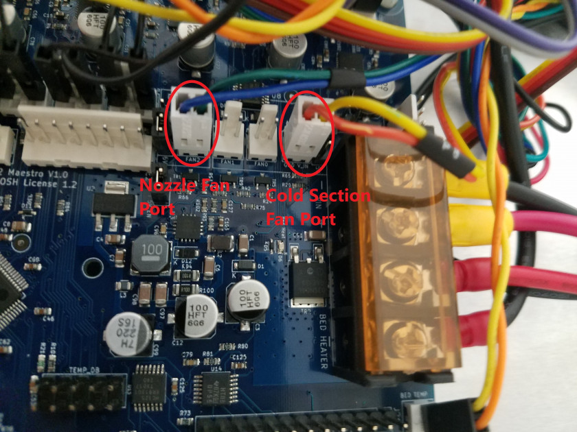

8. Place the nozzle fan connector, that you identified in the previous step, in the slot pictured below. The nozzle fan connector varies for each printer. It will either be P11 or P9. Route the wires as shown in the picture.

   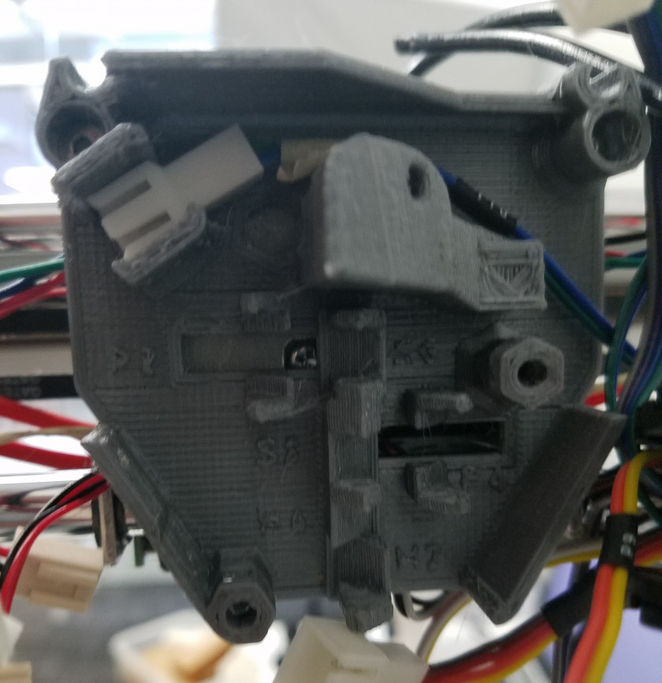

9. Place the cold-section fan connector in the slot above the nozzle-fan connector. Route the wires as shown in the picture.

   

10. Place the thermistor connector S8 in the slot pictured below. Route the cable as shown. \(Color of wire in image is wrong, match the labels, not the colors\)

    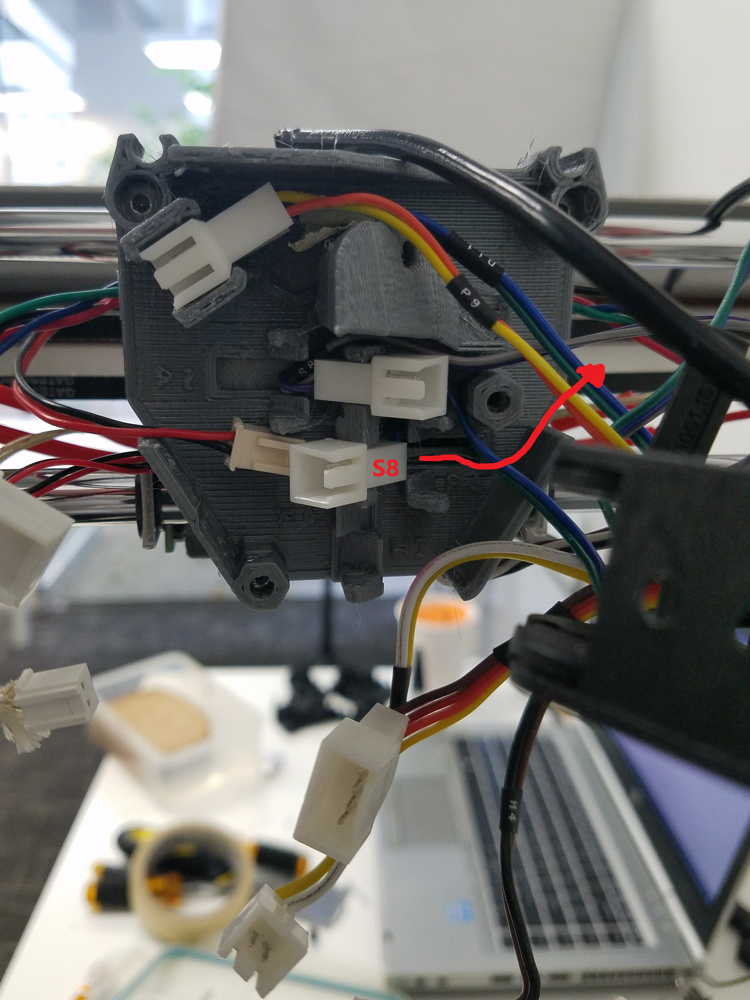

11. Place the other thermistor connector S6 in the slot pictured below. Route the cable as shown. \(Color of wire in image is wrong, match the labels, not the colors\)

    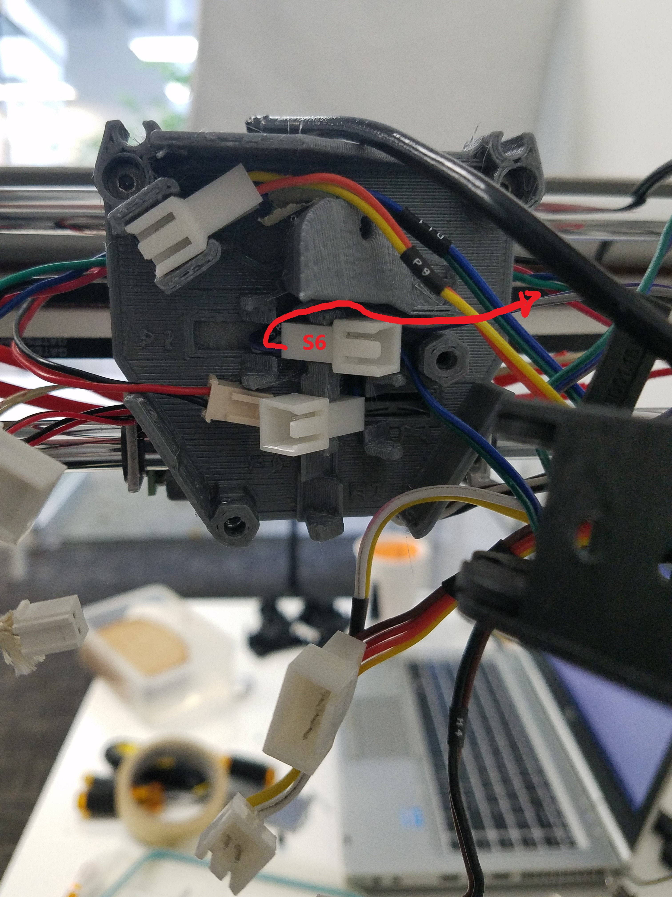

12. Take the two stepper motor connectors P4 and P2 and place them as shown below.

    

13. Place the two heater cables \(H2 and H4\) as shown below. Note: the wiring of H4 should follow the red line, do not wire as shown in the image or the wiring will hit your print.

    

14. Plug in the cold-section fan cable in the top port pictured. **Do not plug in the nozzle fan yet**. Turn on the printer, and the cold-section fan should run. If it does not **the fans might be wired backwards** double check the wiring before continuing. If the cold-section fan worked as expected, plug in the nozzle fans into the bottom connector.

    

15. Plug in the right-side \(when facing the printer from the front\) heater, thermistor and stepper motor. If you are using the Compound nozzle, plug in the heater and thermistor as shown below.

    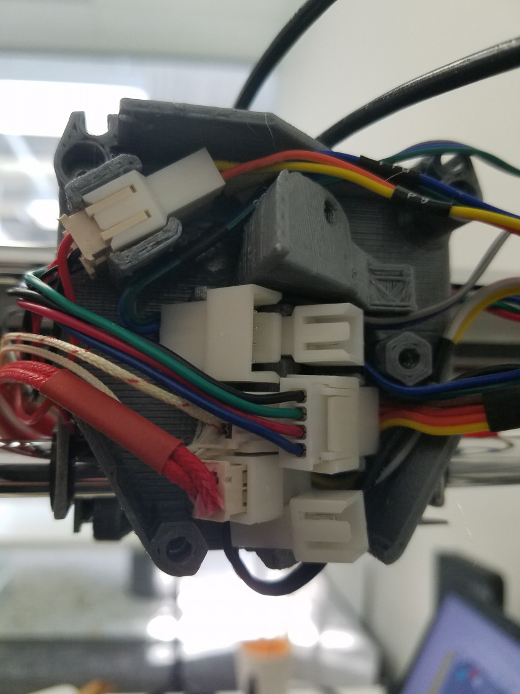

16. Plug in the left-side \(when facing the printer from the front\), heater, thermistor and stepper motor.

    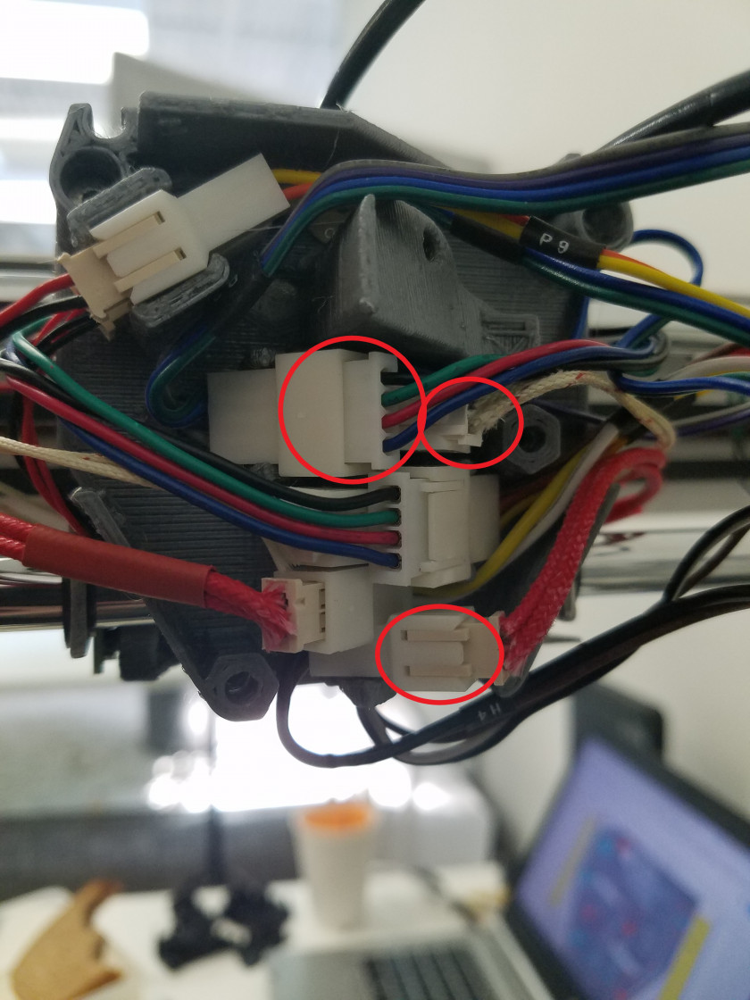

17. Route all wires through the circled channels shown below. Make sure to keep the circled peg clear of wires.

    

18. Put the cable chain into place. Use the M3 20mm bolt to screw down the cable chain into the locknut.

    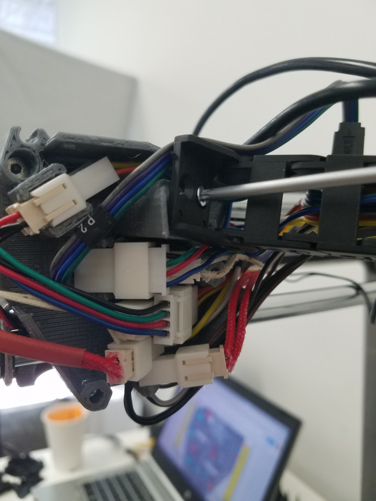

19. If you have an older version of the Promega cable assembly, it will feature two 4-wire connectors that are unused. These can either be removed from the cable chain completely, or you can tuck the connectors back into the cable chain to move them out of the way.
20. Pull the slack out of the wires at the extruder end of the cable chain. Carefully pull the wires at the end of the cable chain at the back of the printer.
21. Power on and connect to the printer and ensure that all the heaters, thermistors, extruders and fans are plugged in correctly. If this is your first time mounting the new cable assembly, download the correct configuration release from the [M3D Promega GitHub Repository](https://github.com/PrintM3D/Promega).
    * Observe the thermistor reading\(s\), none should read 2000C
    * Heat up the nozzle\(s\), no heater fault should occur
    * Check the direction of both extruder motors
22. Screw down the cover for the cable assembly.

    

23. You are now done, please perform a system test before continuing with printing.

## Removing the Old Extruder Wiring Assembly

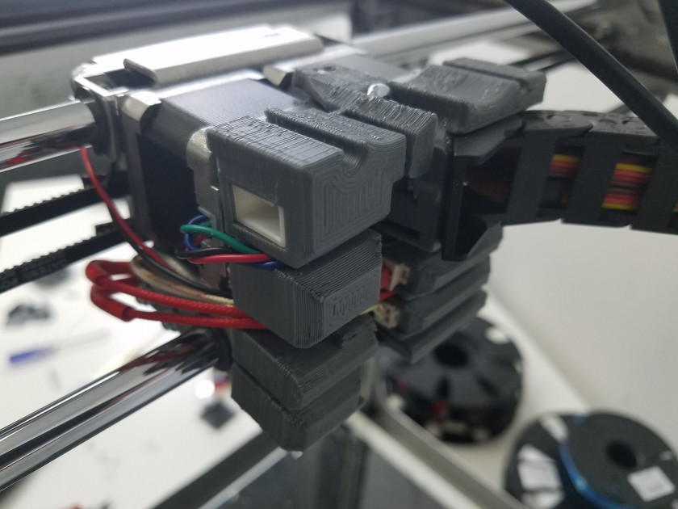

**Tools Required:**

* T20 Torx Screwdriver
* T10 Torx Screwdriver
* Power off the printer if you have not yet done so already!
* Make sure you have the new cable assembly ready and printed.
* Remove the top T20 bolt holding the assembly to the extruder.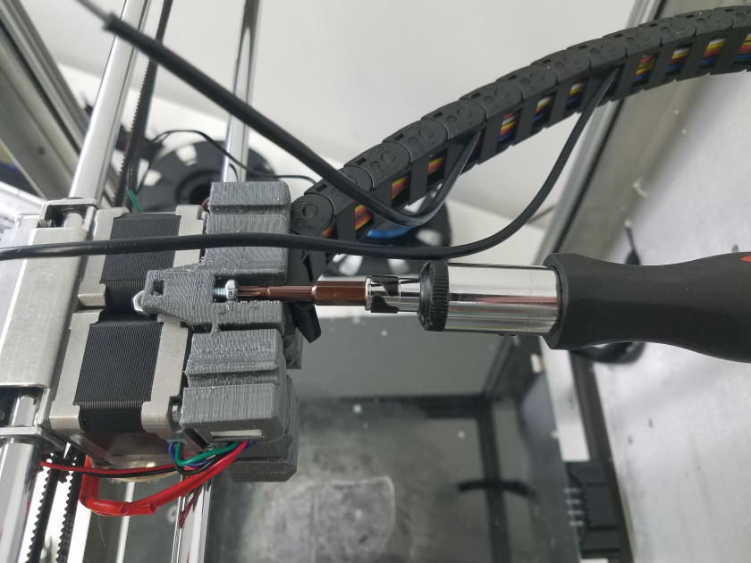
* Remove the T20 bolt on the bottom of the wiring assembly, circled in red.
* Remove the T10 Bolt holding the cable chain to the 3D printed cable assembly.
* Carefully pull the cables out of the connectors inside the wiring assembly until you can pull the plastic part free. Use needlenose pliers and a pick to help you. It can help to first remove the wires constraining the wiring assembly to the extruder assembly to give you more room to work.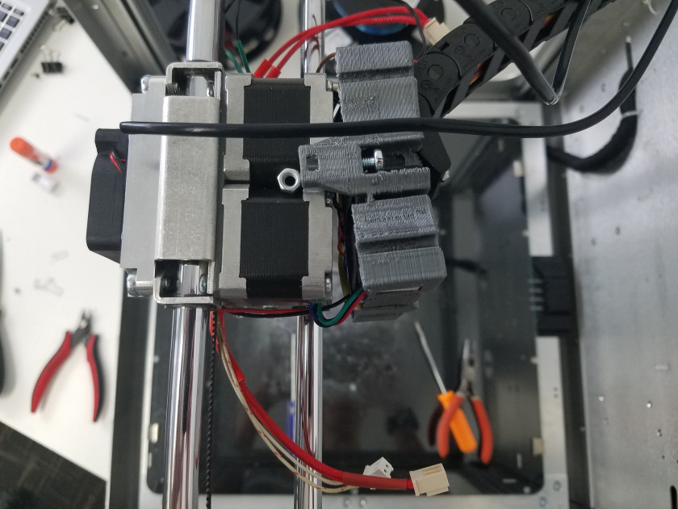
* Next, remove the connectors on the cable chain end from the 3D printed plastic part until you are left with just the old 3D printed cable assembly. 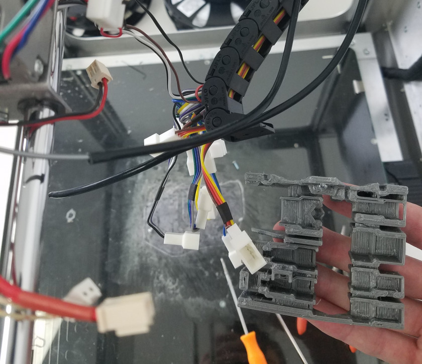
* 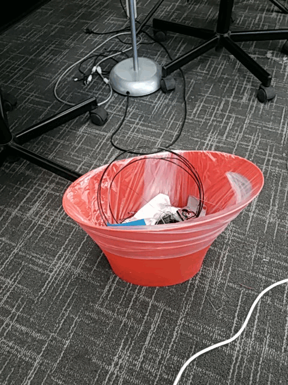

## Old Extruder Assembly Wiring

**This guide is for connecting the OLD extruder wiring assembly. Scroll up for the new wiring assembly!**

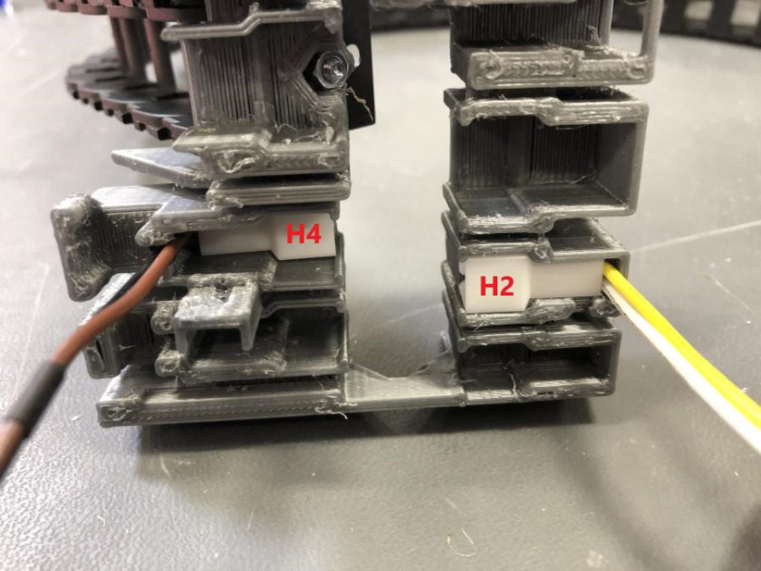

First, cable H4 is plugged in on the left and H2 on the right. These are both heater cartridge connectors. You can find the labels of the wires about 1 inch from the connector on black heatshrink.

Cable S8 is plugged in on the left and S6 on the right. These cables are PT1000 connectors.

P9 and P11 are plugged in according to the diagram. These connectors are for the nozzle and cold-section fans. Sadly, there is no system for which one of these is the nozzle fan or cold section fan. Pleass use caution when plugging these in as plugging the nozzle fan into the cold-section port will result in a fried nozzle fan. **It is best to test the connectors and ensure your wiring is correct before plugging in the fans.** You can either perform a continuity test by taking a multimeter and measuring the resistance between the two ends of the wire. Or you can measure the voltage on the connector when you turn on the Duet board. Remember that the 24V fan is connected to the Always-on port on the Duet board and the 5V is connected to a PWM controlled port. You will have to switch on your nozzle fan in order to measure the 5V in the connector. You can plug in your cold-section fan into both ports in order to determine which one is the cold-section connector.

Insert S4, this is an expansion cable and is not used for any electrical components \(yet\).

Plug in S2 according to the picture above. This is also an expansion cable and will be used for components in the future.

Place P4 and P2 in the housing according to the diagram above. These are extruder motor connectors.

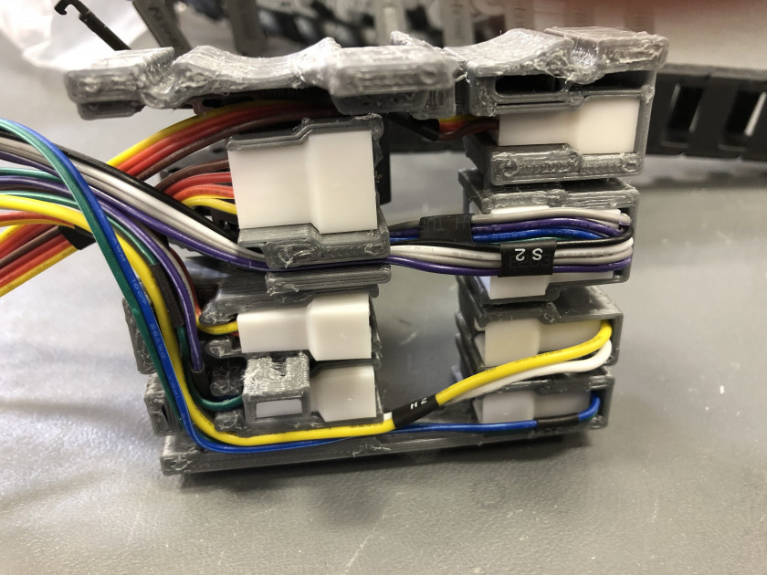

The image above depicts the cable routing prior to attaching the cable assembly onto the extruder carriage.

