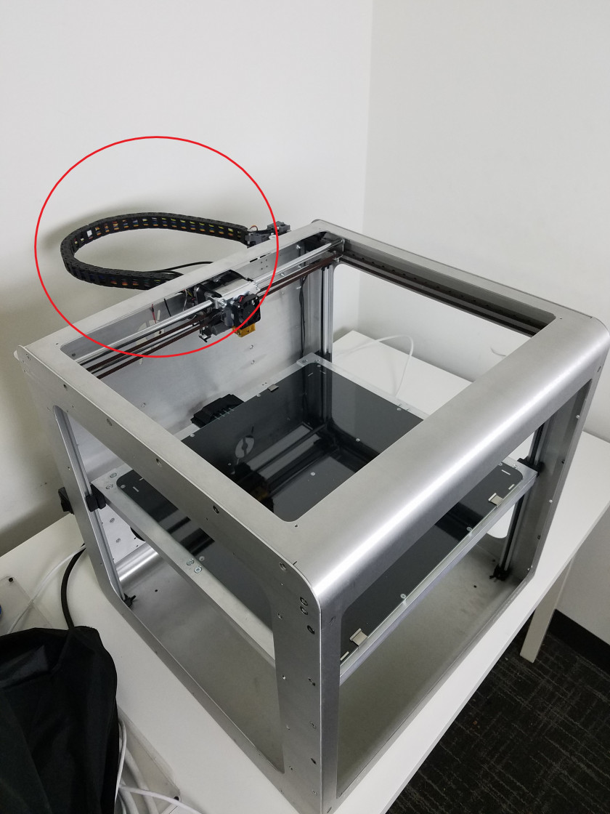
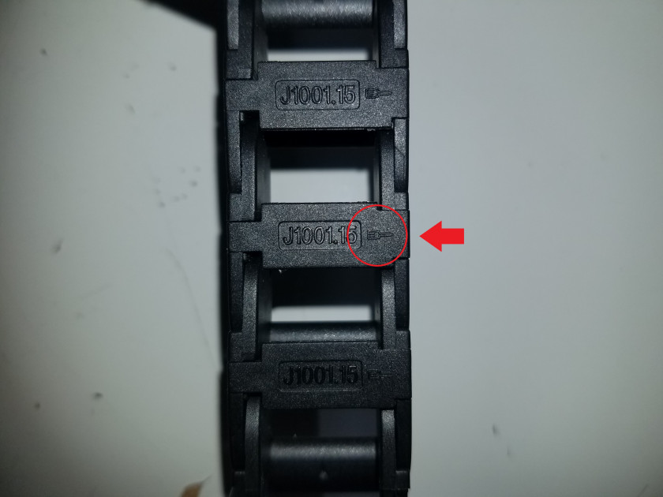

# Opening the Cable Chain

The Promega includes a cable chain to carry wires from the Duet Maestro to the extruder carriage. The cable chain is meant to be a flexible and mobile component that allows the extruder carriage to move around the entire build space of the Promega. It is possible that you need to open your cable chain to gain access to the wires inside. Follow the guide below for an explanation of the cable chain and how to open it.

#### Opening the Cable Chain

1. The cable chain runs from the back of the Promega to the extruder carriage. 

    

2. To open a segment of the cable chain you will need a flathead screwdriver. The width of the end of the flathead screwdriver should not be greater than 2.5mm.

    

3. Insert the flathead bit into the slot in the image below. The insertion slot will have a small indicator as is shown in the image below. Press down lightly and rotate around the bit to leverage the tab open. This should not require a lot of force.

    

    

    

4. Repeat this process for all the cable chain segments necessary. 
5. To close the cable chain segments, simply press the segment closed.

