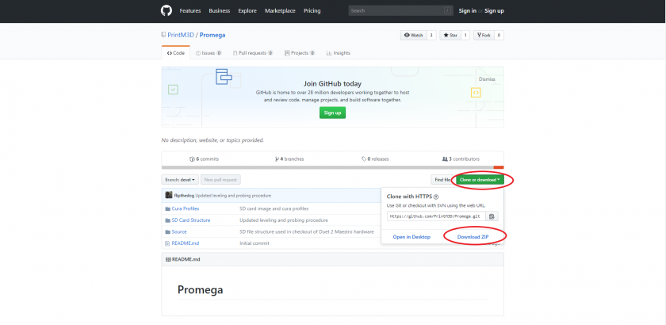

# Updating SD Card Structure

### M3D Release SD Card

The latest SD card files released by M3D can be found on the [M3D Github ProMega Repository](https://github.com/PrintM3D/Promega). Follow the steps below in order to download the latest version for your printer. Always be careful when downloading the latest version of the SD card files. New SD card files can cause unintended results such as flipped motor directions or wrongly configured heaters. **Always test all motors and heaters carefully before printing after downloading a new update.**

Read the [Accessing Your SD Card](http://promega.printm3d.com/books/user-manual/page/accessing-your-sd-card) for more help on getting to the SD card files.

Read the [SD Card Structure](http://promega.printm3d.com/books/user-manual/page/sd-card-structure) guide for more explanation on the files and directories on the SD card.

### Downloading the Update

Once you have found and opened the [M3D Github ProMega Repository](https://github.com/PrintM3D/Promega). Press the _Clone or download_ button circled below and then click _Download ZIP_. This will download a _.zip_ file of the repository. 

### Extracting the Folder

A _.zip_ file is a compressed folder. You will have to first extract the file before you can get to it's contents. Find the file you just downloaded and extract it into a folder. Right click the file and then select _Extract All_. This will move all the files in the compressed file into a folder. You can now access the new SD card files.

### Moving the Files onto the SD Card

**Back-up your SD card files before updating so you can always revert to your original settings**. Now that you have access to the files, locate the _SD Card Structure_ folder in the folder you just extracted. This folder will have two folders _Compound_ and _K'Tana_, select the folder based on what nozzle you currently have mounted on your printer. In both of these folders are the files you want to copy to your microSD card. This should be four folders: _sys, gcodes, macros_ and _www_. Plug in the microSD card into your computer with the microSD card reader and copy the files onto it. Your SD card should look like this. Using WinDiff or a similar program to distinguish differences between the latest SD card release and your files might be a good idea.

### Testing and Tuning

Once you have updated the SD Card files on the microSD card. Test all your motors and heaters one by one to ensure the new settings are compatible with your wiring and board. If you changed any settings in your previous configuration, you will have to add these settings and commands in your new updated version.

