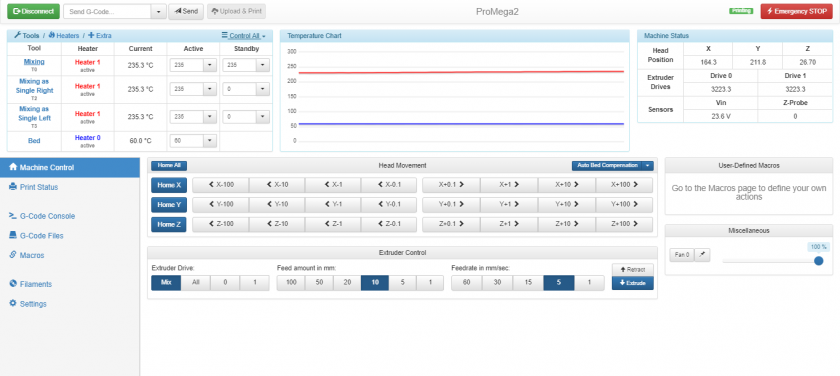
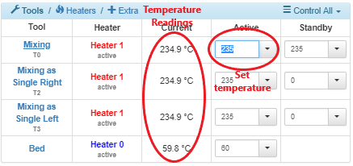
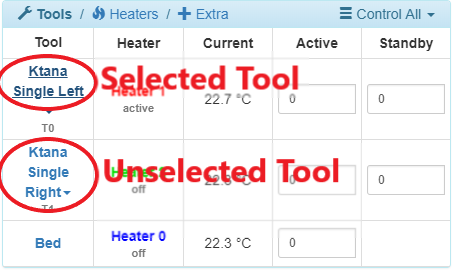
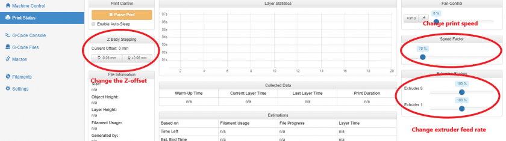
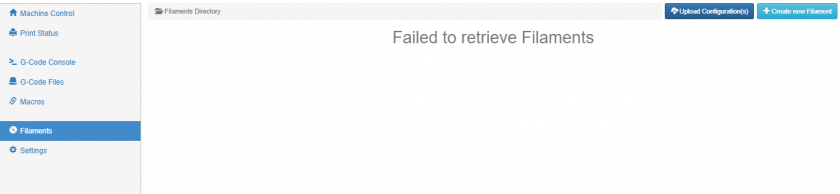

# Accessing Web Interface

The Duet Maestro allows control via the Duet Web Console. We highly recommend connecting to your Promega via your network so that you can make use of this! Follow the guide below to learn more about the Duet Web Console. If you have not yet connected your printer to your network, follow the [Network Setup](https://m3d.gitbook.io/promega-docs/getting-started/network-setup) guide.

## The Duet Web Console

The web console is divided into two halves. The top half features functions to monitor and analyze the status of your printer. The bottom half focuses on control of your printer and configuring its settings.

### Status

The status part of the web page indicates various readings to describe the current state of your printer.

**Tools & Temperature**

On the left half is a table that allows you to monitor the temperature of the different tools as well as the bed. The temperature readings are important to keep track of. With the table as well as the graph you can keep track of all the temperatures of the components of your 3D printer.A value of 2000 C for any of the components in this table indicates problems with a temperature sensor.

By clicking on the textfields of the tools in the table you can change the temperature of the tools. Press enter to update the temperature. You should see a slow increase in temperature. The _Active_ column represents the temperature of a tool when it is **selected**, the _Standby_ column represents the temperature of a tool when it is **not selected ,** but was previously selected. It is best to have a low standby temperature for a tool, so it does not heat up unexpectedly.

By clicking on the tool names in the _Tool_ column you can change your currently selected tool.

The temperature graph provides helpful insight of the temperature of your tools and bed over time. This can be helpful to spot oscillations in temperature, as seen in the image below, or heater faults and other issues.

**Machine Status**

The machine status tab includes the position information of the printer. The head position information displays where the printer currently thinks it is. This is very important to keep track of to minimize the risk of crashing the printer. The X, Y and Z values represent the different axes of the 3D printer. Normal values for these fields are listed below in this table.

|  | Axes Limits |  |
| --- | --- | --- |
|  | Max \(mm\) | Min \(mm\) |
| X - Axis | 388 | 0 |
| Y - Axis | 388 | 0 |
| Z - Axis | 377 | 0 |

The extruder drive values can vary greatly as you perform prints. The voltage in value is helpful as it can help you figure out electrical problems. Optimally it should remain near 24V when none of the printer components are running. The Z-probe value is important as well. This value will change whenever either Z-probe, the limit switch or the IR probe, is toggled. Testing the Z-probe before running probing or leveling commands \(such as `G30`, `G32` or `G29`\) is extremely important and can prevent crashes. When the Z-probe is not toggled the value should rest near 0.

### Control

In order to control your printer, the bottom half of the web console features 6 different tabs on the bottom left side with different features. These tabs allow you to visit different functions of the printer as well as send commands.

**Machine Control**

The Machine Control tab features different buttons in order to control different assemblies of the printer. This feature is helpful to load filament or move the extruder carriage to a specific point in the printer. Be careful with using these buttons as it can crash the printer. Remember the direction that you will send an assembly toward as you press these buttons. Pressing the positive Z buttons will send the bed downward, and pressing negative Z buttons will send the bed up.

**Print Status**

The print status tab is helpful when printing. It includes all kinds of information to analyze during a print. Use the Z Baby Stepping window to change the offset of the nozzle to the bed during a print. Use the Speed and Extrusion factors to change the speed and extrusion rate of the print. These settings can be very helpful to get the first layer to stick, but be careful as these settings can damage your print quality. Use the pause button to temporarily stop the print. Once you pause the print you can resume or stop the print. This screen will also display other statistics during a print such as layer time and length of filament used.

**G-Code Console**

The G-code console is a vital to an experienced 3D printing user. This tab allows you to enter any RepRap Firmware supported command. The printer will execute any command entered here and print feedback and errors. Visit the [RepRap Firmware G-Code](https://reprap.org/wiki/G-code) website to learn more about all possible G-codes. Be careful when entering G-code commands as the printer will execute whatever you command you send it.

**G-code Files**

This tab is used to upload G-code files to the Duet board. Use the _Upload G-code File\(s\)_ button in order to upload a _.gcode_ file to the printer in order to print it. Click on an uploaded file in order to print it. You also have the ability to create directories here in order to organize your files. This is a great idea if you have a 8Gb microSD card.

**Macros**

User defined macros are stored in this tab. Use the dark-blue _Upload Macro File\(s\)_ button to upload _.gcode_ macro files. Macros are useful when you find yourself repeatedly performing a sequence of G-code commands. You can easily put these commands into a macro file and upload it here. Click a macro file in order to execute it.

**Filaments**

Utilize this tab in order to define printer filament settings. This can also be performed in Slicer Software.

**Settings**

**This tab is one of the most important**. This tab allows you to change the _sys/_ directory in your SD card and define other user settings. Whenever the guides in the future reference a change that is necessary to the system files such as _config.g_ or a _machine.g_ file, you can change the files in the settings tab. The Settings tab includes more tabs:

* General: Includes firmware and web console information
* User Interface: Change the look and feel of the Duet Web Console
* List Items: Includes web page suggested options
* System Editor: A very useful tab to change files in the _sys/_ directory of your microSD card. **You will find the** _**config.g**_ **file here as well as other system G-code files.**
* Machine properties: Defines properties of the different drives \(motors\) of the printer.
* Tools: Defines the properties of the tools.

## Additional Resources

* Duet3D Wiki: [Duet Web Control Manual](https://duet3d.dozuki.com/Wiki/Duet_Web_Control_Manual#main)
* [Duet Web Control GitHub Repository](https://github.com/chrishamm/DuetWebControl)

Continue on to the [SD Card Structure](https://m3d.gitbook.io/promega-docs/getting-started/sd-card-structure), the next chapter in the [Getting Started](https://m3d.gitbook.io/promega-docs/getting-started) guide.

