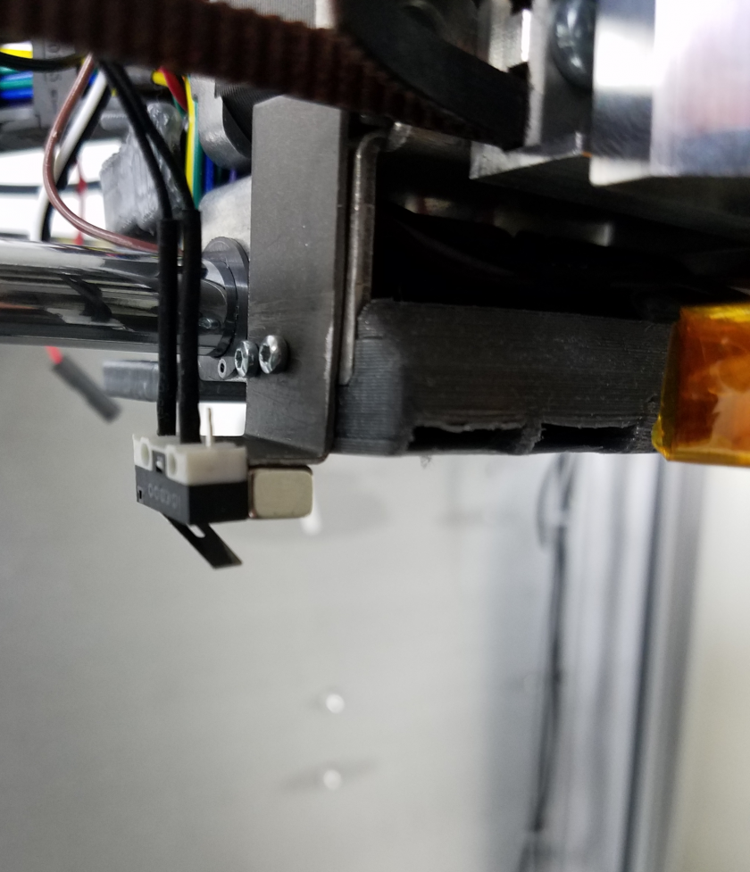

# First Time Success Protocol

**In order to ensure your machine is in working order upon arrival, follow these steps in order. Failure to follow these steps or skipping steps can damage the Promega \(and might void the warranty\). Additionally, it could cause harm to the user.**

Follow this guide step by step to print for the first time successfully, use the other guides located on this website for assistance.

1. Open the box, from side labeled 'top'
2. You will see flat cardboard with invoice + microSD card taped saying 'Stop, watch video on card first'.
3. Insert the microSD card into your computer and watch the included video for a message from M3D's CEO Mike Armani
4. This SD card also contains all the configuration files for the printer. In order for the Duet Maestro control board to be able to connect to your network you need to insert an available IP address in the config.g file. This configuration file is located in the directory _sys_ on the SD card. In _config.g_, find the G-code command `M552 Pn S1` under the section “NETWORKS \(PROLOGUE & COMMUNICATIONS SECTION\)”. \(Note: Newer versions of the microSD card will have the network settings located in _machine\_access.g_\). Where `n` is an IP address. In order to connect to a network, you can utilize DHCP to get asssigned an IP address by your router, or you can insert a unique IP address. **If you are unfamiliar with these network settings, we recommend enabling DHCP**. By changing the IP address to `0.0.0.0` DHCP will be enables and the board will be assigned an IP address by your router. The line should then look like this: `M552 P0.0.0.0 S1`. As the other option, you can set this parameter to a static free IP address on your network like “192.168.1.216” or “10.0.0.212”, this address depends on your network. If you enable a static IP address connection the `M552` command can look like this: `M552 P192.168.1.112 S1`.
5. If you choose the DHCP option, you will have to find and set the machine name using the M550 command located in the config.g file. This command is in the same section as the M552 command. Change the name of the printer to somethings you prefer and then save the config file. Remember that the syntax of the M550 command requires a P parameter followed by the name of the printer. So if you wanted to name your printer _unicorn_. You would have to enter the following command "M550 Punicorn". You can connect to your printer, if you used DHCP, using this machine name followed by a forward slash "/", and entering this name into your browser URL textfield. For example, _unicorn/_.

   **For more help connecting to your printer follow the** [**Network Setup**](http://promega.printm3d.com/books/user-manual/page/network-setup) **guide**.

6. Once you are done configuring your settings you can save this file and insert the SD card into the Duet board.
7. Make sure the printer is switched off \(blue switch\) and plug in the power cord. Check the wiring of the Duet board to ensure that nothing seems out of place.
8. Plug in the ethernet cable.
9. Switch the printer on with the blue switch. Now ensure that the Duet LEDs for 3.3V, 5V and Vin on the top left of your Duet board are on. Also verify that the ethernet LEDs light up.

   

10. You should now be able to connect to your printer with the IP address you just defined. Enter your IP address into a browser. This could be “192.168.1.216” if you defined it as such with a command like “M552 P192.168.1.216 S1” in your config.g file. You should now see the Duet web interface. If you enabled DHCP by entering the `M552 P0.0.0.0 S1` command, you can connect to your machine with the machine name followed by a forward slash.
11. Next, we will make sure that the bed is mechanically level. While you Promega was shipped it is possible that the Z-platform became misaligned. In order to fix that you will have to skip belt teeth in order to level your bed. Gauging whether you need to mechanically level your bed is easy. Lift up all the way to your nozzle. Hold the bed as pictured below and **gently and slowly** pull up.

    

12. Lift the bed up to the nozzle and look at the height of the bed through the front of the printer. You should see a view as pictured below. Observe the distance between the black, 3D printed Z-sliders and the top belt clamps. The distance between all 4 corners should be the same to about 2mm.

    

13. If one corner of the bed needs to be adjusted upwards, move the bed down. Then, gently pull up on the corner that needs to be adjusted until the belt skips, this should happen with a loud click. Repeat this process in the different corners until your bed is level. Auto-bed leveling compensation as will be described and enabled in a later step, can compensate for the rest of the leveling error. If you need more help with leveling your bed read the [Belt Tensioning and Mechanical Leveling](http://promega.printm3d.com/books/user-manual/page/belt-tensioning-and-mechanical-leveling) guide.
14. Under Tools/Heaters/Extra, double check that your Tool and bed temperature are around room temperature. If any of these values are not around room temperature, this could indicate an improperly wired or broken thermistor.
15. Move the extruder assembly to center of the printer by hand. Make sure that nothing is in the printer build space or underneath the bed. The printer comes with foam spacers placed underneath the bed, remove them before homing. Then press the “Home All” button located in “Machine Control”. This will home the printer. **Your motors are now powered and you will not be able to move the system by hand unless you turn the system off or disable the motors.**
16. Move the extruder to X200 Y200, which is the center of the printer, by entering the command “G1 X200 Y200”.
17. Move the bed up to Z20 by entering the command “G1 Z20”.
18. Next, you have to deploy the z-probe by moving the limit switch with magnet and attaching it to its mount. Future versions have a deployable Z-probe that slides up and down.

    

    

19. Ensure that the limit switch is working by pressing and holding it in order to observe the change of the z-probe value in the web interface from 0 to 1000. This is indicated in the image below.

     

20. Send the command `G29 S2`. This will disable bed leveling to prevent the bed leveling compensation from conflicting with other Z-axis settings.
21. Send the command `G31 P999 X-43 Y25 Z0.0`, this will set your Z-probe offset to 0.
22. Run the command "G30", this will move your bed toward the switch in order to accurately determine the position of the bed and update your Z-axis value to your Z-probe offset when the limit switch is triggered. 
23. Send the command `M564 S0`, this will temporarily disable axis limits.
24. Retract your Z-probe.
25. Jog the bed up to the nozzle with the buttons in the _Machine Control_ tab on the Duet Web Console.
26. Once your bed is touching the nozzle, read your Z-value in _Machine Status_. This Z-value will be your new Z-probe offset.
27. Send the command `G31 P999 X-43 Y25 Zn` where `n` is your Z-value from the previous step.
28. Move the bed down to Z20 with the command `G1 Z20`.
29. Deploy your Z-probe.
30. Send the command `G30`.
31. Your Z-axis should now be zeroed correctly.
32. In order to check that this worked, we recommend you remove your z-probe and go to Z0 incrementally with the buttons in machine control. When the bed is touching the nozzle, the Z-value in _Machine Status_ on the Duet Web Console should be near 0. If you observe that the z-axis was not homed correctly you could try repeating the steps above. If this is still not satisfactory, you can probe the bed by manually jogging the bed to Z0 and zeroing your z-axis with the G92 Z0 command. For more help on Z-probing correctly visit: [Calibrating the Limit Switch](http://promega.printm3d.com/books/user-manual/page/bed-leveling-probing#bkmrk-calibrating-the-limi)
33. Next you have to heat your bed. Enter 60 in the web interface under bed as seen in the image below. This will start heating up your bed, this process could take a few minutes.

    

34. In order to disable any previous bed leveling enter G-code M561 and G29 S2
35. When your bed has reached the set temperature, ensure that your z-probe is deployed and run the command “G29” which will start bed leveling as defined in the configuration file. This bed leveling process could take a while as it probes many points on the bed.
36. Once bed leveling is completed, you will see the heightmap displayed on your screen. You can find the heightmap.csv file under Settings &gt; System Editor. 
37. Running G29 automatically enables bed leveling. Next you are ready to perform an extrusion test.
38. Move your bed down to about Z200 with the command “G1 Z200” and center your extruder carriage by entering the command “G1 X200 Y200”. You can also combine them with “G1 X200 Y200 Z200”. Now remove your z-probe.
39. Heat up your nozzle by selecting tool 0 with the command “T0” and entering the temperature in the text field for tool 0. For printing ABS-R we recommend a temperature 230C.
40. When your nozzle is at temperature. Go to the tab labeled “Machine Control” on the web interface. Here, you can find a box labeled extruder control.

    

    **Remember to load filament into both extruders if you are using the compound nozzle!** Otherwise the filament will be pushed out of the other extruder. If you only want to use one side of the compound nozzle use the PC plug to plug the other hole. Select the options, Mix \(if you have a compound nozzle\), or 0 or 1 if you have a K’Tana for Extruder Drive. Feed amount should be set to 10 mm and feedrate should be 5 mm/s. Then press extrude and feed the filament into both ports at the same time. Keep pressing extrude until filament comes out of the nozzle. NOTE: 5 mm/s is a high feed rate for normal printing so the extruder may skip. If the extruder starts skipping, you should be able to hear a thud sound, in which case reduce your feedrate to 1. You should see a steady stream of filament coming out.

41. Remove any printed or oozing filament. If you want, you can apply glue to your bed now. Watch the hot nozzle as you apply glue.
42. Move the bed to about Z30 “G1 Z30”
43. You are now ready to start a print. You can find a g-code file to print with the right settings at: [G-code file](https://drive.google.com/open?id=1PK1snlv7iPuX1XC8wjrwxUQiDmN8HcHH). Download this .gcode file of a Chess Rook by _Cordavi_ onto your computer.
44. In order to start a print you have to upload the g-code of the print file. The Upload G-Code Files button is under the G-Code Files tab. Notice the dark blue button in the top right of the image below. Path to the file you downloaded previously. This file will now start uploading.

    

45. When the file is uploaded, click the file and it will prompt a confirmation for you to start printing. Press _yes_ in order to start printing.
46. Under the “Print Status” tab you can control your printer while it is printing. If you are an experienced user, feel free to tune the settings of the print such as extrusion, or baby step the z. Be careful as it could mess up your print.

    

47. If your print fails, you can press the cancel button in order to stop the print. Then clear the print from the bed carefully and start the print again. If you feel you need additional assistance or suspect the printer has been damaged in shipping please contact our support team here [M3D Support](https://support.printm3d.com/submit_ticket)
48. Once the print completes, the bed will lower automatically and the system will execute stop.g which turns off the bed and nozzle.

Now that you have seen success, progress further by learning from these materials: 1. [Launchpad Website](https://store.printm3d.com/pages/promegalaunchpad) 2. Read more articles on the ProMega Docs Website!

