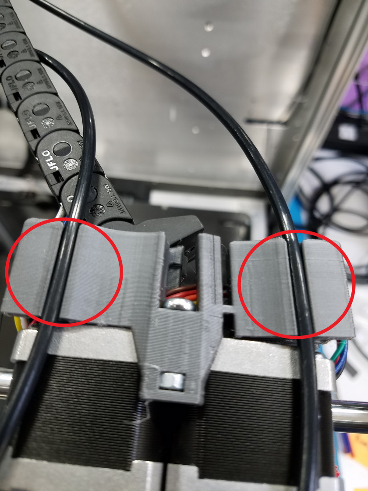
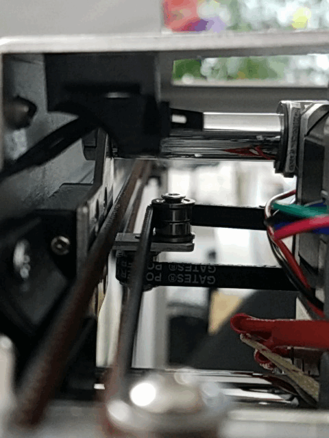
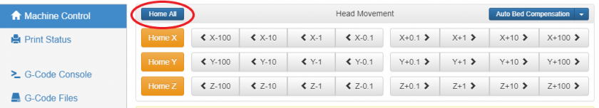

# Homing the Printer

Before you start printing or moving any component of the ProMega, we recommend homing the printer. Follow the steps below in order to home your printer. Prior to homing your printer check that the gantry and bed are able to move freely and access the limit switch.

## Printer Axes

In order to control the Promega it is important to understand the axes of the printer and their orientation. As you can see in the image above the X axis spans across the back of the printer from right to left if you are facing the printer. The Y axis is pointing from the back to the front and the z-axis is pointing down. Remember this as you jog the printer with the _Machine Control_ tab in the [Duet Web Console](https://m3d.gitbook.io/promega-docs/getting-started/accessing-web-interface).

The origin of this coordinate frame is in the top-right-back corner of the printer. This can be seen at the intersection of the three red axes of the 3D printer in the image above.

## The Homing Process

Follow the steps below to correctly home your printer.

### Checking the path

1. To ensure that the printer homes correctly, we recommend moving the coreXY gantry manually to the limit switches located in the back right corner when the motors are not powered. If you need to unpower the motors you can use the G-code command `M84` to stop the idle hold of the motors. Watch out as this will disable **all** motors, and could cause the bed to drop. Remove all items from inside of the printer before homing. The PTFE filament tubes on the extruder carriage cable assembly should be clicked in place \(shown in the image below\), or they could cause problems when homing the X-axis.

   

2. Move the coreXY gantry against the Y-limit switch, listen for the click of the limit switch. **Warning: when manually moving the gantry be careful not to move the gantry past the limit switches as you could break the limit switch**.

   

3. Then move the coreXY gantry against the X-limit switch.

   

4. Make sure the bed is resting on the Z-limit switch and that there is nothing underneath the bed.

### Homing the Printer

1. You are now ready to home the printer. There are multiple ways to initiate the homing process. You can press the _Home All_ button located in the _Machine Control_ tab of the Duet Web Console. You can also send the G-code command G28. These two operations will both execute the same file _homeall.g_, located on the microSD card.

   

2. The coreXY gantry should move toward the Y-limit switch located at the back of the printer first. Once it has hit that limit switch, it will move toward the x-limit switch. Next, the bed will lift itself up and back down slowly, until it has hit its limit switch.
3. Now all axes are homed. Remember that your motors are now powered and you will not be able to move any of the assemblies by hand. Use the `M84` command to temporarily disable idle hold current on your stepper motors, allowing you to move the motors. Your \(0,0,0\) is located at the back-right-top of the printer. Before moving the Z axis to 0, we recommend using the z-probe to accurately zero the z-axis.

Continue on to the [Heating the Bed and Nozzles](https://m3d.gitbook.io/promega-docs/getting-started/heating-the-bed-and-nozzles), the next chapter in the [Getting Started](https://m3d.gitbook.io/promega-docs/getting-started) guide.

