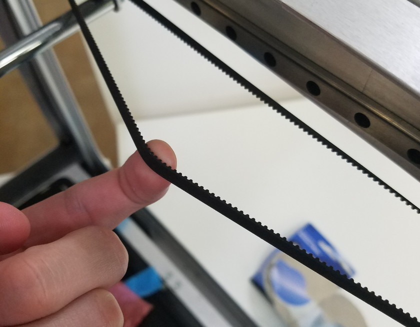
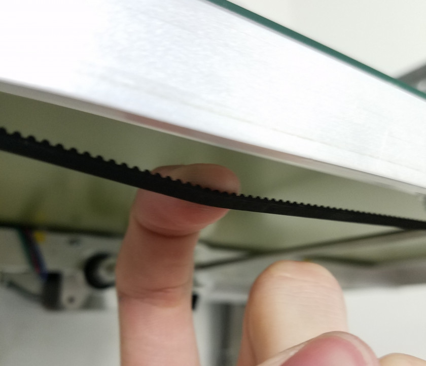

# Mechanical Check

WORK IN PROGRESS!!

Your Promega has probably had a long journey to arrive at your front door. Follow this guide to ensure that your Promega arrived in one piece and is ready to print. First of all, check for any nuts and bolts inside the Promega, it is possible that screws loosened and fell.

## CoreXY

**Belt Routing**

All the belts should be riding on bearings or driven by pulleys. If the belt tension became too low during the trip it is possible that one of the belts moved from its desired place. If you notice a coreXY belt which is not seated on a bearing or pulley. Follow the [Repairing CoreXY](http://promega.printm3d.com/books/user-manual/page/repairing-corexy) guide.

**Belt Tension**

Check the belt tension in the CoreXY, you can do this by feeling the force on the belt as shown in the picture below. The first picture shows a tight coreXY belt, the second picture a loose belt. Once you release the belt, it should spring back and vibrate. If this does not happen, it might be another indicator of a loose coreXY belt.

If your CoreXY belt system is loose follow the [Belt Tensioning Guide](http://promega.printm3d.com/books/user-manual/page/belt-tensioning-and-mechanical-leveling#bkmrk-corexy-assembly).

## Z-Platform

**Belt Routing**

Confirm that the belts are properly mounted in the Promega. Check that all four belts are held in place at the bed of the 3D printer by belt clamps or screws. Check that the belts go through the 15x15 aluminum extrusion rail, to the pulley and to the top belt clamps.

**Belt Tension**

To confirm that the belt tension in each of the Z-sliders is appropriate, feel the tension of the belt tension under the Z-platform as shown in the picture. Pull down softly on the belt in order to feel the tension. You should be able to strum the belts slightly. Try to maintain a similar belt tension between the four different corners.

## Cable Chain

Continue on to the [Accessing Your SD Card](http://promega.printm3d.com/books/user-manual/page/accessing-your-sd-card), the next chapter in the [Getting Started](http://promega.printm3d.com/books/user-manual/chapter/getting-started) guide.

