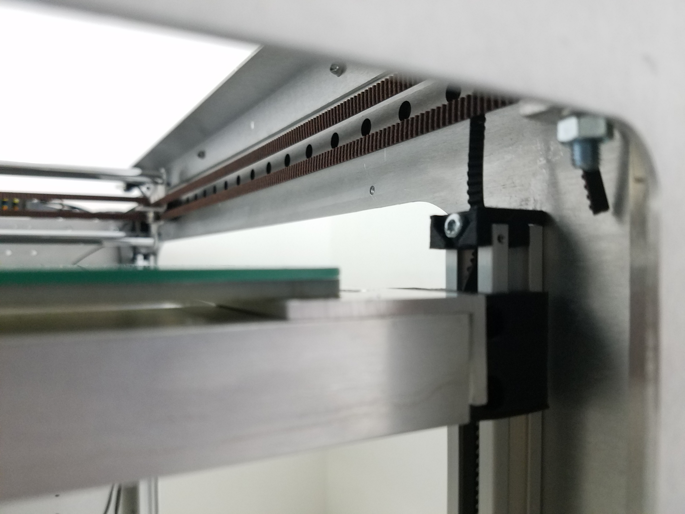
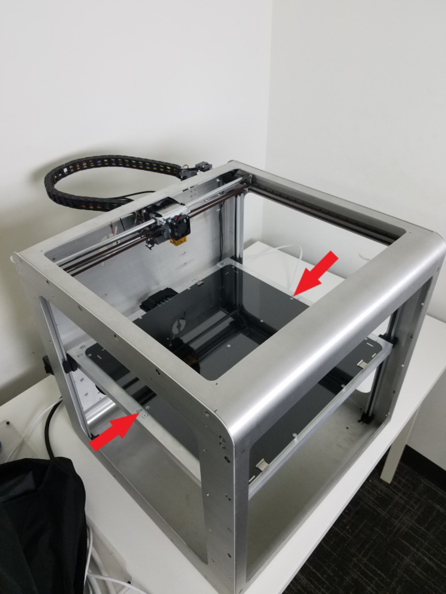
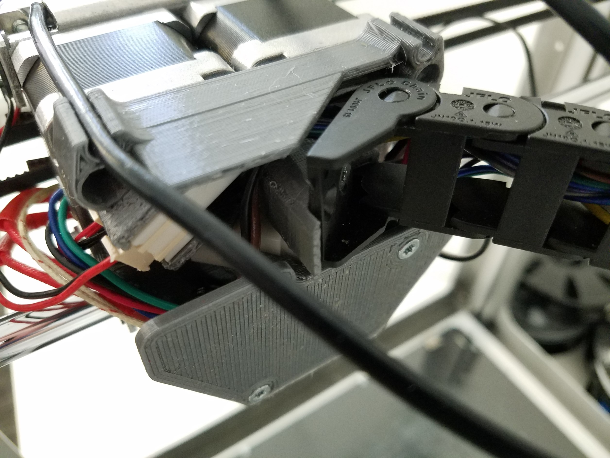
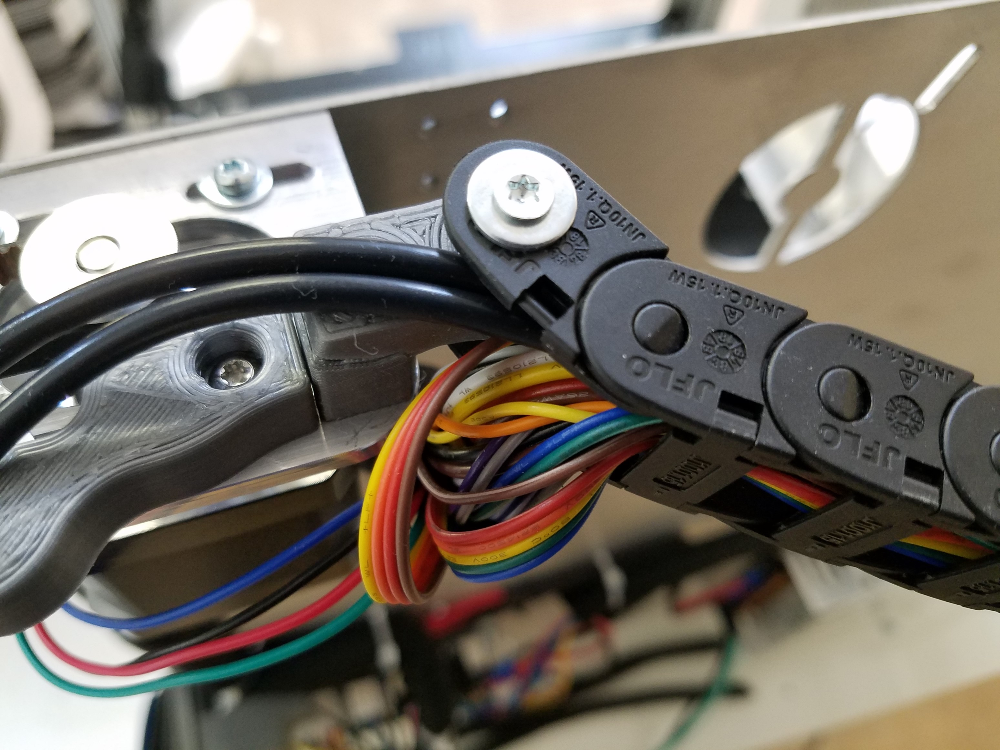

# Mechanical Check

First of all, check for any nuts and bolts in and around the frame. It is possible that fasteners became loose during shipping.

## CoreXY

### **Belt Routing**

All the belts should be riding on bearings or driven by pulleys. If the belt tension became too low during the trip it is possible that one of the belts moved from its desired place. If you notice a coreXY belt which is not seated on a bearing or pulley. Follow the [Repairing CoreXY](https://m3d.gitbook.io/promega-docs/repair-guides/repairing-broken-belt-clamps) guide.

### **Belt Tension**

Check the belt tension in the CoreXY, you can do this by feeling the force on the belt as shown in the picture below. The first picture shows a tight coreXY belt, the second picture a loose belt. Once you release the belt, it should spring back and vibrate. If this does not happen, it might be another indicator of a loose coreXY belt.

If your CoreXY belt system is loose follow the [Belt Tensioning Guide](https://m3d.gitbook.io/promega-docs/maintenance-guides/belt-tensioning-and-mechanical-leveling#corexy-assembly).

## Z-Platform

### Z-sliders

The Z-sliders are 3D printed parts that allow the Z-platform to ride along the four aluminum extrusion on the corners. Check that the Z-sliders are properly seated on the aluminum extrusion.

### Lifting the Bed

Next, we will checkout the Z-assembly. During transport it is possible that your Z-assembly became misaligned. If you cannot lift your bed as outlined in the steps below because the bed is too far off level, follow the steps in the [Leveling the Bed](https://promega.printm3d.com/repair-guides/repairing-broken-belt-clamps#leveling-the-bed) section.

1. Grab your bed from two points opposite from each-other, as shown in the image below.   
2. Gently and slowly lift the bed up. Never pull up the bed too fast. Remember that moving motors by hand will generate a current and power your printer. While you are lifting the bed you will notice your Cold-section fan spinning. The board can tolerate a significant amount of voltage, but lifting the bed up too fast can fry it.

### **Belt Routing**

Confirm that the belts are properly mounted in the Promega. Check that all four belts are held in place at the bed of the 3D printer by belt clamps or screws. Check that the belts go through the 15x15 aluminum extrusion rail, to the pulley and to the top belt clamps.

### **Belt Tension**

To confirm that the belt tension in each of the Z-sliders is appropriate, feel the tension of the belt tension under the Z-platform as shown in the picture. Pull down softly on the belt in order to feel the tension. You should be able to strum the belts slightly. Try to maintain a similar belt tension between the four different corners.

## Cable Chain

Next we will check the cable chain of the Promega. The cable chain should be attached at the back of the extruder on the wiring assembly as well as on the back right of the printer. Check that the cable chain is properly attached on both of these points.

 

