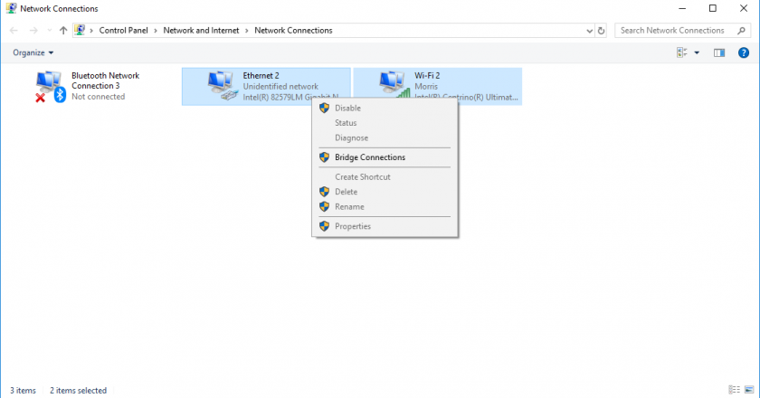

# Network Setup

Connecting to your Promega via your local network is very useful as you get access to the Duet Web Console. You can connect your Promega to your local network via the Ethernet port on the Duet Maestro. Once the network settings are properly configured, you should be able to connect to the Duet board and access the Duet Web Console. In order to configure your network settings you will need to edit files on the microSD card. The Promega microSD card has a configuration file called _config.g_ in the _sys/_ folder. This file contains all the necessary information in order to connect to your network. 

The pre-configured Promega network settings, which are loaded onto every SD card when the printer goes out our door, utilize DHCP in order to get an IP address from your router. This should allow your printer to connect automatically to your network. If this is successful, you should be able to enter the machine name into your browser tab followed by a forward slash "/". This could look like this: **my\_promega\_name/**. If you are connecting to your Promega for the first time, you should be able to enter **promega/** into a browser URL textfield in order to connect. 

It is also possible to set a static IP address for your Promega, this will allow you to connect to that IP address to connect to your printer. For example, a static IP address could be the following: _192.168.1.144_ or _10.0.0.214_. However, the type of IP address is dependent on your network. Follow the steps below in order to configure your network settings using microSD or USB. **We recommend using the SD option as it requires less work and setup.** If you are unable to connect your Promega to your internal network by directly connecting an Ethernet cable to the router, follow the Network Bridging section below. Network bridging will allow you to access the Duet Web Console with the Ethernet cable directly connected to your computer.

## Connecting to the ProMega via SD

1. Before removing your microSD card from your printer, we recommend you turn off your printer. This reduces the risk of damaging your Duet Maestro. Once the printer is powered off, press the SD card into the board in order to remove it. For more guidance on the SD card check out [this guide.](https://m3d.gitbook.io/promega-docs/getting-started/accessing-your-sd-card)
2. Insert the microSD card into your computer with the microSD card reader. Open the _machine\_access.g_ file. This file will be in the _sys/_ folder. It is best to open the file with a text editor like [Notepad++](https://notepad-plus-plus.org/download/v7.5.6.html) or WordPad \(Default Windows Accessory\). The default Windows Accessory _Notepad_ is not recommended as it does not separate the G-code commands into individual lines.
3. There are two options for configuring your network: DHCP and static IP. If you utilize DHCP, your network router will assign the control board an IP address. You will then be able to connect to the printer using the printer name you define in the configuration file. **DHCP is the recommended option if you are unfamiliar with networking.** Using a static IP means that you give the Promega a unique and free IP address on your network. You will then be able to connect to the Promega by entering that IP address into a browser tab. Choose the tab below \(DHCP or static IP\) depending on your choice.



Complete these steps if you want to connect to your Promega using the DHCP option.

a. Open the file _machine\_access.g_ and find the `M550` command located in this file. The `M550` command sets the machine name, this command syntax requires a P parameter before the machine name. Therefore, if you wanted to name your printer _unicorn_ you would type `M550 Punicorn`. Change the printer name to something you prefer, remember this name as you will use it to connect to your printer.

b. Find the `M552` command in the _machine\_access.g_ file. The `M552` command sets your IP address and enables or disables the network. In order to set your network setting to DHCP, the following command should be entered: `M552 P0.0.0.0 S1`. The P parameter allows you to define an IP address, entering `P0.0.0.0` enables DHCP. The S parameter enables \(`S1`\) or disables \(`S0`\) network, because you are setting up your network you should set the parameter to `S1`.

c. Ensure that the other `M552` command is commented out!

Your _machine\_access.g_ file network settings for connecting to a network using DHCP could look like this:

```text
 ; machine_access.g
 ; June 29, 2018

 ; Set the machine name and IP address in here

 M111 S0                       ; Debugging off
 M550 Punicorn                 ; Set machine name, in this case typing unicorn/ would connect you to the printer

 ; M551, No Machine Password
 ; M540 PBE:EF:DE:AD:FE:ED     ; Set MAC address, this can be used to assign a given IP in the DHCP
 M552 P0.0.0.0 S1             ; Use this to enable DHCP
 ; M552 P192.168.1.112 S1     ; This would set a static IP address but it is commented
```

In the example above your machine name would be _unicorn_. Continue to the step below.  



**Static IP Address**  
Complete this if you want to connect to your Promega with a Static IP address.

a. Find the network section in the _machine\_access.g_ file. Find the `M552` command. This command sets your IP address and enables or disables the network. In order to set your network setting with a static IP the following command should be entered: `M552 Pnnn S1`. Where `nnn` is your preferred IP address. Your IP address depends on your local network. It could be in the form of \(_192.168.1.216_ or _10.0.0.216_\). The S parameter enables \(`S1`\) or disables \(`S0`\) network, because you are setting up your network, and want it enabled, you should set the parameter to `S1`.  
b. Ensure that the other `M552` command is commented out!  
  
Your _machine\_access.g_ file network settings for connecting to a network with a static IP address could look like this:  


```scheme
 ; machine_access.g
 ; June 29, 2018

 ; Set the machine name and IP address in here

 M111 S0                       ; Debugging off
 M550 PPromega                 ; Set machine name, type promega/ in your browser!

 ; M551, No Machine Password
 ; M540 PBE:EF:DE:AD:FE:ED     ; Set MAC address, this can be used to assign a given IP in the DHCP
 ; M552 P0.0.0.0 S1             ; Use this to enable DHCP, in this case commented
 M552 P192.168.1.112 S1        ; Set Static IP address and enable networking
```


  
In the example above you should be able to connect to your printer by entering the IP address 192.168.1.112 in your browser tab.  
  
If you want to find out the structure of your internal IP address, open a command prompt on a computer connected to the same network as the promega and enter the command `ipconfig`. \(Open a command prompt by pressing _Windows Key_ + _R_, type _cmd_ and press _Enter_\). This will print your network settings and status, look for the "IPv4 Address" number. That number represents an internal IP address on your network. Of course this IP address is occupied by your computer and therefore not a valid IP address for your Promega!   
  
Continue to the step below.



1. When you have made the necessary changes to your network settings, save the _machine\_access.g_ file and safely eject the SD card. Insert the SD card back into the Duet board. Ensure that the Ethernet cable is connected properly to the Duet board and turn the board back on. It will take a while for your printer to boot and connect to the network \(~30 seconds\). When your Ethernet cable is properly connected to the board, the green LED should be flashing and the yellow LED should be solid.  
2. Once your printer has had the time to start up, open a browser tab on a computer **connected to the same network as the printer**. In the browser URL textfield enter:
   * Your printer name followed by a forward slash "/" if you used DHCP. For example, `unicorn/`, if you named your printer "unicorn" \(nothing wrong with that!\).
   * Your printer IP address if you used a static IP address with the M552 command. It could look like this `192.168.1.216`.
3. If the connection is successful the Duet Web Console should be shown. You have completed the network setup.

**Continue on to the** [**Accessing Web Interface**](https://m3d.gitbook.io/promega-docs/getting-started/accessing-web-interface)**, the next chapter in the** [**Getting Started**](https://m3d.gitbook.io/promega-docs/getting-started) **guide.**

**Network Bridging**

If you are unable to connect your ProMega to your internal network it is possible to use the ethernet cable to connect the printer directly to your computer. In order to do this, complete the _Connecting to the Promega via SD: Static IP_ section, remember the static IP you give the printer, but instead of connecting the ethernet cable to your network, connect it to your computer and follow the guide below.

**Windows**

1. Open Network Connections, you can do this by opening the _Control Panel &gt; Network and Internet &gt; Network and Sharing Center &gt; Change adapter settings_

   

2. Once you have the _Network Connections_ window open. Here you will see your network adapters. The ethernet adapter represents your connection to the Duet board. Find your current network adapter, presumably a WiFi adapter. Ctrl + click both the Ethernet adapter as well as the current network you are using. Then right click on one of the selected adapters and select _Bridge Connections_.

   

3. This will create a new Network Adapter called _Network Bridge_. You should now be able to connect to the ProMega with the static IP address you determined earlier. Enter the static IP address into a browser URL textfield.

Continue on to the [Accessing Web Interface](https://m3d.gitbook.io/promega-docs/getting-started/accessing-web-interface), the next chapter in the [Getting Started](https://m3d.gitbook.io/promega-docs/getting-started) guide.

## Configuring Multiple Devices to the Same Network

If you are adding multiple different Promegas to the network it will change the procedure. This is because a network will require a unique machine name or IP address in order to work.



If you are using DHCP you will have to give the two different Promegas different unique machine names with the`M550` command. By default the Promega will be called Promega with `M550 PPromega` , so you will have to open _machine\_access.g_ and change the `M550` .



If you want to configure multiple Promegas with static IP addresses you will have to give the Promegas each a unique IP address that is free on your network with the `M552` command. The machine name does not have to be unique.



Continue on to the [Accessing Web Interface](https://m3d.gitbook.io/promega-docs/getting-started/accessing-web-interface), the next chapter in the [Getting Started](https://m3d.gitbook.io/promega-docs/getting-started) guide.

For additional help connecting to the printer via USB and Network setup, visit the following links:

1. [Duet3D Network Setup](https://duet3d.dozuki.com/Guide/1.%29+Getting+Connected+to+your+Duet/7)
2. [RepRap Firmware G-Code Wiki](http://reprap.org/wiki/G-code)
3. [M3D Support](https://printm3d.com/support)
4. [Duet Forum](https://forum.duet3d.com/): For Duet and RepRap firmware specific questions

