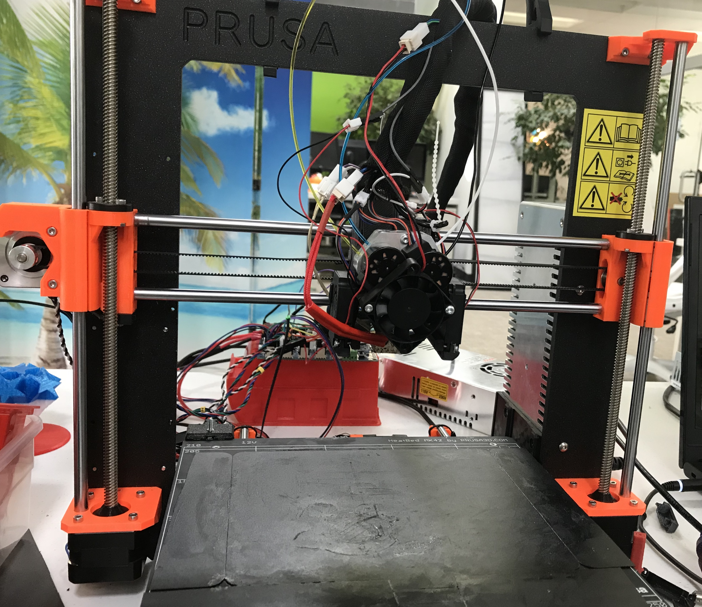

# Mounting the Hardware

The QuadFusion is a versatile 3D print head, so it is very likely that it will be able to adapt to whatever printer you have at home. At M3D we have mounted the QuadFusion on many different types of printers. The following guide will show you how we mounted the QuadFusion's hardware on each of those printers. 

## Fan Mounts

The first thing that must be understood is that based on the printer you have, you may need a certain type of fan mount. The fan mounts on the ProMega will be different than those on the Crane, and those on the CR-10S. So, we will also be providing the \(\_\_\_\_\_\_\_\) for these fan mounts to help you properly attach your QuadFusion to your printer.

**Types of Fan Mounts:**

Crane Fan Mount

ProMega Fan Mount

Basic Fan Mount

You will need...  
- 12V fan \(x2\) **\(Look at the picture below to make sure you have the correct type of fan\)**  
- 24V fan \(x1\)  
- 2mm Torx screw \(x4\)  
- 3mm Cone-Head Torx  screw \(x2\)  
- Fan Mount  
- Fan Ducts 

Tools...  
- T-10 Torx Screwdriver  
- T-6 Torx Screwdriver


This fan mount is what was typically used when mounting the QuadFusion on to non-M3D printers. 


## Printers:

M3D Crane  
M3D ProMega  
Prusa i3 MK2S  
CR-10S  
MakerBot Replicator 2X

### Prusa i3 MK2S

The Prusa i3 MK2S requires an entirely new extruder mount in order to mount the QuadFusion. The new mount is very similar to the old, a few things were just shifted to accommodate for the new fan mounts.

You will need...  
- 20mm standoffs \(for a 3mm screw\) \(x2\)  
- 3mm Hex screw \(33mm long\) \(x2\)  
- 8mm nut \(3mm thick\) \(x2\)  
- QuadFusion Mount  
- Zip-ties \(x6\)

As you can see, the front of the mount has two sets of holes, the bottom set is where you will be screwing in two 20mm standoffs.

