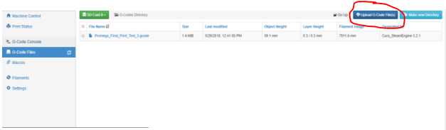

# Running a Print

Running a print is best done using the Duet Web Console. To connect to your Duet via a network, visit the [Network Setup](https://m3d.gitbook.io/promega-docs/getting-started/network-setup) guide. For an introduction on the Duet Web Console visit the [Accessing Web Interface](https://m3d.gitbook.io/promega-docs/getting-started/accessing-web-interface) guide.

## Uploading the Print

In order to print something from the Duet board you must first upload the print to the Duet Board. This can be done via the Duet Web Console or by ejecting the SD card and uploading it with a computer. Uploading a print via the Duet Web Console is the easiest way. To print on the Duet board your print must have a _.gcode_ file extension. To create a G-code file you must slice a model with a slicer.

**Uploading via Duet Web Console**

1. Connect to the Duet Web Console
2. Go to the _G-Code Files_ tab on the bottom left of the screen and find the dark-blue _Upload G-code File\(s\)_ button. Click this button to upload G-code files.

   

3. Clicking this button will open File Explorer and allow you to find the file\(s\) you want to upload on your computer. You can upload multiple files. Upon selecting Open, the file will upload to the board. This can take a couple of minutes depending on the size of your G-code file and network speed.
4. Click one of the uploaded files to print it.

**Uploading via microSD**

1. Power off your printer with the blue switch \('O'\).
2. Remove your microSD card from its slot on the Duet board by pressing it into the board. Be careful as the microSD slot on the board is fragile.
3. Insert the microSD card with microSD card reader into your computer.
4. Open up the drive and select the folder _gcodes_. Upload all the _.gcode_ prints you want into this folder. When this has completed, safely eject the card and insert it back into the Duet board.
5. Power on the printer and reconnect to the Duet Web Console. You should now be able to see all your prints in the _G-Code Files_ tab on the console \(shown in the image above\).
6. Click one of the uploaded files to print it.

## Monitoring Prints

1. Once you have selected a file to print it you can view the prints progress in the _Print Status_ tab.

   

   With various buttons on this screen you can manipulate your print. This can help in certain cases. Change the print speed with the _Speed Factor_ slider on the right. This can be helpful to slow down your print during tricky parts, such as the first layer. With the _Z Baby Stepping_ buttons you can change the height of the Z during a print. This is very helpful to improve first layer stick during a print. _Extruder Factors_ sliders can be used to change the flow rate of the extruders. Exercise caution when using these controls, improper use can quickly ruin your print.

2. Aside from these controls the Duet Web Console displayes a heap of cool statistics such as Layer time and length of filament required. Remember that these statistics are estimates!
3. At any point during a print you can pause the print with the orange _Pause Print_ button. This will execute a file on the microSD card called _pause.g_. This will remove the extruder head from the print, and retract filament but keep the temperature steady. You will then be able to execute G-code commands. Be careful as you can easily damage your print and printer if you move the extruder into the print. Whenever you want to continue printing you can press _Resume_. This will execute _resume.g_. If you want to stop your print, you can press the _Cancel_ button. This will execute _stop.g_, this file is also called at the end of a print.

Continue on to the [An Introduction to Tools](https://m3d.gitbook.io/promega-docs/getting-started/an-introduction-to-tools), the next chapter in the [Getting Started](https://m3d.gitbook.io/promega-docs/getting-started) guide.

