# Unboxing & Assembly

## Before Opening

Check the outside of the packaging for any significant amount of damage that might have occurred in shipping. We recommend taking pictures of the box in case the Promega was damaged in shipping. In this box you will find various small items in different packages. Please thoroughly check all wrapping and padding before discarding them to ensure you keep all parts. Keep the Promega's box intact in case you need to transport the printer in the future.

## Opening the Box

1. Cut through the tape of the box on the top. Do not cut deep as the Promega is located below! 
2. Remove the top and side cardboard layers and bubble wrap.
3. Carefully lift the Promega from the box. Lift from the points indicated in the image below. **Do not lift from the frame member at the back \(marked by red cross\).**

   

4. Remove any additional padding from the box to ensure no other parts remain in the box.
5. Remove plastic wrap from the printer. You should now see items on the bed of the printer. The package includes important items, please take care when opening.

   

6. Remove the tape from the coreXY assembly.

   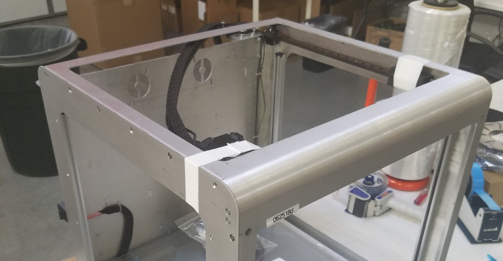

7. Remove the tape holding the items and the Z-platform down.
8. Remove the items from the bed of the printer. 
9. Lift the Z-platform as shown in the image below and remove foam blocks from under the bed.

   

## Items Included

1. microSD Card + microSD Card Reader
2. Optional: Motor Extension Cable

   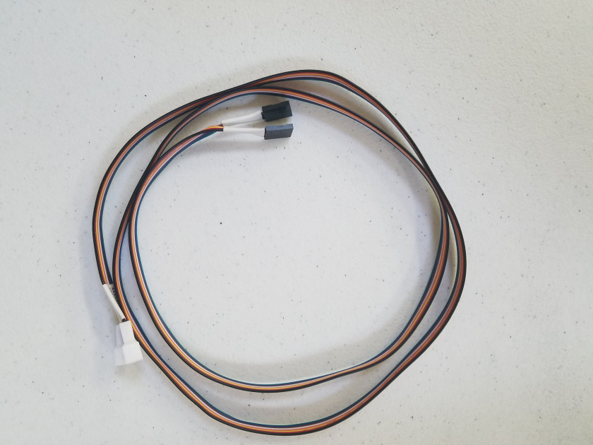

3. PC Plug

   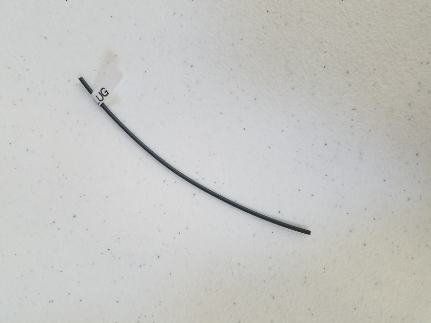

4. Spool Holders

   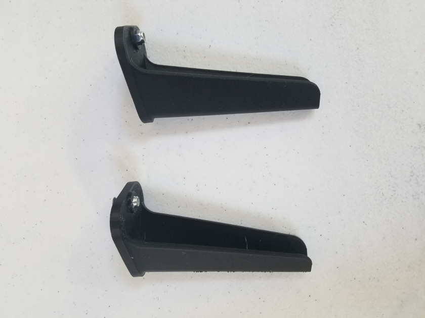

5. Windows \(Optional: Glass Bed\)

   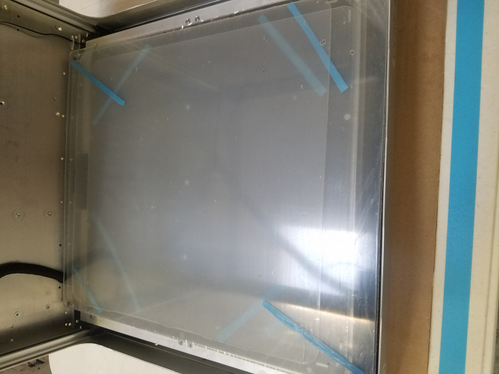

6. Rubber Feet x4

   

7. microUSB Cable

   

8. Optional: Glass Bed Clamps x4

   

### Mounting the Spool Holders

The spoolholders should be placed on the back of the printer. Two M4 T20 Torx Countersunk bolts and a locknut hold the spoolholder in place.

 

## Mounting the Feet

Follow this section to attach the feet to the printer. You will need a T20 Torx screwdriver.

1. The base of the printer has four holes intended for the feet of the Promega.
2. Carefully flip the printer on it's front in order to get access to the bottom of the printer.  

   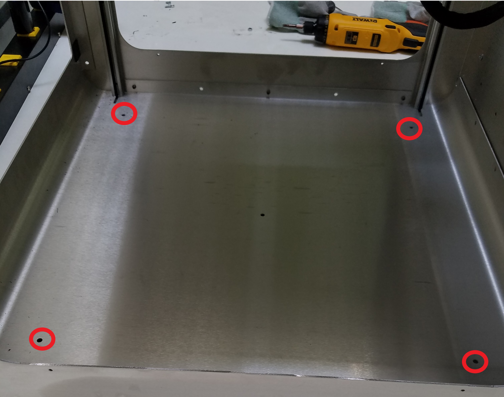

3. Take the M4 bolts out of the bag and screw them into the feet with a T20 Torx tool.   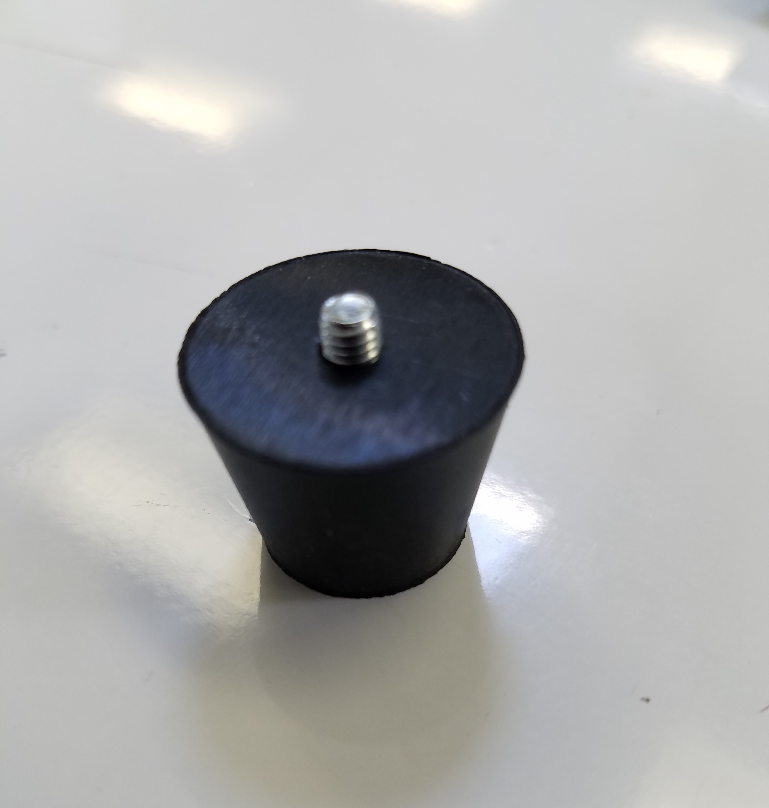 
4. You can now attach the feet to the base of the Promega through the holes in the picture in step 1. Tighten the feet down with the included M4 lock-nuts.

## Attaching the Glass Bed

Attaching the glass bed clamps to the glass bed can be tricky. Using a flathead screwdriver as a wedge makes it a lot easier!

1. Use the flathead screwdriver to open the clamp as shown. Try different sized flathead screwdrivers if this is too difficult. If the clamp is too tight to mount on the bed you can rotate the flathead screwdriver in the clamp to open it up more.

   

2. Use the flathead screwdriver to open the clamp and slide one side on the bed as shown. 

   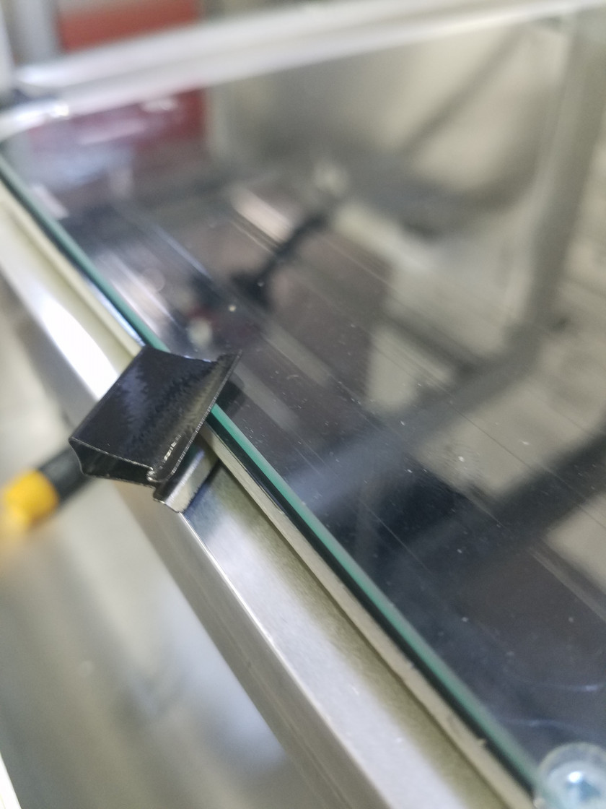

3. Once you have one side on, remove the flathead screwdriver and simply slide on the clamp 

   

## Attaching the Switches

To prevent damage while shipping, the power switch and heated bed coil switch are not connected. You can attach these in the following section.

You will need two M4 12mm Bolts and two M4 nuts per side. You will also need a T20 Torx screw-driver and an M4 wrench or pliers. Screw on both the power switch and the heated bed coil switch.

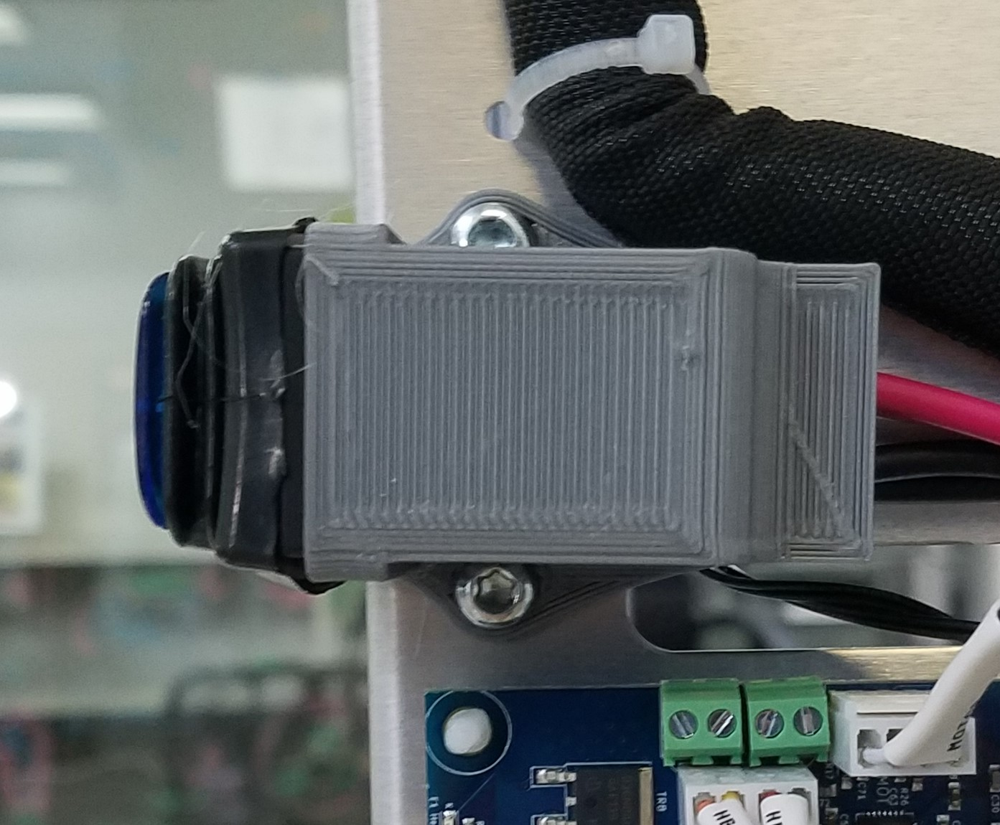

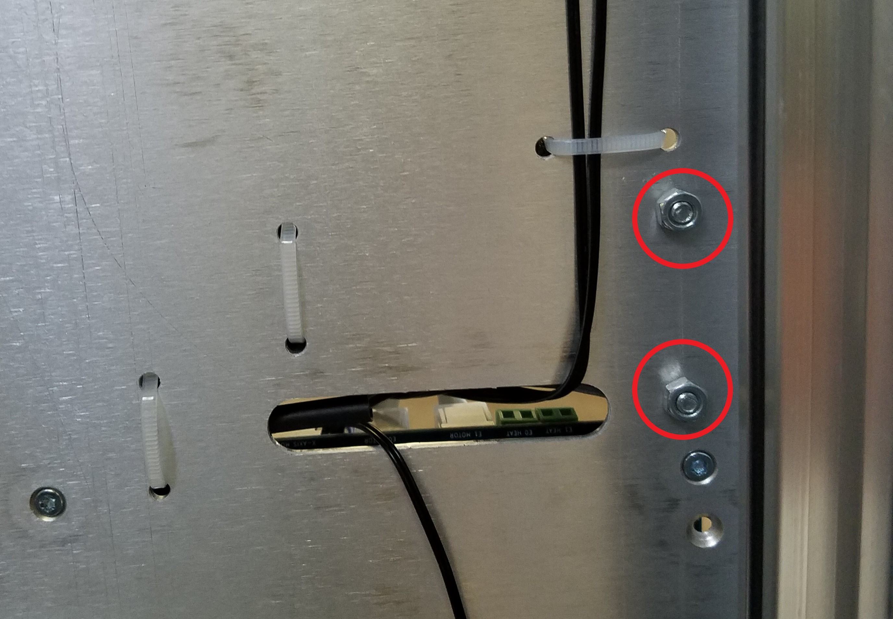

## Installing Windows

This section will walk you through installing your top, side and front windows on your Promega. **This step is optional and can be performed at a later time when you prefer to print with a full enclosure.** All screws needed for this section should be included in the plastic bag.

### Front Window

The front window has four small screw heads that lock onto small magnets located on the front of the Promega. The front window can be identified by the 4 small black screws sticking out of it. Face the screws toward the frame and simply stick it on the Promega. 

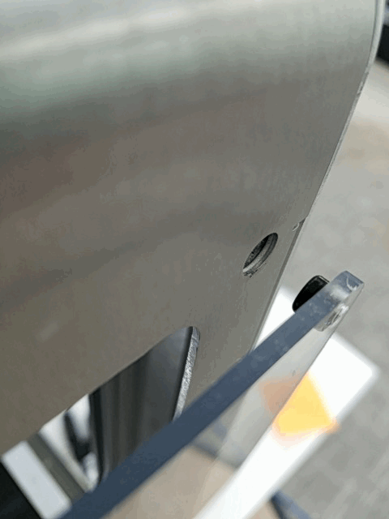

### Top Window

Next, we will install the top windows. You can find the top window by finding a thicker piece of plastic that does not have screws in it. For this you will need 4 12mm M3 bolts and a T10 Torx screw-driver. Screw in the M3 bolt on all four sides as shown in the image below.

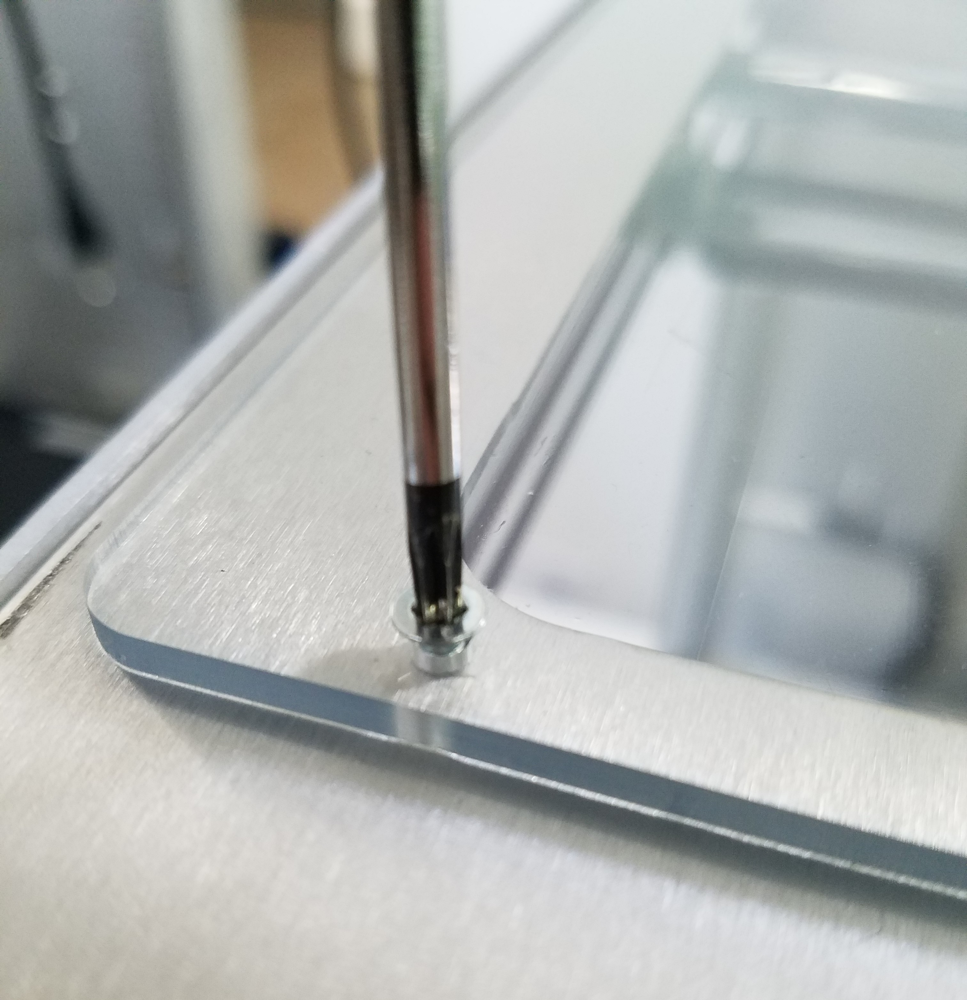

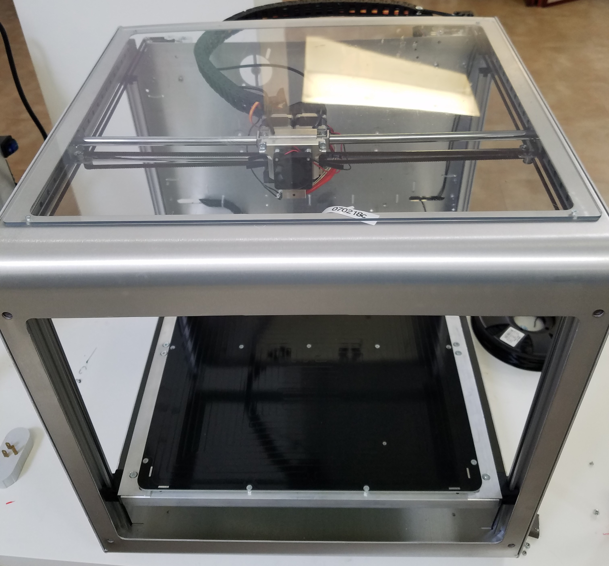

### Side Windows

The side windows can be identified by the fact that they are made of thinner plastic, and that there are two of them. For the side windows you will need 8 \(4 for each side\) M3 5mm bolts. You can screw these into place with the T10 Torx Screw Driver as shown in one of the images below. The side windows go on the inside of the Promega.

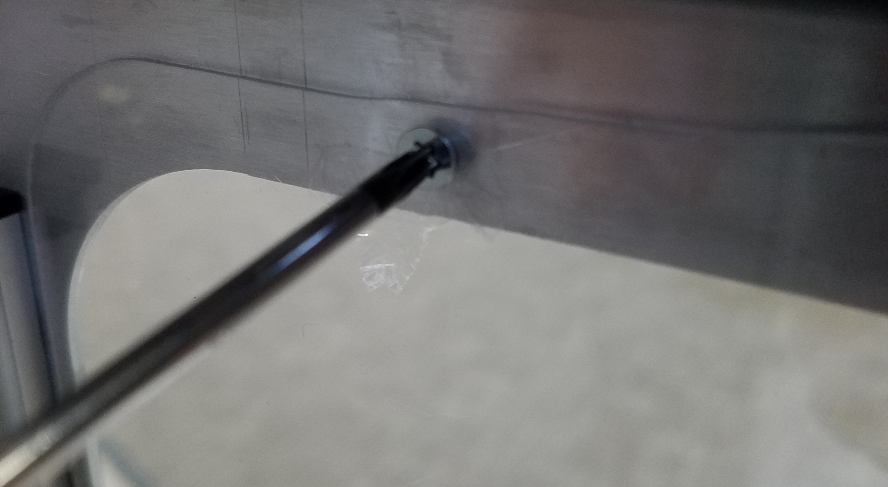

Continue on to the [Mechanical Check](https://m3d.gitbook.io/promega-docs/getting-started/mechanical-check), the next chapter in the [Getting Started](https://m3d.gitbook.io/promega-docs/getting-started) guide.

