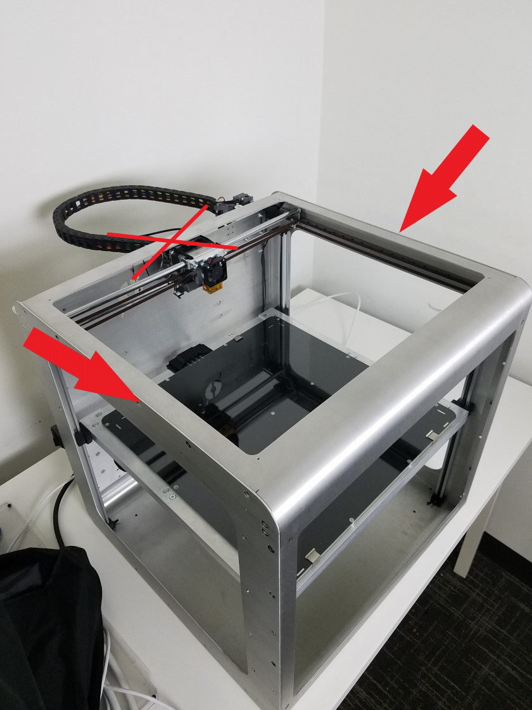
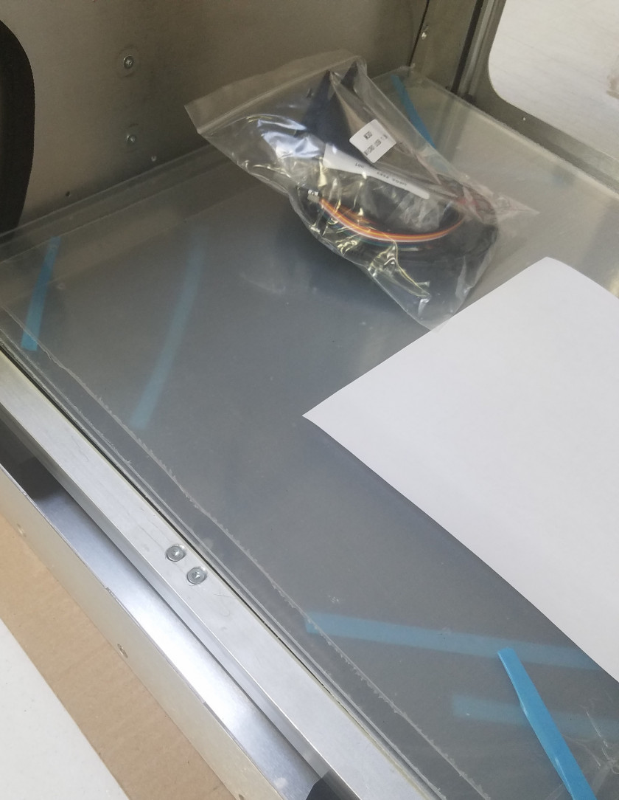
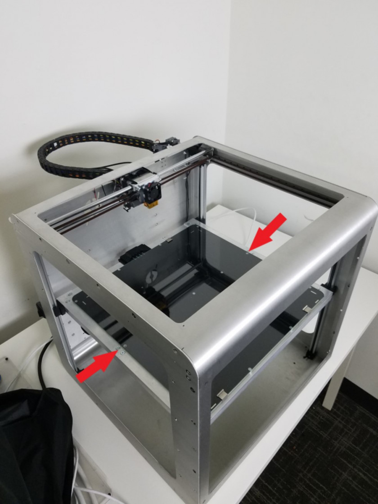
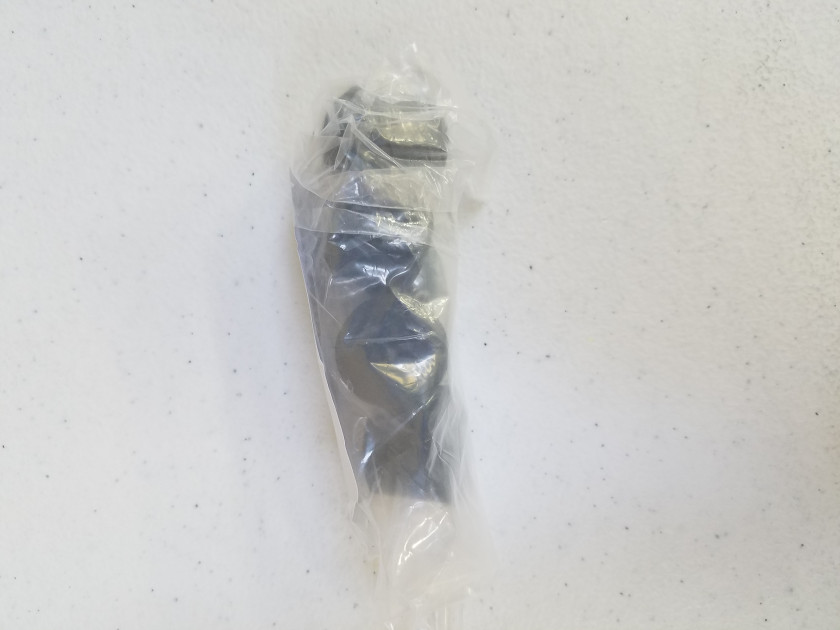
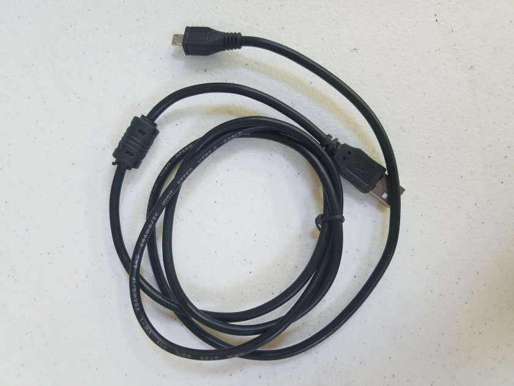
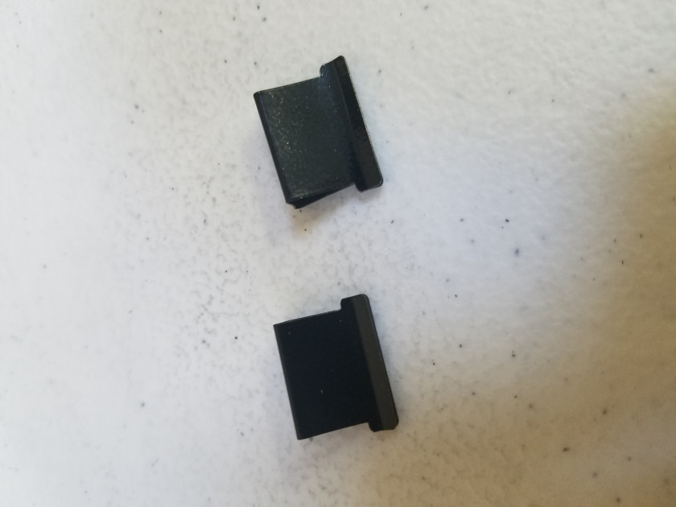
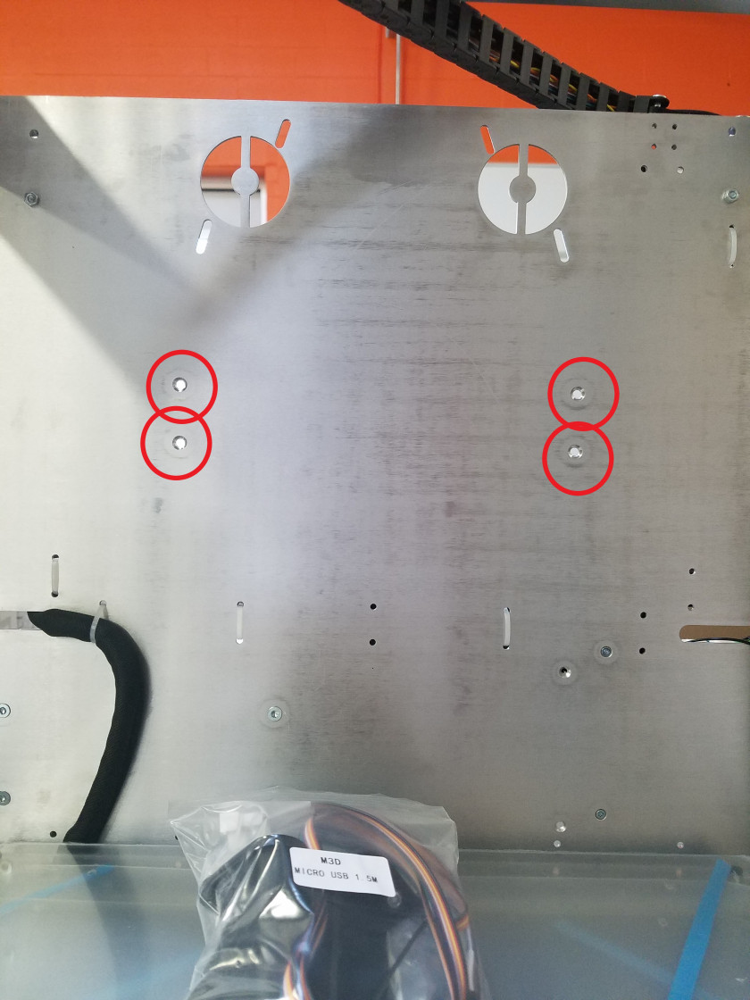
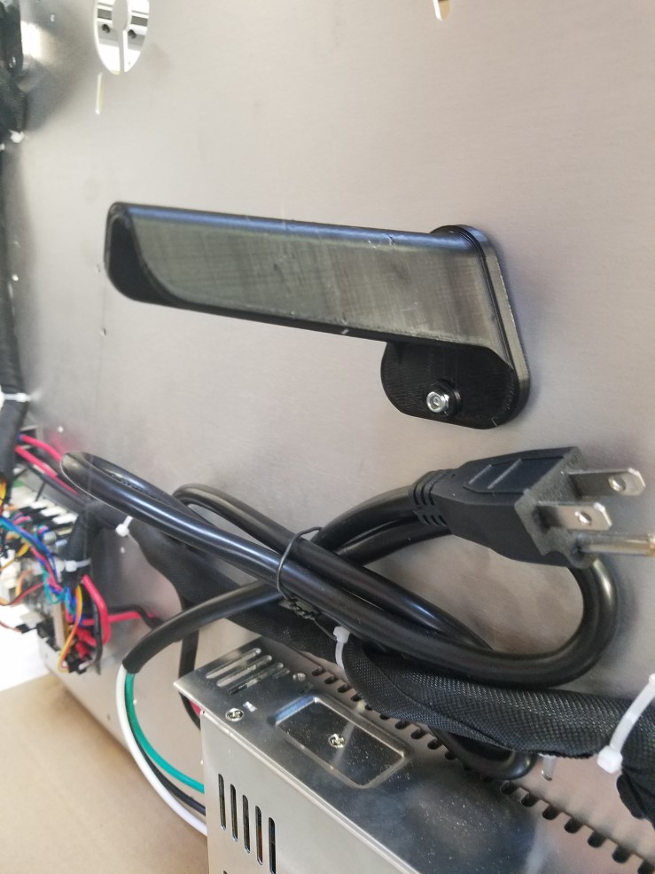
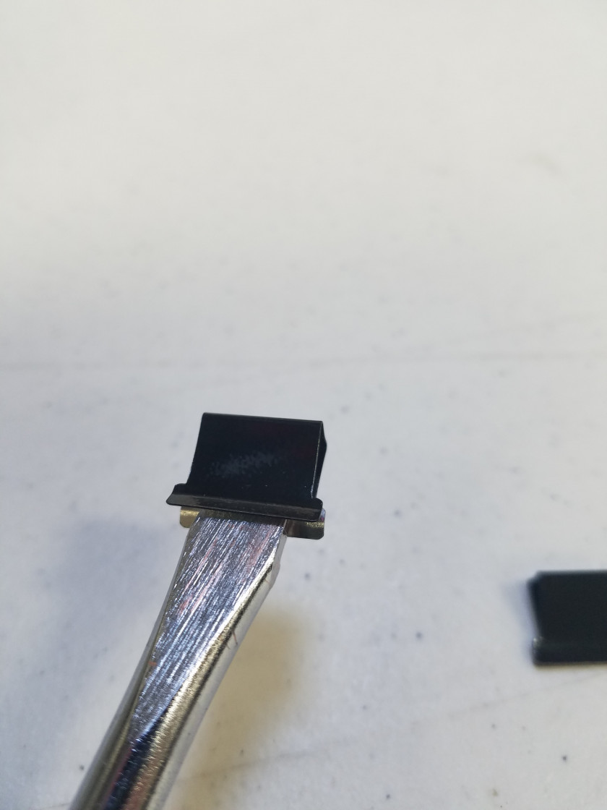
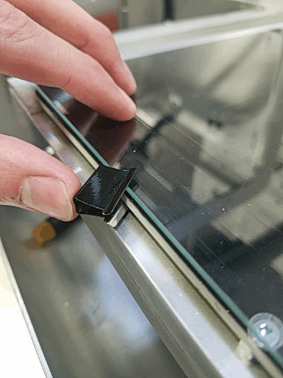

# Unboxing & Assembly

Work in progress, this guide will be updated soon!

As you unbox your Promega you will find a lot of different items packaged with it.

## Before Opening

Check the outside of the packaging for any significant amount of damage that might have occurred in shipping. We recommend taking pictures of the box in case the Promega was damaged in shipping. You will find various small items in different packages. Please thoroughly check all wrapping and padding before discarding them. Keep the Promega's box intact in case you need to ship the printer in the future.

## Opening the Box

1. Cut through the tape of the box on the top. Do not cut deep as the Promega is located below! 
2. Remove the top and side cardboard layers and bubble wrap.
3. Carefully lift the Promega from the box. Lift from the points indicated in the image below. **Do not lift from the frame member at the back \(marked by red cross\).**

   

4. Remove any additional padding from the box to ensure no other parts remain in the box.
5. Remove plastic wrap from the printer. You should now see items on the bed of the printer. The package includes important items, please take care when opening.

   

6. Remove the tape from the coreXY assembly.

   

7. Remove the tape holding the items and the Z-platform down.
8. Remove the items from the bed of the printer. 
9. Lift the Z-platform as shown in the image below and remove foam blocks from under the bed.

   

## Items Included

1. microSD Card + microSD Card Reader
2. Optional: Motor Extension Cable

   

3. PC Plug

   

4. Spool Holders

   

5. Windows \(Optional: Glass Bed\)

   

6. Rubber Feet x4

   

7. microUSB Cable

   

8. Optional: Glass Bed Clamps x4

   

### Mounting the Spool Holders

The spoolholders should be placed on the back of the printer. Two M4 T20 Torx Countersunk bolts and a locknut hold the spoolholder in place.

 

## Mounting the Feet

## Attaching the Glass Bed

Attaching the glass bed clamps to the glass bed can be tricky. Using a flathead screwdriver as a wedge makes it a lot easier! 1. Use the flathead screwdriver to open the clamp as shown. Try different sized flathead screwdrivers if this is too difficult. If the clamp is too tight to mount on the bed you can rotate the flathead screwdriver in the clamp to open it up more.

1. Use the flathead screwdriver to open the clamp and slide one side on the bed as shown. 
2. Once you have one side on, remove the flathead screwdriver and simply slide on the clamp 

Continue on to the [Mechanical Check](http://promega.printm3d.com/books/user-manual/page/mechanical-check), the next chapter in the [Getting Started](http://promega.printm3d.com/books/user-manual/chapter/getting-started) guide.

