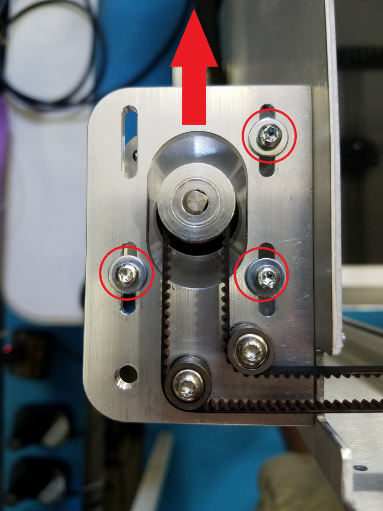
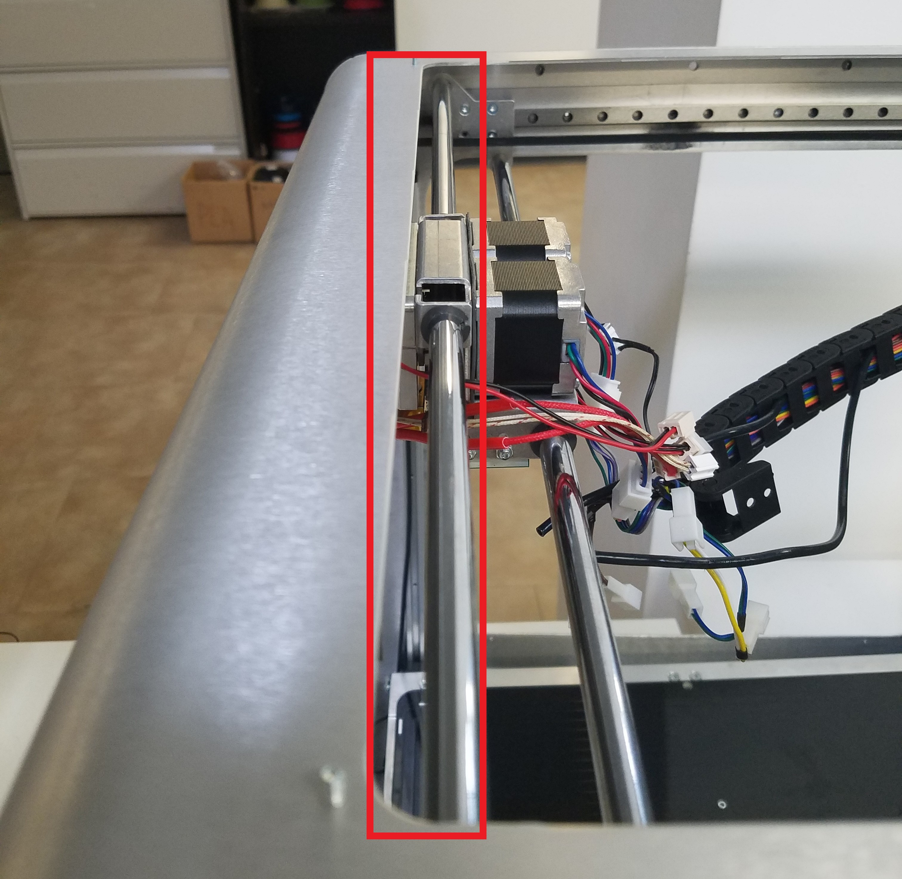
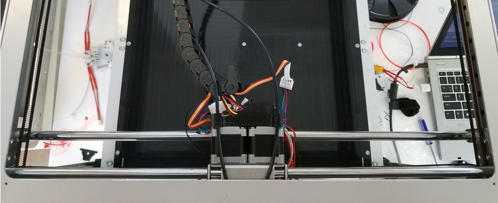
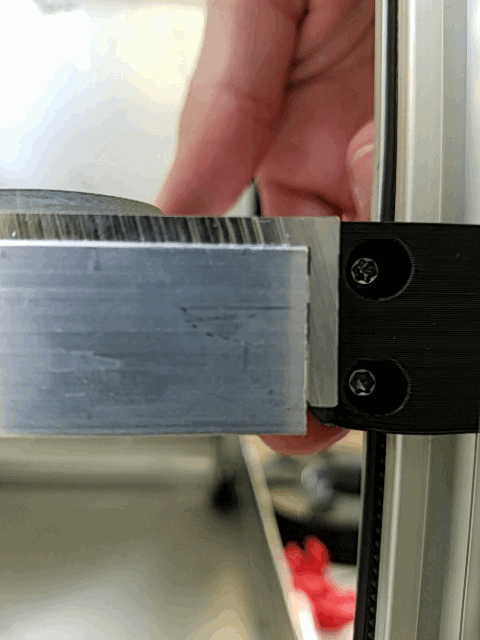

# Belt Tensioning and Mechanical Leveling

## Belt Tensioning and Mechanical Leveling

As the Crane is used over time it is possible slack develops in the CoreXY or Z-assembly belts. This can be fixed easily by following the guides below. Properly tensioning your belts will address problems with backlash and XY skipping.

## CoreXY Assembly

1. In order to tension the CoreXY loosen the three screws as indicated below.

   

2. Once the screws are loosened you should be able to pull the motor to tension the belts. Pull in the direction of the arrow. Typically you will **not** need to pull very hard to tension these belts, around 2 lb of force is sufficient. Strum the belts near the extruder assembly to get an idea of the tension applied to the system by pulling the motor. Once you are satisfied with the tension, tighten the M3 screws back down.
3. Apply this same process to the other coreXY motor. Be sure to tension this belt system with the same amount of force or you can misalign the extruder carriage gantry and your coreXY system will not be square. 
4. To check that your system is properly square, align the extruder gantry with the front frame of the Crane as shown in the image below. The extruder gantry shaft should be parallel to the frame. If one side is off, your system is not square and you will have to readjust tension. 

In the image below you can see a coreXY assembly that is not square. The left side is not pulled in as far as the right side. This is because the right side of the gantry is being tugged backwards harder than the left. The solution would be to tension the right side tighter.

## Z-assembly

### Tensioning the Belts

1. In order to gauge the tension of the Z-axis belts you can pull down on the belt as pictured below. Determining the proper tension on the Z-axis belt is difficult. This is because more tension will result in better accuracy but can also cause too much friction for the Z-motor to handle comfortably. It is a careful balance and you will become more familiar with the proper tension over time. While pulling on the belt check that the top and bottom clamps are gripping the belt firmly. You should see no evidence of slipping.

   

2. To tension the belt pull up as shown in the picture below, while tightening down the screw underneath the Crane. You should not have to pull hard to achieve the proper tension as tightening down the clamp can tension the belt.

   

### Leveling the Bed

After you change out belt clamps, your bed might be misaligned. As covered in the [Bed Leveling & Probing](https://m3d.gitbook.io/promega-docs/printing-guides/slicers-and-printer-settings/bed-leveling-and-probing) guide, bed leveling compensation will work for differences of about 3mm across the entire bed. Leveling your bed can be done by skipping teeth on the bed in specific corners. If your is extremely unlevel, it will not be movable by hand.

1. Look at your bed and determine if one side is visibly higher than the other side.
2. Remove the binder clip if you have placed one on the Z-motor belt
3. Gently pull up on the corner that you want to skip. Apply pressure until you feel the corner give with a loud click. **Do not skip the bed near the belt clamps as it can break your belt clamps.**   
4. Once the bed is level enough to the point where it drops by itself, move the bed up to the nozzle by hand. The bed is best lifted up from the points pictured below. Lift slowly or you will skip the bed. Moving the bed too fast can also fry your Duet board, so be careful.   
5. When the bed is touching the nozzle, determine the offset of the Z-sliders to the top belt clamps to determine whether the bed is level. This will give you a good enough estimate to level the bed, bed leveling compensation with `G29` can take care of the rest. The bed can be leveled more accurately by using a caliper to measure the distance between the bed and the top of the Z-slider rails and comparing the corners.

