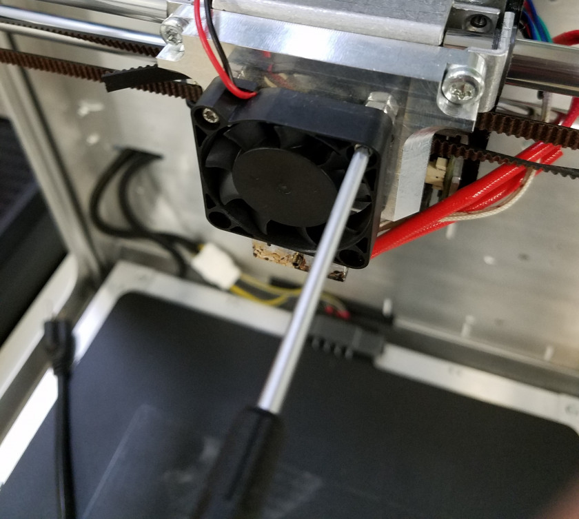
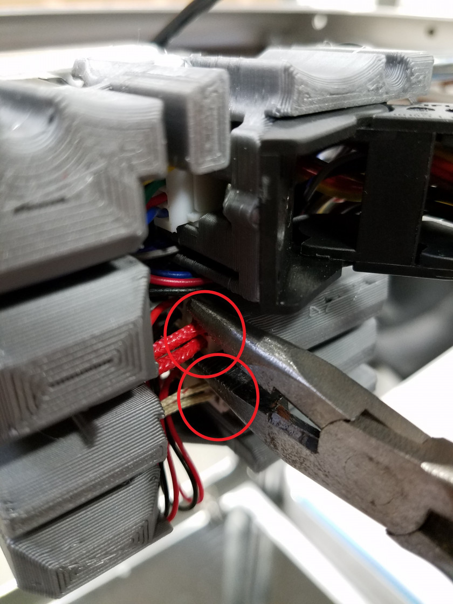
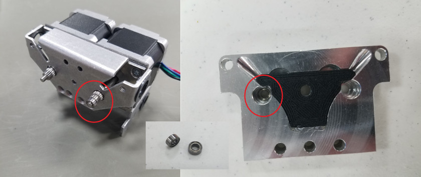
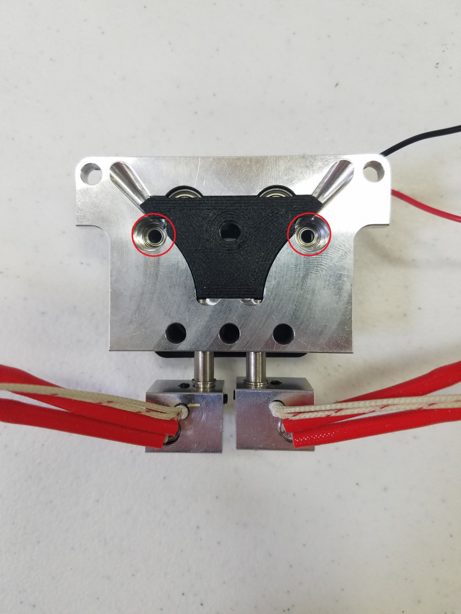
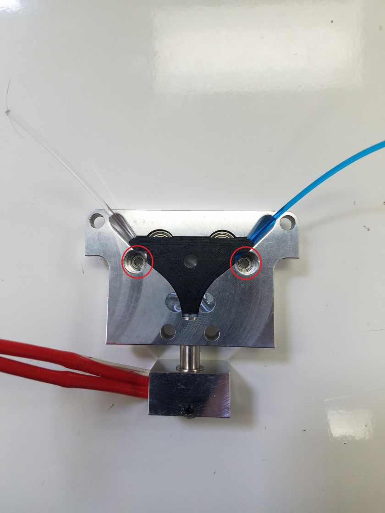
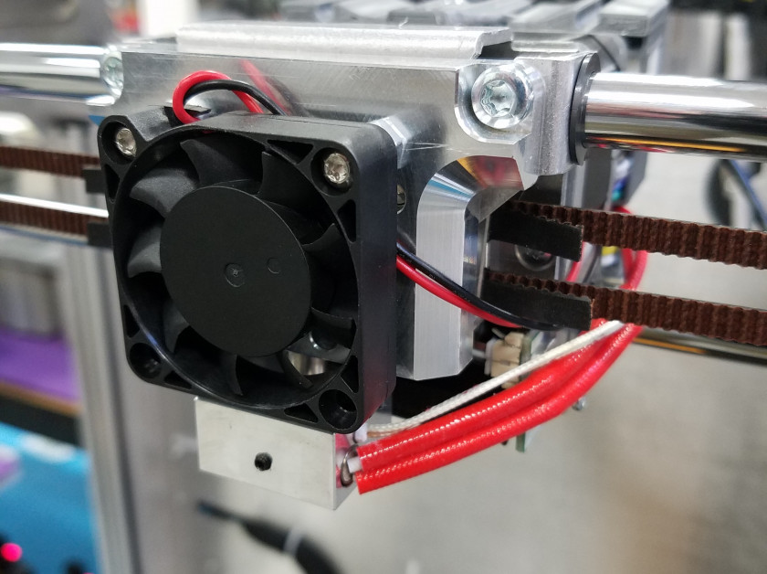
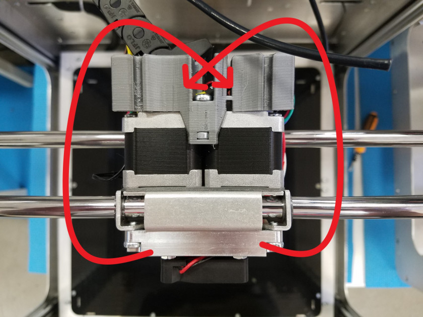
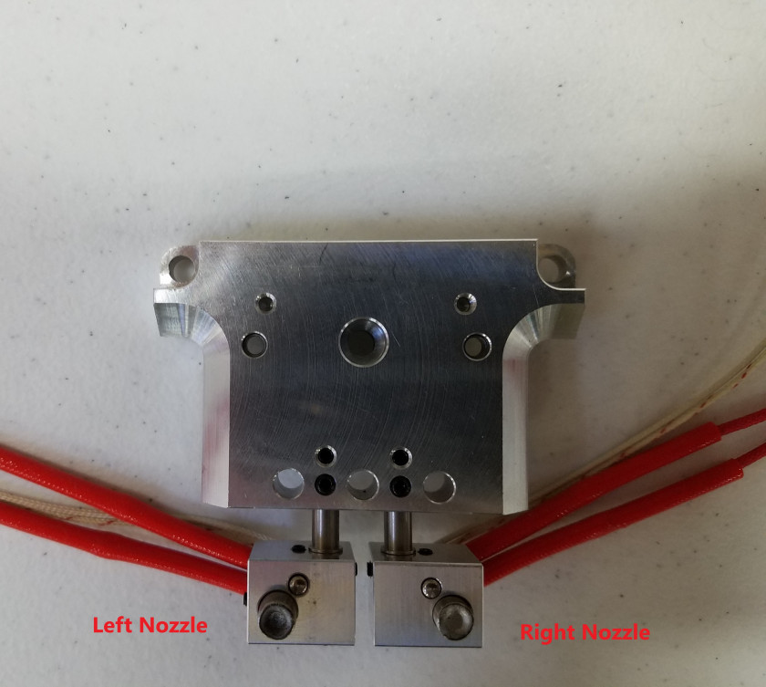
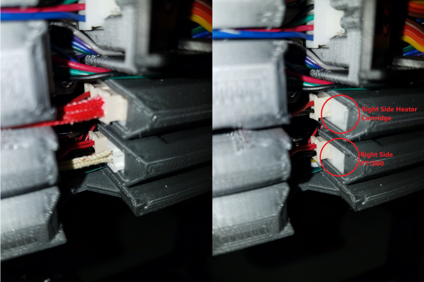
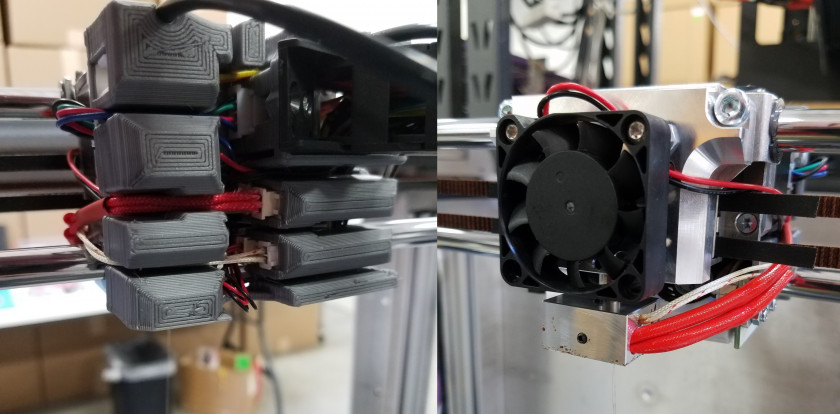

# Changing Extruders

The Promega has two extruder heads the K'Tana and the Compound nozzle. The compound nozzle accepts two filaments as input and prints through one nozzle by mixing the two filaments. The K'Tana has two separate filament inputs and two seperate nozzles to print from. In order to switch between the two tools, you will have to perform a series of mechanical and software changes.

## Preparation

Be sure to turn off and unplug the printer. Retract and remove any filament currently in the nozzle. Use [this guide](http://promega.printm3d.com/books/user-manual/page/loading-and-unloading-filament) if you need help. Wait for the hot end\(s\) of the printer to cool before continuing with this guide.

Tools and items you will need:

1. T10 Torx Screwdriver
2. T30 Torx Screwdriver
3. Needlenose pliers
4. Container to hold screws

## Removing the Extruder

1. Take the T10 Torx screwdriver and remove the cold section fan from the extruder carriage. Collect the two screws and M4 nuts in a container and place them aside. Move the fan over to the back of the extruder carriage assembly so it is out of the way.

   

2. Use the T30 Torx screwdriver to remove the three different screws \(circled in red\) holding the extruder block to the coreXY gantry. Place these screws in the container.

   

3. Disconnect the heater cartridge and PT1000 cartridge thermistor cables at the back of the extruder carriage \(Circled in red\). The heater cartridge cables are red and the thermistor cables are beige. Needlenose pliers can be helpful to reach the cable connectors.

   

4. Now that all the screws and cables are detached from the extruder assembly, you should be able to remove the old extruder head.
5. Look for two small bearings in the old extruder head. These bearings hold the extruder gears in place while printing. You can find them in the extruder head or on the tip of the extruder gears. Remove these bearings from the old extruder head or extruder gears and place them in the container, you will need them for the next step.

   

## Installing the new Extruder

1. Inspect the new extruder head. Ensure that there are PTFE tubes in the nozzle\(s\). Check that there are bearings underneath the black 3D printed cover. Make sure the nozzle\(s\) are fitted securely in the extruder head and in the correct orientation.
2. Place the two bearings in the circled portion of the extruder head pictured below. Make sure they are seated flat and all the way into the hole. A pen or pencil can help to insert these bearings in place. Almost no force should be required.  
3. You can now mount the extruder head on the extruder assembly. Make sure the extruder gears are properly seated in the bearings you placed in the step above. Screw in the three M4 bolts holding the extruder to the extruder assembly. Be careful with the amount of force you apply to the screw as you could strip the threads in the extruder assembly.
4. Next, wire the fan onto the extruder head you just mounted. Remember to put the M4 spacers in place as well. Place the wires of the fan below the second screw as shown in the picture below.

   

5. Now move on to the back of the extruder assembly to connect the heater cartridge and PT1000 of your new extruder head. Needlenose pliers and a small screw driver are useful to reach into the wiring assembly. If you are wiring the compound nozzle the wires go around the right side of the extruder assembly but plug into the left side of the cable assembly. For the K'tana nozzle the right heater and PT1000 wrap around the right side of the extruder and plug into the left side of the cable assembly. The left heater and PT1000 do the same but mirrored, the cables wrap around the left side of the extruder and plug into the right side. The image below illustrates this. 

   **Left and right is identified in the image below**  
   

6. Place the cables in the wiring chassis according to the image below. Place the PT1000 cables into the channel before the heater cartridge cables. This is because the PT1000 has a greater distance to reach to its connector. 
7. Plug the wires in according to the diagram below. Plug in the left side cables before the right side. Use needlenose pliers and a flathead screwdriver to carefully plug in the cables into their housing. !\[gN4Sz33QK3kbeWMV-K'tanaportwires.jpg\]\(\[../.gitbook/assets/gallery/2018-06-Jun/scaled-840-0/gN4Sz33QK3kbeWMV-K'tanaportwires.jpg\]\(../.gitbook/assets/gallery/2018-06-Jun/scaled-840-0/gN4Sz33QK3kbeWMV-K'tanaportwires.jpg\)\) 
8. The wiring portion of changing extruders is now complete. Look at the pictures below to see the final result for a mounted compound or K'tana extruder head.

### Compound Extruder Head

### K'tana Extruder Head

## SD Card Configuration

1. Download the SD card image from our GitHub [Repository](https://github.com/PrintM3D/Promega). Select either the Compound or K'Tana folder depending on what extruder you are mounting. The SD card should have 4 folders and one text file:
2. _sys/_
3. _gcodes/_
4. _macros/_
5. _www/_

A text file will also be present on the SD card. This file simply makes it easier and faster to determine if you currently have the K'tana or compound SD card mounted.

1. Plug your SD card into your computer with the microSD card reader. 
2. Backup your current SD card onto your computer. This can be done by copying the folders listed above into a seperate folder onto your computer. This will make it easier to switch back to the other extruder head in the future as you will not have to spend as long reconfiguring your printer.
3. Delete the files on the microSD card.
4. Copy the downloaded files from the PrintM3D GitHub Repository onto the SD card.
5. Open the _config.g_ file in the _sys/_ folder and configure your network settings. You can also use your backed up SD card image that you copied in step 3 to obtain your network settings. For more help on configuring you network use the [Network Setup](http://promega.printm3d.com/books/user-manual/page/network-setup) guide.
6. Once you have finished configuring your network, eject the card and insert it into the Duet's microSD card slot.

## Testing

Before you continue it is best to follow the steps below to ensure that the process of changing extruders worked correctly.

1. Plug in the Duet Board ethernet cable.
2. Power on the Promega. 
3. Connect to the Duet Web Console and observe the hotend and bed temperature values. If any of these values are not around room temperature it can indicate incorrect wiring. A temperature reading of 2000C is the temperature error value and means that the PT1000 is wired incorrectly. If the displayed temperature is incorrect, address the problem and continue. 
4. Ensure that the extruder carriage can move to the limit switches in the back left of the printer. Make sure there is nothing placed on or underneath the bed. 
5. Move each of the axes and extruders independently and verify for every motor that they are moving in the right direction. Once you have verified that, you can home the printer. 
6. Heat up the nozzle\(s\) and make sure no heater faults occur. 
7. Once the printer is homed and the nozzles heat up correctly you can carry on printing!

