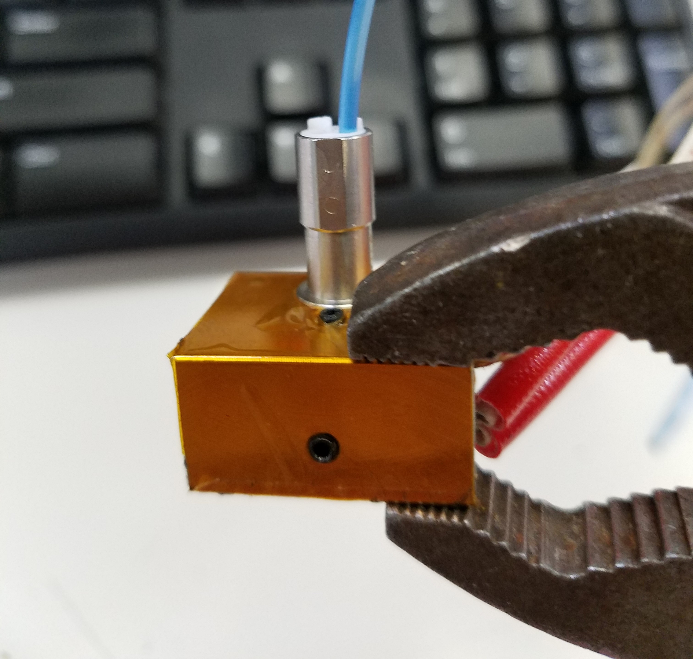

# Changing Nozzles

Follow the steps below in order to mount a new nozzle on your 3D printer.

**Warning: Follow the steps listed in the guide closely. You will be working with heated hot-ends. Use appropriate tools.**

Some of the following steps have to be performed with a heated hot-end in order to allow you to slide out and replace the nozzle. If you don't heat your nozzle cooled filament will act like glue and hold the components together. If you have an exceptionally clean or

1. Unplug the 24V cold-section fan on the front of the extruder.
2. Remove the cold-section fan. Follow: [Fan Installation and Replacement](https://promega.printm3d.com/~/edit/drafts/-LHdXavkB_zqUw_einTK/repair-guides/fan-installation-and-replacement) for help.
3. Connect to the Duet Web Console.
4. Heat-up the nozzle and retract any filament inside.
5. **Keep the nozzle hot for the next steps! Hold the heater block with pliers as shown in the images below.**  
6. Remove the 1.5mm hex set-screws holding the compound heater block in place.   
7. Slide the heater block and cold-section out of the extruder with the pliers.
8. \(Optional\) If you need to remove the PTFE tube from the extruder you can feed a bit of filament into the hot-end. This will push the PTFE tube up and out, allowing you to pull the PTFE tube out. Place this PTFE tube in the replacement nozzle.   
9. Remove the screw indicated in the image below, this holds the nozzle inside the heater block.  
10. With another pair of pliers, carefully pull out the nozzle from the heater block.
11. Place the **hot** nozzle on a heat-resistant surface. If you have a glass bed, you can place the nozzle on there.
12. With the pliers, grab the new nozzle and place it into the heater block, pay attention to the orientation of the nozzle. The dimple should face the set-screw in the heater block. This keeps the heater block in place during operation.  
13. Tighten down the setscrew that holds the nozzle in place.
14. Place the nozzle, with the heater block attached, back into the extruder.
15. Tighten down the 1.5mm setscrews
16. **You can now power off the heater.**
17. You can attach the cold-section fan again and continue printing!

