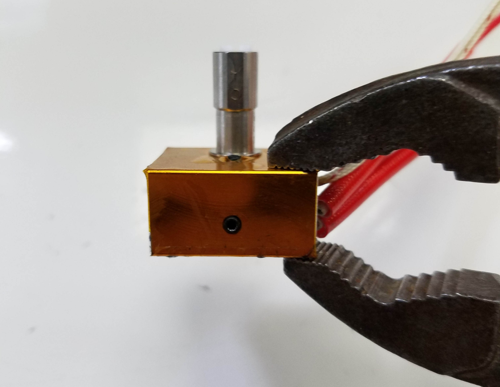
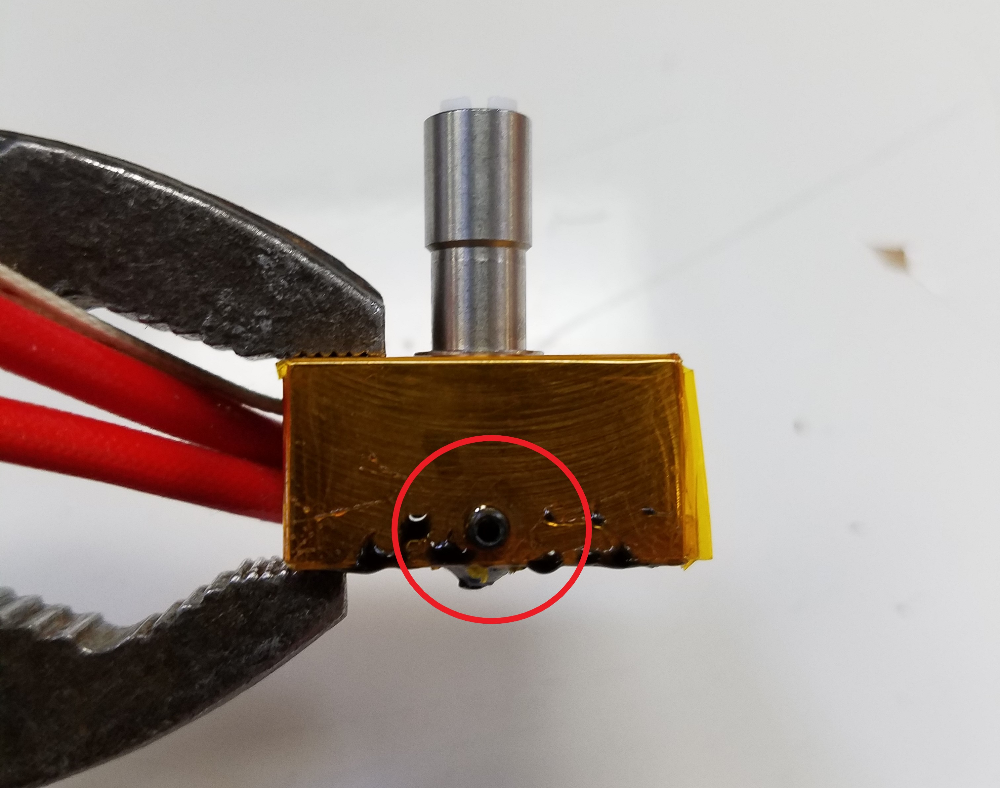
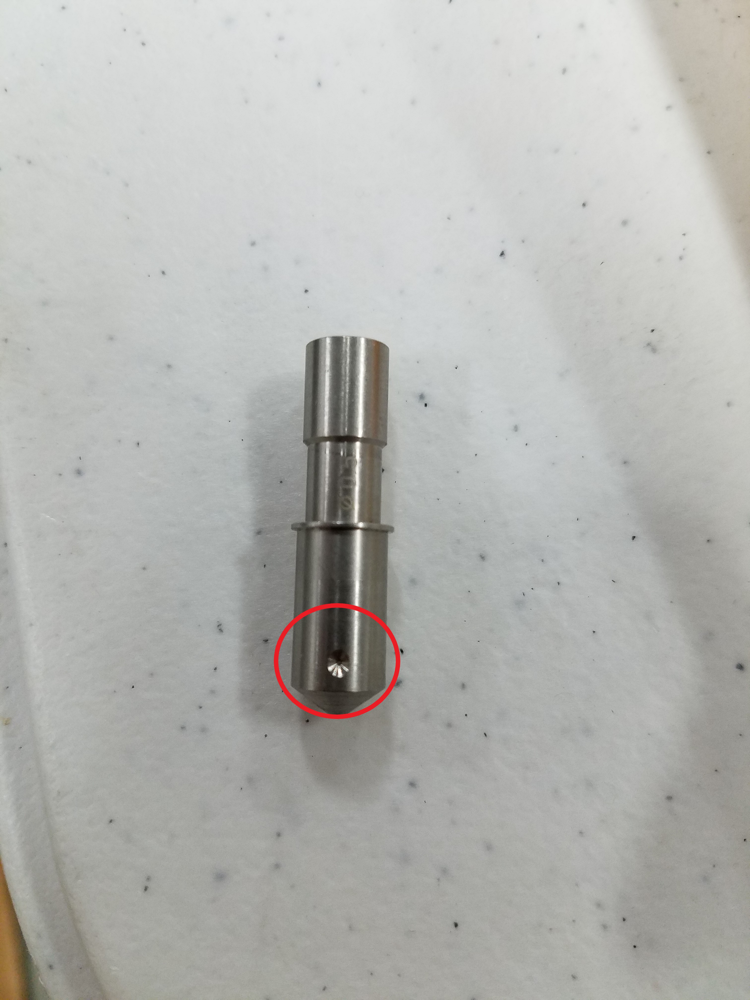

# \*Changing Nozzles

Follow the steps below in order to mount a new nozzle on your 3D printer.


**Follow the steps listed in the guide closely. You will be working with heated hot-ends. Use appropriate tools.**


Some of the following steps have to be performed with a heated hot-end in order to allow you to slide out and replace the nozzle. If you don't heat your nozzle cooled filament will act like glue and hold the components together. If you have an exceptionally clean or new nozzle then heating is not required

1. Connect to the Duet Web Console.
2. Heat-up the nozzle and retract any filament inside.
3. **Keep the nozzle hot for the next steps!** 
4. Remove the front fan from the Quad Fusion by unscrewing the circled screws

5. Next, **loosen** the next circled screws. Some of the Quad Fusions may not be mounted the same way.

6. Remove the set-screw holding the nozzle and heater block in place. Carefully retract them using pliers.

  

7. Slide the heater block and cold-section out of the extruder with the pliers.

8. Remove the screw indicated in the image below, this holds the nozzle inside the heater block.

  

9. With another pair of pliers, carefully pull out the nozzle from the heater block.

10. Place the **hot** nozzle on a heat-resistant surface. If you have a glass bed, you can place the nozzle on there.

11. With the pliers, grab the new nozzle and place it into the heater block, pay attention to the orientation of the nozzle. The dimple should face the set-screw in the heater block. This keeps the heater block in place during operation.

  

12. Tighten down the setscrew that holds the nozzle in place.

13. Place the nozzle, with the heater block attached, back into the extruder.

14. Tighten down the setscrews and any other screw you were instructed to loosen.

15. **You can now power off the heater.**

16. You can attach the front fan again and continue printing!

