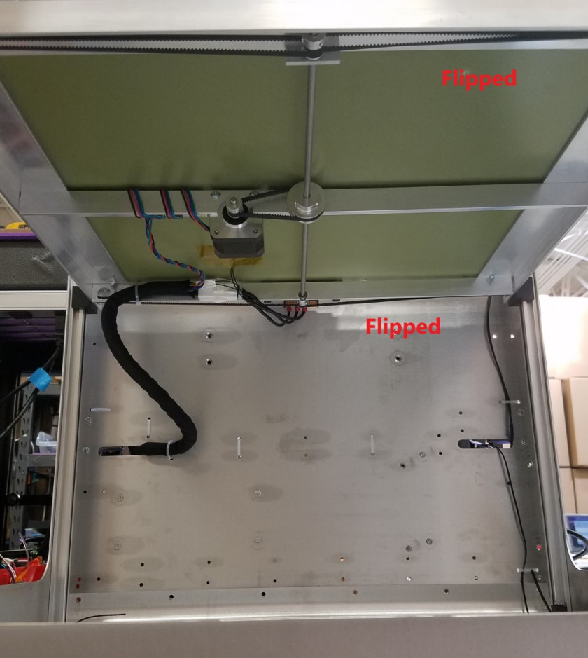
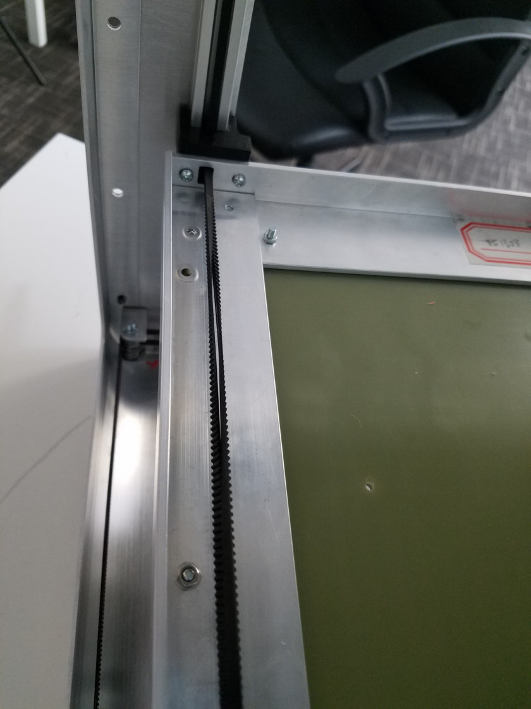

# Routing Z-belts

## Routing Z-belts

Follow this guide in order to properly route the belts of the Z-assembly. This guide will not cover how to properly tension and level the system. Belt tensioning and mechanical leveling is covered [here](http://promega.printm3d.com/books/user-manual/page/belt-tensioning-and-mechanical-leveling).

## Belt Routing

The Z-belts are clamped at the top and bottom by 3D printed clamps. From there, the belt enters a 3D printed block mountedf to the Z-platform called the Z-slider.

After the z-slider the belts go to the pulley. If you look on the underside of the Z-platform of the Promega, you will notice that two of the four belts cross over themselves. This allows the bed to be driven by a single motor with a single axle. The belt that crosses over is referred to as the _Flipped Belt_. Follow the section immediately below to route a bed as normal, and the section _Flipped Belts_ to route the flipped belt. When facing the front of the Promega, the right side belts of the Z-platform should have its belts flipped.

## Normal Belts

1. Loop the belt through the Z-slider as shown below. The inside of the Z-slider contains bearings that allow the belt to smoothly slide as it is being driven.

1. After routing the belt through the Z-slider the belt must go around the pulley as shown in the image above.
2. The belt is then routed back through the Z-slider. The belt should nest comfortably inside the 15x15 aluminum extrusion channel.
3. The tops and bottoms can now be fastened. Following the [Repairing Broken Belt Clamps](http://promega.printm3d.com/books/user-manual/page/repairing-broken-belt-clamps) guide covers installation of the belt clamps. 
4. To tension the belt system follow [Z-belt Tensioning](http://promega.printm3d.com/books/user-manual/page/repairing-broken-belt-clamps#bkmrk-tensioning-the-belts) guide.

## Flipped Belts

1. Loop the belts through the Z-slider. The flat of the belt must be riding the bearing.

   

2. Once the belt is through the Z-slider, flip the belt 180 degrees so the teeth can properly mesh with the pulley. Remember to cross the belt as well, if you are routing the belt from the top of the z-slider it should go around the bottom of the pulley.

   

3. When the belt is around the pulley, flip the belt 180 degrees again. **Flip the belt in the right direction!** If you rotate in the wrong direction it will cause the belt teeth to mesh together instead of the flat of the belt. It should look like the image below. **Notice how the two belt flats face each other!**

   

   This is not what the flipped belt should look like, notice how the belts mesh together.

   

4. The final result should look like this:

   

