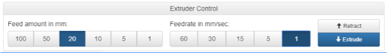

# \*ABS-R

Follow this step by step guide for successful printing with ABS-R.

## Material Table

|  | First Layer | Printing |
| :--- | :--- | :--- |
| Bed Temperature | 70°C | 60°C |
| Nozzle Temperature | 220°C | 235°C |
| Retraction Distance | - | - |
| Retraction Speed | - | - |

## Preparation

Follow the [Preparing a Print](https://m3d.gitbook.io/promega-docs/getting-started/preparing-a-print) guide for more help on slicing a print. Incorporate the material settings above into printing and bed temperature.

## Guide

1. Heat the bed up to ABS-R first layer temperature
2. Once the bed is hot, probe the bed with `G30` and then level the bed with `G29 S0`. Follow the [Bed Leveling & Probing](https://m3d.gitbook.io/promega-docs/repair-guides/repairing-broken-belt-clamps#leveling-the-bed) guide if you need help.
3. Heat up the nozzle to printing temperature and load filament. Follow the [Loading and Unloading Filament](https://m3d.gitbook.io/promega-docs/getting-started/loading-and-unloading-filament#loading-filament) guide. It is best to extruder about 10  mm of filament to make sure filament is flowing through correctly. Remember to clear the extruded filament with tweezers before starting the print.
4. Upload the print to the board. For more help follow the [Running a Print](https://m3d.gitbook.io/promega-docs/getting-started/running-a-print) guide.

## Quality Troubleshooting

Read the section below to improve the quality of your ABS-R print. The titles of the section below indicate the problems that you might see when printing ABS-R and how to solve them.

**Blobbing**

Blobbing can look like what is circled on the picture below:

The reason blobbing occurs is because the nozzle suddenly extrudes more than usual, thus creating a "blob" in the print. One of the causes of this can be back pressure, which is more of a concern with the QuadFusion. Since there are four filaments being loaded into the QuadFusion, if they are not all in line some back pressure may occur. Thus, when you retract one of the four filaments the other three will still be experiencing pressure and may ooze out of the nozzle.  
Another cause for blobbing can be \_\_\_\_\_\_

Solution:  
While blobbing may occur for many reasons, it can be prevented with many more. For starters, make sure when you're loading your filaments that they are all in line. This has been explained in [Loading and Unloading Filament](../loading-and-unloading-filament.md).   
Another solution is to edit your slicer settings, by including the ability to retract the filament for each new layer your print is less likely to contain blobs.   
The most important solution is to calibrate your extrusion settings. Sometimes you may be over-extruding which can cause lots of problems \(not just blobbing\). Try fiddling around with E-Steps and find the value that works best for you!

**Stringing**

Stringing can look like this:

Stringing is usually caused when the extruder is traveling between prints and some filament is oozing. This ooze can cause these strings which can be a real hassle to remove. 

Solution:  
The number one solution that we can recommend is to edit your retraction settings. When slicing your print make sure to add this function. 


In Cura, the function is under the _Material_ tab and is called "Enable Retraction".


This function allows your extruder to retract the filament slightly whenever moving over empty space.  
One other possible reason for stringing is that your temperature is too high. With certain filaments, the higher the temperature the more liquid it becomes. Try fiddling around with the nozzle temperature to find the best fit for your filament. 

**Under-extrusion**

Under-extrusion can look like this: 

The simplest cause for under extrusion is when your extruder is unable to supply the requested amount of filament.

Solution:  

