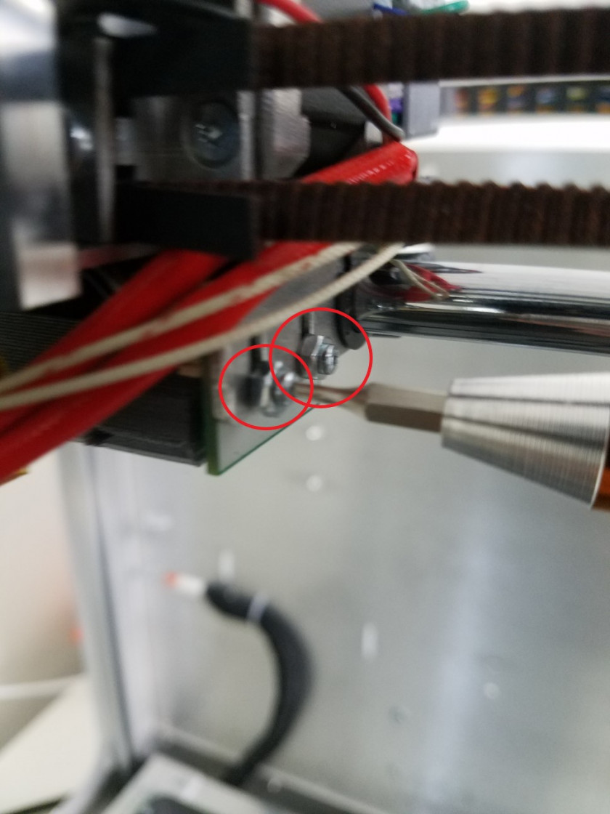
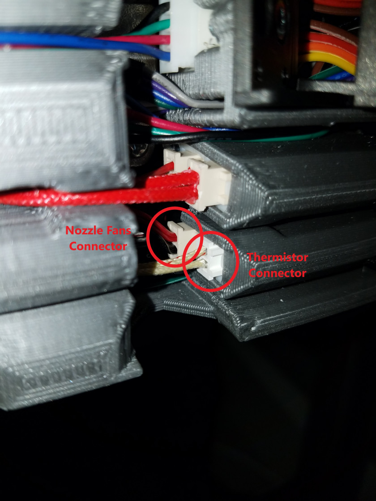
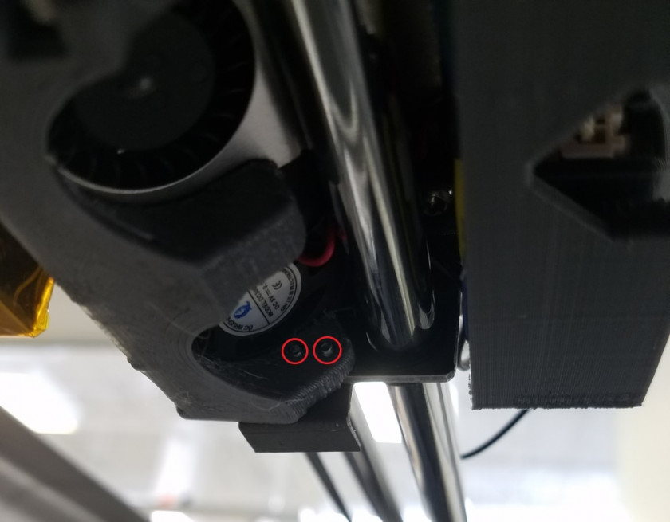

# Fan Installation and Replacement

On the Promega you will find two different fans. The nozzle fan, located on the bottom of the extruder assembly, and the cold-section fan. This guide will cover their removal and installation. You might need to remove either of these fans in order to get to the components below.

### Fan Location

 

The cold-section fan, on the front of the extruder assembly, serves to cool the extruder assembly. This fan is very important to ensure that materials with lower printing temperatures, such as PLA, can comfortably pass through the extruder without losing its rigidity. If the cold-section fan is not functioning properly, heat could creep up from the hot-end, located right underneath, and cause filament to melt and jam the extruder. The cold-section fan is currently a 24V fan and is plugged into the "Always On" port on the Duet Maestro board. This is usually the best idea to ensure that the fan is always on while the hot-end is hot.

The nozzle fans are two 5V fans located underneath the extruder assembly, this fan allows for cooler air to reach the nozzle. This is important to allow printed filament to cool as quickly as possible and become rigid. Bridging without this fan would be very difficult. These fans are PWM controllable, by entering the G-code command `M106 Pn Sm` you can turn the fans on or off. `n` specifies the port number that the fan is plugged into. `m` represents the desired speed of the fan. This can be a value of 0 to 255, where 0 is off and 255 is the highest setting.

### Cold-Section Fan

Items you will need:

* T10 Torx Screwdriver
* Container
* Needlenose pliers
* Switch off power to the system. Wait for nearby components of the printer to cool before attempting to remove the fans.
* Remove the two screws holding the fan to the extruder assembly, one of these screws will be held in place with glue, you might have to use some force. When the fan is removed, place the nuts and bolts in a seperate container.

  

* Move the fan over to the back of the extruder assembly, and observe where the cold-section fan is currently plugged in. The new fan will have to be plugged into the same location.

  

* Use needlenose pliers to carefully remove the male fan connector from the female connector at the back of the cable assembly. You might have to unplug the heater cartridge connector in order to reach the fan connector.

  

* Connect the cable of the new fan. Plug the new fan into the same location that the old fan was plugged into. Before you continue with reassembling the printer, test if the fan works. Double check your wiring and turn on your Promega, the fan should start spinning immediately.
* Route the wire to the fan as shown in the image below. Remember to plug in the heater cartridge if you unplugged it.
* Insert the bolts with the M4 nut spacers to fasten the fan back to the extruder assembly. Pay attention to path of the fan wire. We recommend applying glue to one of the nozzle fan bolts to prevent it from loosening with vibration.

  

### Nozzle Fan

Items you will need:

* T6 Torx Screwdriver
* Needlenose pliers
* Container
* Switch off power to the system. Wait for nearby components of the printer to cool before attempting to remove the fans.
* Move the bed all the way down so it is resting on the limit switch. Do not place a significant amount of weight on the bed throughout this process as it could skip your bed.
* Remove the four T6 Torx bolts holding the nozzle fan duct, IR probe board and limit switch mount to the extruder assembly. Place the four T6 torx bolts, two M2 nuts and two M3 nuts aside in a container.

  

  

* Once all the screws are removed, you should be able to pull the nozzle fan duct down and out of the extruder assembly. You can now remove the nozzle fans from the fan duct by simply pulling them out.

  

* Place the fan duct aside, now we will remove the nozzle fan connector from the cable assembly on the back of the extruder assembly. Find the connector pictured below and remove it with needlenose pliers, you might have to remove the thermistor connector first in order to reach the nozzle fan connector.

  

* Once you disconnect the nozzle fan connector you should be able to pull out the nozzle fans.
* The orientation of your nozzle fans is very important, be sure that you have your new nozzle fans inserted into the fan duct as shown below. This will blow the air out the center of the fan duct. If you flip your nozzle fans it will result in the fans attempting to blow air out the sides of the fan duct \(not a great idea!\).

  

* Push the nozzle fan connector up through the extruder assembly and above the X-axis rod. The fan connector should be right next to its female connector. Plug it in with needlenose pliers. Before you continue reassembling your printer it is best to check that both new fans work. Double check your wiring and turn on your Promega, connect to the printer and send the g-code command to turn the nozzle fans on. Remember that these fans are PWM controllable, and by entering the G-code command `M106 Pn Sm` you can turn the fans on or off. `n` specifies the port number that the fan is plugged into. `m` represents the desired speed of the fan. This can be a value of 0 to 255, where 0 is off and 255 is the highest setting.
* Once you have verified that your nozzle fans work you can slide your fan duct back into place. Ensure that the IR probe board is right on the side as shown in the image in step 4. 
* Screw the bolts back into the IR board and attach the limit switch mount. Ensure that you fasten the nuts on the bolts of the limit switch mount. Make sure both the limit switch mount and the IR probe board are level.

  

