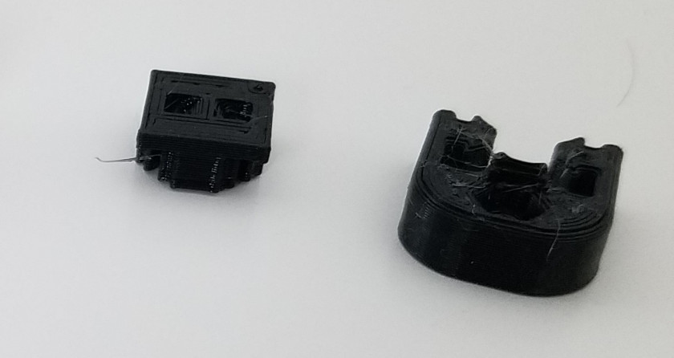
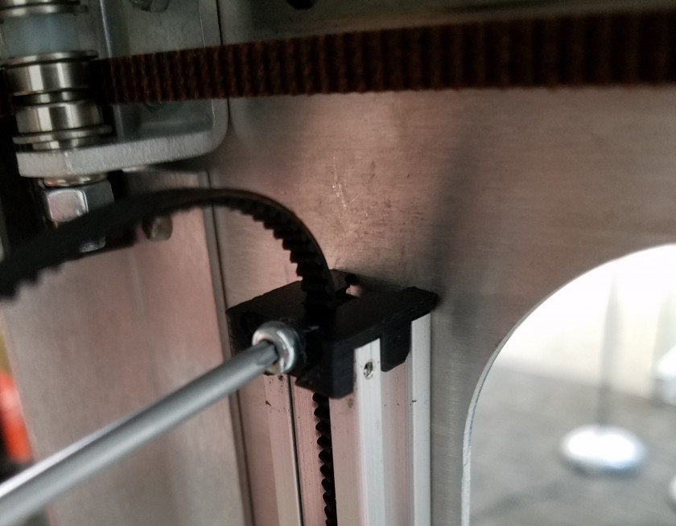
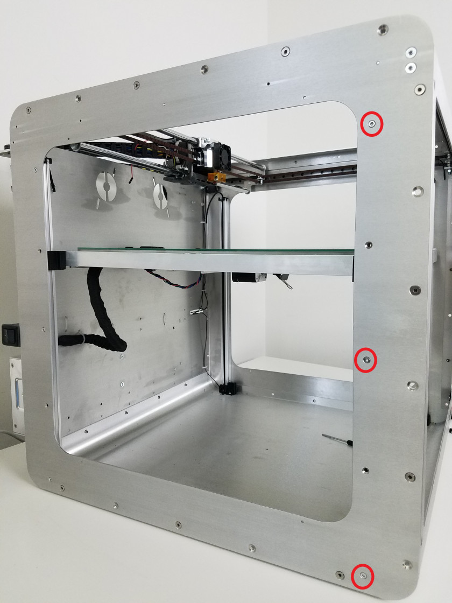
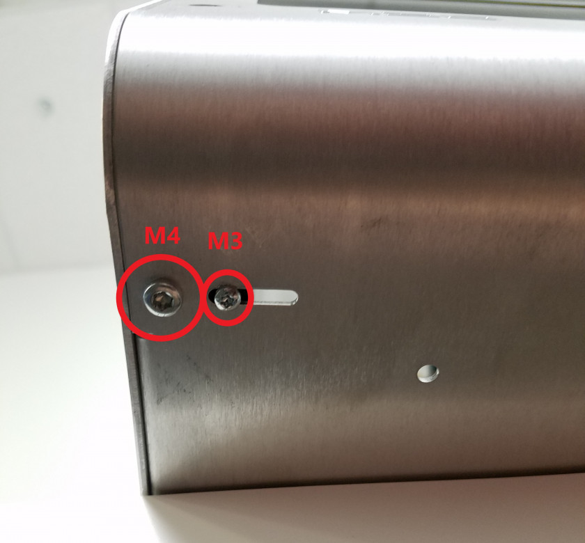
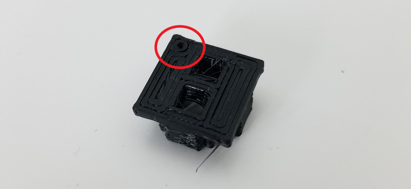
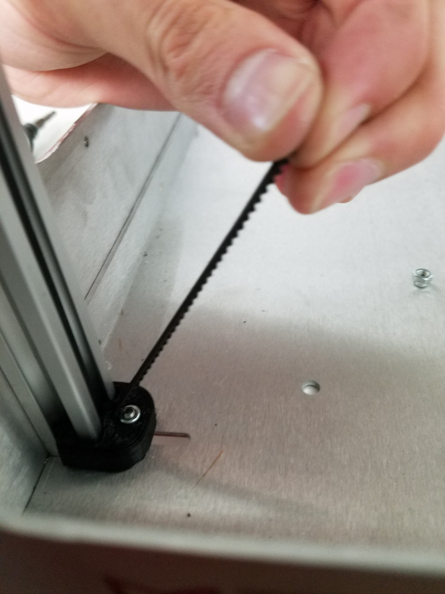
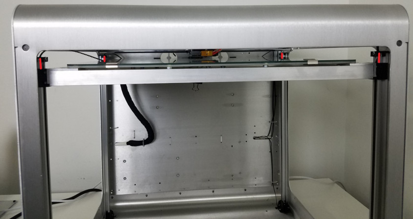

# Repairing Broken Belt Clamps

This guide covers repair of broken belt Z-axis belt clamps. This can occur if you crash the bed into the nozzle or place too much weight on the bed. The Z-axis belt is held in place with two different 3D printed clamps on the top and the bottom. If either of these two clamps break you can follow the guide below for instructions on how to replace them. The belt clamps are 3D printed, so you are welcome to print replacement belt clamps to fix the printer.

### Preparation

To prepare for the removal of the clamps, perform the following steps: 1. Turn off your Promega and unplug all cords attached to it, this will make it easier to move the printer throughout the process. 2. Place a binder clip, or something similar on the belt of the Z-motor. This will allow you to work under and around the bed without the bed falling. You can also place the printer on its side, if you do so, be careful with the switches on either side of the printer.

> The steps for removing and installing the new belt clamps is best done one corner at a time. This allows the bed to stay relatively level and in place, making the repair easier.

For the removal and installation of the belt clamps you will need the following tools:

* T10 Torx Screwdriver
* T30 Torx Screwdriver
* New belt clamps
* Container

### Removing Broken Belt Clamps

Follow the instructions below to remove the broken belt clamps, pictured below, from your printer.

**Removing the Top Clamp**

**Remember that it is easiest to replace the clamps in one corner at a time.**

* **Removing old clamps:** Remove the top belt clamp by unscrewing the M3 pan bolt with the T10 driver and sliding it off the belt. 
* **Removing new clamps:** In order to remove the new top clamp you can simply pull it up and out of the Z-slider **after** you relieve the belt of its tension. You can relieve tension by loosening the bottom clamp.

**Removing the Bottom Clamp**

**Remember that it is easiest to replace the clamps in one corner at a time.**

1. Whether you have the old or the new bottom belt clamps, removing them is the same procedure for both. Remove the bottom clamps by unscrewing the M3 pan bolt with the T10 screwdriver on the bottom of the printer. Store the M3 lock nut and M3 bolt in the container.
2. Unscrew the three M3 countersunk bolts with a T10 Torx driver holding the linear rail in place.

1. Unscrew the M4 pan bolt with the T30 Torx head on the bottom of the linear rail, under the printer. Place the printer corner you are working on over the side of a table so you can easily access the bottom of a printer.  

1. Once you have removed all 4 screws holding the linear rail in place, you can slide up the linear rail and remove the bottom belt clamp. This is assuming that all tension on the belt is removed. You do not have to remove the belt in order to replace the clamp.

1. You can now move on to the next section in order to place your new belt clamps.

### Installing New Top Belt Clamps

1. Attach the new top belt clamp by threading the belt through the new belt clamp as pictured. The orientation of the new top belt clamp is important to ensure that the belt clamp properly holds on to the belt when installed. On the new top belt clamp you will find a small dot as pictured below. This dot should be facing the bed \(or the Front as labeled in the second image\). All **top** belt clamps will have this dot, so be sure to orient them correctly. The length of the belt on the back should be similar to the length in the second picture. **If the belt on the back of the belt clamp is too long it will hit an M3 screw holding the aluminum Z-rail in place.** This will make it impossible to fit the belt clamp.

   

   

2. Before you insert the new top belt clamp into the slider
3. Now that the belt is threaded through the new top belt clamp you can insert it in the rail as pictured above. This can be a little tricky, make sure the back belt properly enters the rail slot before attempting to place the clamp on the slider. It can help to pull down the belt on the front of the z-slider as you insert the belt clamp.
4. Once the belt is properly seated on the aluminum rail you can continue on to the section _Tensioning the Belts_ below.

### Installing New Bottom Belt Clamps

1. Thread the belt through the new belt clamp as pictured below.

   

2. Pull all the slack out of the belt in the corner you are working on.
3. Slide the new belt clamp onto the linear z-slider.
4. Attach all four screws that were removed in the _Removing the Bottom Clamp_ section. This should hold the linear rail in place again. Make sure that the rail is flush \(flat\) against the frame on both the bottom and the side.
5. Insert the M3 locknut into the bottom Z-clamp. Throught the bottom of the Promega, insert a M3 pan head screw. Again, it might help to place the Promega over the edge of your work surface so you can reach this slot better.
6. Follow the _Tensioning the Belts_ section below to continue.

## Tensioning the Belts

1. In order to gauge the tension of the Z-axis belts you can pull down on the belt as pictured below. Determining the proper tension on the Z-axis belt is difficult. This is because more tension will result in better accuracy but can also cause too much friction for the Z-motor to handle comfortably. It is a careful balance and you will become more familiar with the proper tension over time. While pulling on the belt check that the top and bottom clamps are gripping the belt firmly. You should see no evidence of slipping.

   

2. To tension the belt pull up as shown in the picture below, while tightening down the screw underneath the Promega. You should not have to pull hard to achieve the proper tension as tightening down the clamp can tension the belt.

   

## Leveling the Bed

After you change out belt clamps, your bed might be misaligned. As covered in the [Bed Leveling & Probing](https://m3d.gitbook.io/promega-docs/printing-guides/slicers-and-printer-settings/bed-leveling-and-probing) guide, bed leveling compensation will work for differences of about 3mm across the entire bed. Leveling your bed can be done by skipping teeth on the bed in specific corners.

1. Look at your bed and determine if one side is visibly higher than the other side.
2. Remove the binder clip if you have placed one on the Z-motor belt
3. Gently pull up on the corner that you want to skip. Apply pressure until you feel the corner give with a loud click. **Do not skip the bed near the belt clamps as it can break your belt clamps**
4. Once the bed is level enough to the point where it drops by itself, move the bed up to the nozzle. The bed is best lifted up from the points pictured below. Lift slowly or you will skip the bed. Moving the bed too fast can also fry your Duet board, so be careful.
5. When the bed is touching the nozzle, determine the offset of the Z-sliders to the top belt clamps to determine whether the bed is level. This will give you a good enough estimate to level the bed, bed leveling compensation with `G29` can take care of the rest. The bed can be leveled more accurately by using a caliper to measure the distance between the bed and the top of the Z-slider rails and comparing the corners.

   

6. Skip corners until the bed looks visibly level using the procedure in step 5.

