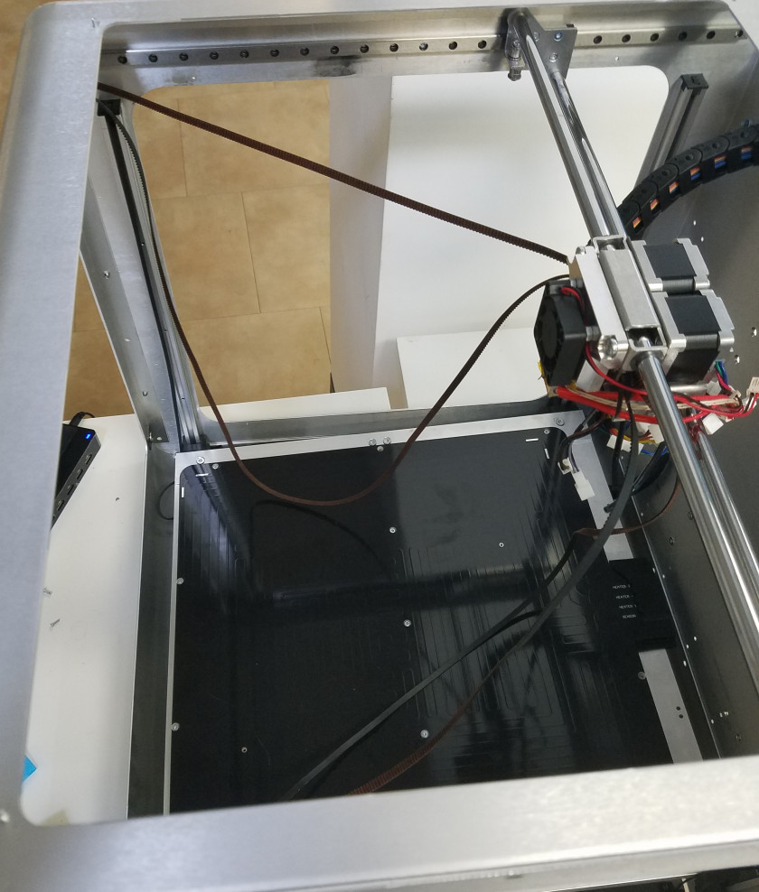
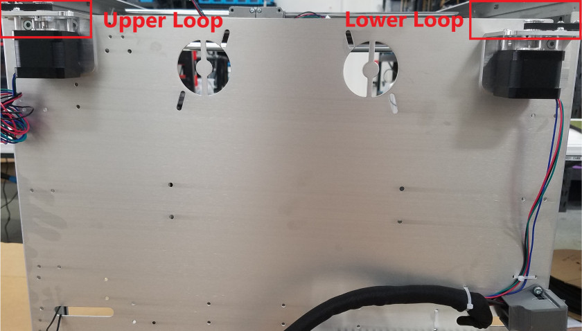
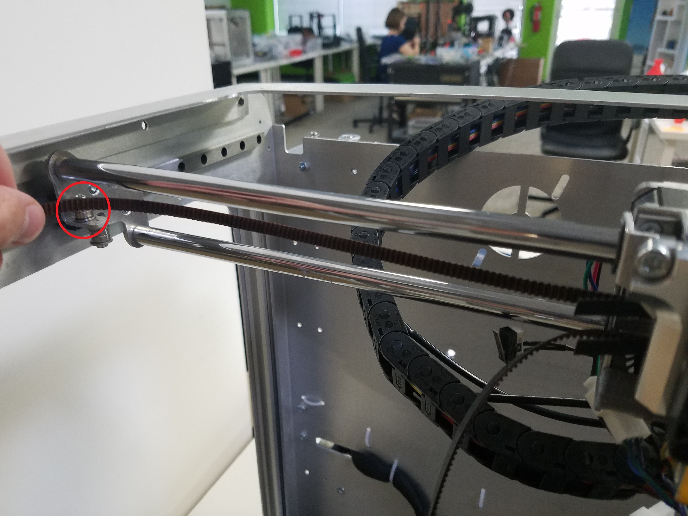
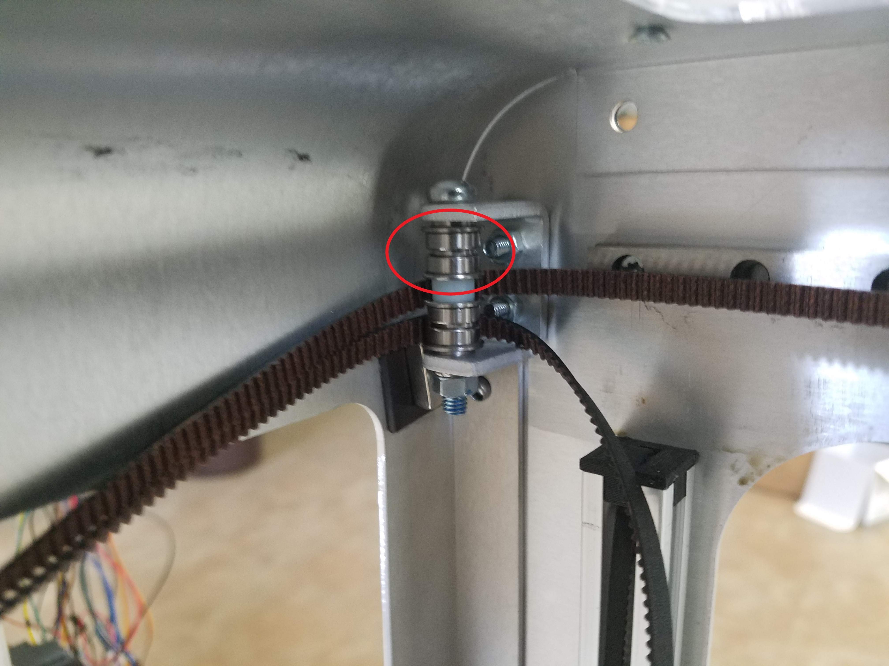
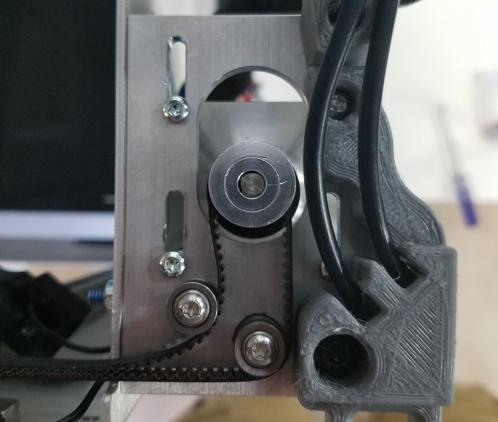
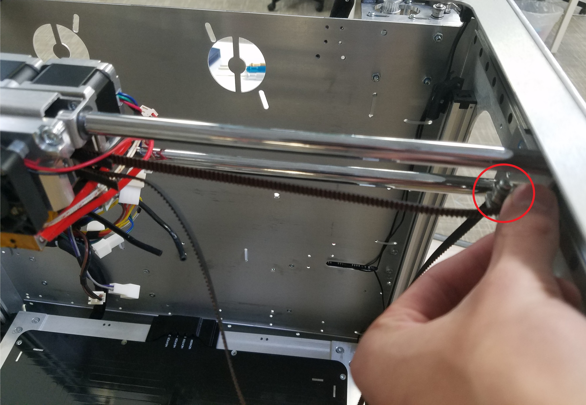

# Repairing CoreXY

Work in Progress

This guide covers the coreXY system and how to fix common problems that might occur with it.

## Belt Routing

If the belt tension in the coreXY system became too loose the belts can become unseated from their bearings. The coreXY belt system might seem complicated, but it is relatively simple. If your Crane system.

### Two Loops

The coreXY belt system is made up from two loops, an upper loop and a bottom loop. You can see this in the image below, one of the stepper motor mounts is higher than the other one. They each pass around the entire frame of the printer and incorporate one of the stepper motors.

This is the belt routing diagram for a generic coreXY system. Below you can see that the belt system is in fact two different colors \(blue and red\). This same concept is applied in the Crane, there is an upper loop and lower loop.

On the Crane, note that all the belts start at the extruder carriage, and that they end on the extruder carriage as well.

Follow the steps below in order to reroute the coreXY belts. The following steps will start with the upper loop, on the left side of the extruder carriage.

1. Make sure both CoreXY stepper motors are loose on their mounts. This will make it possible to route the belts. Routing the belts while these motors are not loose will make it extremely hard as you will not find slack in the system. Follow the coreXY tensioning guide in [Belt Tensioning and Mechanical Leveling](../maintenance-guides/belt-tensioning-and-mechanical-leveling.md#corexy-assembly) for more help.   
2. 1. Route the belt from the extruder carriage around the bearing on the bracket on the linear slider. Remember the upper and lower belt loop throughout these steps. A belt that is mounted lower on the extruder carriage is supposed to go around all the lower bearings around the coreXY assembly.   
3. Once the belt is around the first bearing, it will go around the bearings on the bolt in the front left corner.   
4. The belt will then travel and go around the bearings on an identical bolt but on the front right corner of the printer.
5. The belt will then travel all the way to the stepper motor bracket in the back-right corner of the printer. The belt routing through the motor bracket is shown below.   
6. The belt will then go around the final bearing and then should go to the extruder carriage.   
7. You have now completed the first loop of  the belt system. It helps to tighten down the motor in the back right corner while putting a bit of tension on the belt system in order keep the belts in place.
8. Repeat this same process for the lower belt loop.
9. Follow the [Belt Tensioning and Mechanical Leveling](../maintenance-guides/belt-tensioning-and-mechanical-leveling.md#corexy-assembly) guide in order to tension your coreXY system and make sure it is square.

