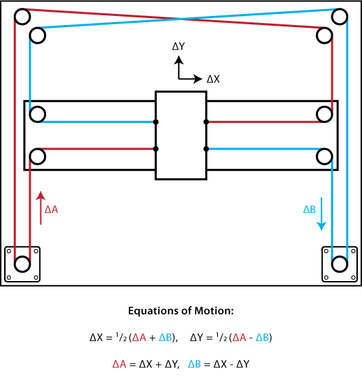

# Repairing CoreXY

Work in Progress

This guide covers the coreXY system and how to fix common problems that might occur with it.

### Belt Routing

If the belt tension in the coreXY system became too loose the belts can become unseated from their bearings. The coreXY belt system might seem complicated, but it is relatively simple. If your Promega system.

 

#### Two Loops

The coreXY belt system is made up from two loops, an upper loop and a bottom loop. You can see this in the image below, one of the stepper motor mounts is higher than the other one. They each pass around the entire frame of the printer and incorporate one of the stepper motors. 

This is the belt routing diagram for a generic coreXY system. Here you can see that the belt system is in fact two different colors \(blue and red\). This same concept is applied in the Promega, there is an upper loop and lower loop.

 

Follow the steps below in order to reroute the coreXY belts. 

1.

