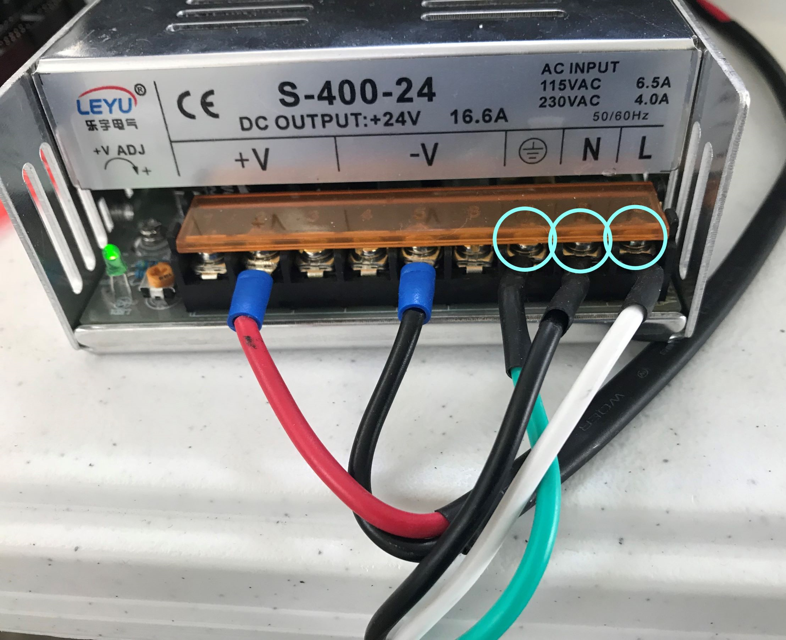

# Prusa i3 MK2S

This guide will go through the process of hooking up your QuadFusion to Prusa's i3 MK2S printer.


There is no affiliation between M3D/The QuadFusion and Prusa/The i3 MK2S


## Mechanically

The Prusa i3 MK2S requires an entirely new extruder mount in order to mount the QuadFusion. The new mount is very similar to the old, only a few things were shifted around to accommodate the new extruder.

**You will need...**  
**-** 3mm Hex Standoffs \(20mm long\) \(x2\)  
**-** 3mm Hex Screw \(33mm long\) \(x2\)  
**-** QuadFusion Mount  (Downloadable under "STL File(s)")
**-** Zip-ties \(x6\)

**Tools...**  
**-** 2.5mm Hex Screwdriver

The front of the mount has 4 holes, screw the two 20mm long standoffs into the 2 lower holes, as shown in the image below

The back of the mount shows where it will be mounted to the Prusa. The lower X-belt will lie across the ledge of the mount. While the upper X-belt will be wrapped around the two protruding cylinders. You can tighten the X-belt by wrapping more of the belt around the cylinder, as shown in the picture above.  
Additionally, the mount is attached to the Prusa using six zip-ties. Theses zip-ties can be routed through designated holes that the mount contains.

Lastly, using the 33mm long Hex Screws, thread the screw into the QuadFusion till the come out the other end and thread into the standoffs.

You have now fully attached the QuadFusion to your i3 MK2S.

**STL File\(s\):**



## **Electrically**


You will need a Duet Maestro board if you wish to follow along during the electrical part of this guide. Look at the bottom of the page to see where to get one.



Go to this link: https://www.thingiverse.com/search?q=Duet&dwh=345c37c6245e907   if you want to print a Duet Holder. These can be very helpful with protecting and organizing your Duet Maestro!


**You will need...  
-** 24V Power Supply  
**-** Duet Maestro Board  
**-** Duet Maestro Expansion Board  
**-** Jumper  
**-** Terminal board

**Tools  
-** Flat-Head Screwdriver

This is the Duet Maestro:

This will be a walk through on how to connect the QuadFusion, as well as part of the i3 MK2S, to the Duet Maestro board.

Before you can begin to wire your QuadFusion to the Duet Maestro board you must attach an extension to the board. With this extension you will be able to connect the the extra motor wires to the board.

The following pictures show where the extension goes, and how it looks once it has been plugged in:

Additionally, you will need to attach a jumper to the pins next to the expansion board:

### Base Connections

Without the fans, the QuadFusion has six main wires coming from it. The four wires with yellow dots at the ends are the motor wires. The wire with a green dot is the heater wire, and lastly the wire with the red dot is the thermistor.

The wires plug in to their corresponding color that is boxed in the following picture:

Notes:

* Keep in mind when you're wiring your QuadFusion's motors to the Duet Maestro board which motor is connected to which port. The first picture in this guide labels each port as E0 Stepper, E1 Stepper, E2 External Driver, and E3 External Driver. When facing the front of your QuadFusion, the front left motor is 0, the front right motor is 2, the back left motor is 1, and the back right motor is 3. 
* If you decide to extend the wires given to you, make sure that you are maintaining the original positive and negative wires. 

The next steps will be to connect your i3 MK2S' stepper motors, power source, limit switches and Z-probe.


The bed is not connected to the Duet Maestro board, this will be further explained in this guide.


Starting with the stepper motors, each one will plug into one of these highlighted ports:

The color coordination is as follows;  
Yellow = X-Stepper Motor  
Orange = Y-Stepper Motor  
Green = Z-Stepper Motors


The original connectors on the i3 MK2S' electrical board are not compatible with the Duet Maestro. We recommend cutting off the locking mechanisms on each connector since they interfer with plugging the wires into the Duet Maestro.


The next step is to wire the limit switches and Z-probe to these highlighted ports:

The picture above shows where each limit switch and the Z-probe should be connected. Color coordination is as follows;  
Yellow = X-Limit Switch  
Red = Y-Limit Switch  
Green = Z-Probe

When attaching the Z-probe you will need to use some Dupont connectors in order to properly connect it to the Duet Maestro:

Color coordination is as follows:  
The black wire represents the Z-probe's black wire  
The grey wire represents the Z-probe's blue wire  
The brown wire represents the Z-probe's brown wire

After plugging these in you can move on to connecting the power supply. **You will need a 24V power supply** to power your Duet Maestro board

The three circled wires are what will be connecting your power supply to an outlet. The non circled wires are what will be connecting to your Duet Maestro board


We recommend having an on/off switch between the power supply and Duet Maestro board, this makes it easier to turn your printer on and off.


The red and black wires will be connecting to ports 3 and 4, respectively, as shown in the image above.

**Attaching the LCD Screen**

To attach the LCD screen to your Duet Maestro you will need to use these ribbon cables provided in the upgrade kit given to you. You will plug the cables into the Duet Maestro in ports labeled "Future Expandability" 

Finally, attach the cables to your LCD screen.

**Heating the Bed**

The bed was wired separately from the main collection of wires because of the power supply. The QuadFusion requires a 24V power supply in order to properly power the motors, heater, and thermistor. However, the bed could only be safely powered by 12V, so it was decided to have the bed remain wired to Prusa's original power source, but also be connected to the Duest Maestro.


Make sure you make the same connections, in the same location, that are described and pictured below.


To begin, the bed's heater wire will be attaching to the Duet Maestro here:

Once you have done this you will want to use a terminal board to make further connections. Take the two wires coming from the back of your Prusa i3 MK2S and connect them on the same side, like so:

Color coordination:  
The yellow circled wire is the plain black wire.  
The green circled wire is the black wire with a red stripe.

Next, you will want to create you own wire, preferably with a loop connector, that connects from the terminal board to the Duet Maestro's positive Port 1. As shown below:

The following step is to make a another wire connecting a 24V power supply's negative port to the terminal board:

The last connections to make are those from the 12V power supply, that Prusa has with the i3 MK2S, to the terminal board:

Color coordination:  
The blue circled wire will be black and have a red stripe on it.  
The yellow circled wire will be plain black.

Don't have something that is listed here? Check out these links if you need something for the QuadFusion!

24V power supply: [https://store.printm3d.com/collections/parts/products/400w-power-supply?variant=12283391148110](https://store.printm3d.com/collections/parts/products/400w-power-supply?variant=12283391148110)  
Duet Maestro Board: [https://fitforlaunch.com/projects/duet-2-maestro](https://fitforlaunch.com/projects/duet-2-maestro)  
Extruder Expansion Board: https://store.printm3d.com/products/copy-of-duet-2-maestro-expansion?variant=21198635434062                   
Toggle Switch: [https://store.printm3d.com/collections/parts/products/lighted-toggle-switch?variant=12283706245198](https://store.printm3d.com/collections/parts/products/lighted-toggle-switch?variant=12283706245198)

Thank you for supporting the QuadFusion, and Happy Printing!
