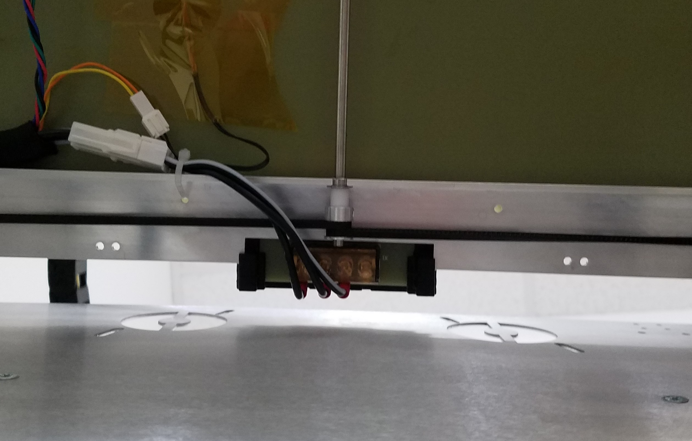
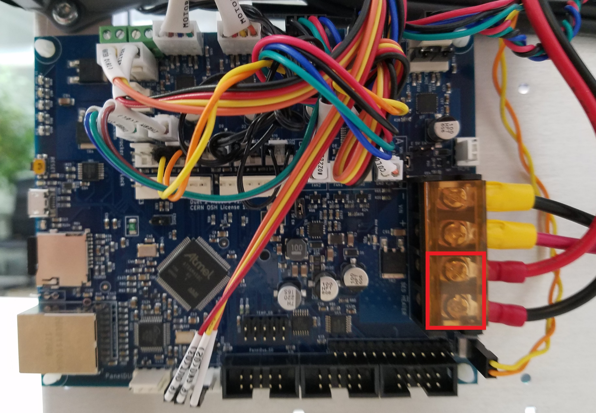

# \(Edit pictures\) Heater Troubleshooting

This guide serves to fix any problems you might have with the heater cartridges, PT1000 or the heated bed.

## PT1000 Problems

## Heater Problems

## Bed Problems

### Bed Terminal Connection

If your bed is not heating up uniformly or not heating up at all check the screw terminals that connect the bed to the Duet. Check these terminals on both the Duet side and the heated bed side. It is possible that they loosened up and are not making proper connection.

#### Solution

**Turn off the printer.** Feel the wires going into the terminals and move them around to see if they are loose. If they are open the terminal cover and screw them down tight again with a Phillips head screwdriver.

