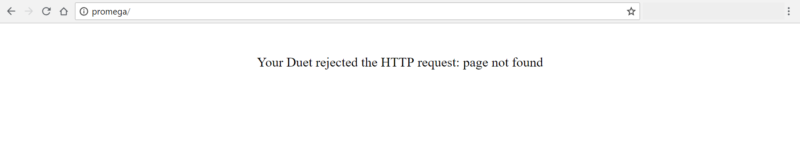
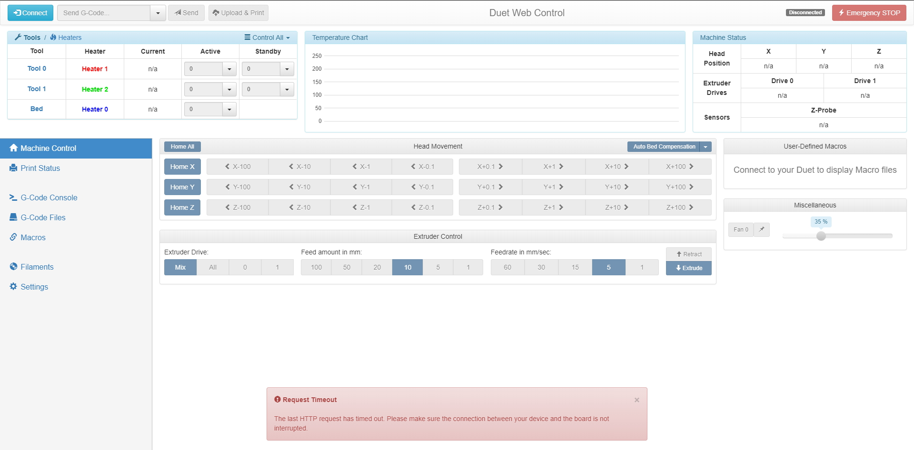

# Troubleshooting Duet Web Console

This guide will walk through possible problems that can be encountered while connecting to the Duet Web Console.

## Rejected by the Duet

### Problem

When attempting to connect to the Promega the error "Your Duet rejected the HTTP request: page not found" is shown.

This indicates that the web pages of the Duet web server can not be loaded from the SD card. Usually the problem lies in the SD card not being properly mounted to the system. This can happen if you ejected the SD card and then put it back into the Duet board while it was powered.

### Solution

* Reboot the Duet Maestro board with the microSD card properly fitted inside.
* Reformat the microSD card.
* [Update the microSD card files.](../getting-started/updating-sd-card-structure.md)
* [Update the Duet Web Firmware.](../firmware-guides/updating-firmware.md)

## Frequent Disconnects from the Duet Web Console

### Problem

When working with the Duet Web Console there are frequent disconnects with the Duet Web Console.

### Solutions

* Ensure that your computer has a proper connection to the local network. It is possible that the Duet is not disconnected from the network but your computer is.
* Ensure that the Duet has a proper connection to your local network.
* [Try configuring a static IP address](../getting-started/network-setup.md). It is possible that the router is continuously changing the IP address of your Promega.
* Go to _Settings &gt; General_ on the Duet Web Console and increase the _Status Update Interval_ and _Maximum Number of AJAX Retries_.

