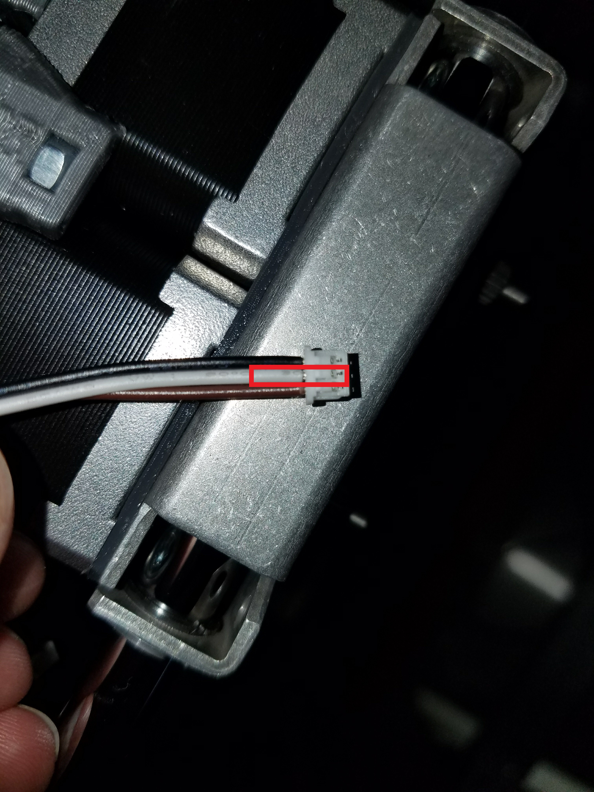

# Troubleshooting the Z-probe

This guide will cover various problems that you might encounter while working with the Z-probe.

## Z-probe Not Triggering

### Problem

Pressing the Z-probe does not result in a change in Z-probe value in the Duet Web Console _Machine Status_ table.

### Solution

This indicates a broken Z-probe or a problem with the Z-probe wiring. 

#### Z-probe Limit Switch Wiring Problem

The limit switch has an extension cable that extends into the cable chain as it goes to the Duet Board. It is possible that the Z-probe become disconnected from the extension cable during printer use.

1. Turn off the printer
2. Open the cable chain segments until you find the connection of the Z-probe limit switch cable to the extension cable. Read [this guide](../electrical-guides/opening-the-cable-chain.md) for more instructions on how to open the cable chain.   
3. Make sure the cable is properly plugged in. Polarity does not matter as it is a switch.
4. You can apply glue to the connector to ensure that the connector stays in place. Also make sure that the cable overall has enough slack for the gantry to move around the entire coreXY plane.

#### Z-probe IR Probe Wiring Problem

A connection problem has been identified in some of the IR probe connectors. This is easy to fix with the following procedure.

1. Turn off the printer
2. Take out the nozzle fan duct in order to take out the IR probe board. This is optional but it will give you more room to perform the following steps.
3. Unplug the connector from the IR board.
4. Take the contact of the white signal cable out of the connector. You will notice that this contact has a U shape on the end. This is meant to properly contact the pin on the IR board, but it does not. Crimp this U so that the tips come closer together.   
5. When inserting the white cable back in the connector it might help to apply a little bit of superglue to keep it in place.
6. Plug the connector back in the IR board.
7. Put the fan duct and IR board back in their place.
8. Test the IR Z-probe.

## Error: Z-probe Triggered Before Move

### Problem

The probing procedure does not start and the Error: Z-probe Triggered Before Move is  printed in the console.

### Explanation

This indicates that the firmware has detected a triggering Z-probe value before it has even started moving the Z-platform. This can be seen in the _Machine Status_ table as the _Z-probe_ value will usually be 1000. The procedure here is attempting to move the Z-platform to the Z-probe in order to trigger it, but the Z-probe is already triggered.

### Solution

1. Test that the Z-probe value in the Duet Web Console is toggling correctly.
2. Ensure that the Z-probe is properly connected.
3. Ensure that the Z-probe is properly configured with the `M558` command.

## Error: Z-probe Not Triggered During Move

### Problem

As the image above indicates, the Error: Z-probe Not Triggered During Move is printed out and the probing operation has failed. If the printer was moving during the probing command, the printer stopped moving before the Z-probe was triggered.

### Explanation

This error is actually a fail safe, the printer is preventing what it presumes is a crash. Since the printer does not know where the mechanical limits of the printer are, it assumes the software limits are the limits of its motion. When the printer is performing its probing procedure it reaches the axes limit before the Z-probe is triggered and prints the error above.  

### Solution

1. Disable axes limits with the command `M564 S0`
2. Make sure that the Z-probe value on the Duet Web Console changes when the Z-probe is supposed to be triggered.
3. Ensure that the printer never reaches a value less than 0 in the Z, during a probe move. You can do this by sending the command `G92 Z50` while the printer is less than 50mm away from the nozzle. **Warning: Travelling to a small Z-value after you do this will crash the printer!**

